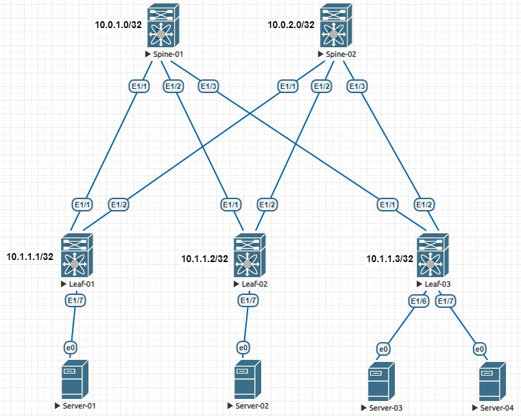

# Основы проектирования сети
### Цели
- Собрать схему CLOS;
- Распределить адресное пространство.
### Схема сети

### Адресное пространство
#### Общее описание схемы назначения IP-адресов
IP = 10.Dn.Sn.X, где  
Dn - номер DC;  
Sn - номер spine коммутатора в DC;  
X - значение по порядку.  
Для каждого DC выделяется 8 бит, т.о для DC1 Dn = 0 - 7. При этом  
0 - loopback IP-адреса spine коммутаторов;  
1 - loopback IP-адреса leaf коммутаторов;  
2 - IP-адреса p2p подключений;  
3 - резерв;  
4-7 - сервисы DC. 
#### IP-адреса loopback-интерфейсов
|Device|Loopback 1|
|---|---|
Spine-01|10.0.1.0/32
Spine-02|10.0.2.0/32
Leaf-01|10.1.1.1/32
Leaf-01|10.1.1.2/32
Leaf-01|10.1.1.3/32
#### IP-адреса P2P-интерфейсов Spine коммутаторов
|Device|to Leaf-01|to Leaf-02|to Leaf-03|
|---|---|---|---|
Spine-01|10.2.1.0/32|10.2.1.2/32|10.2.1.4/32
Spine-02|10.2.2.0/32|10.2.2.2/32|10.2.2.4/32|
#### IP-адреса P2P-интерфейсов Leaf коммутаторов
|Device|to Spine-01|to Spine-02|
|---|---|---|
Leaf-01|10.2.1.1/32|10.2.2.1/32
Leaf-02|10.2.1.3/32|10.2.2.3/32
Leaf-03|10.2.1.5/32|10.2.5.1/32
### Настройка оборудования
 <details>
<summary>  Настройка Leaf-03: </summary>

```
hostname Spine-01

interface Ethernet1/1
  no switchport
  ip address 10.2.1.0/31
  no shutdown

interface Ethernet1/2
  no switchport
  ip address 10.2.1.2/31
  no shutdown

interface Ethernet1/3
  no switchport
  ip address 10.2.1.4/31
  no shutdown

interface loopback1
  ip address 10.0.1.0/32
```
</details>

<details>
 
#### Настройка Spine-02
```
hostname Spine-02

interface Ethernet1/1
  no switchport
  ip address 10.2.2.0/31
  no shutdown

interface Ethernet1/2
  no switchport
  ip address 10.2.2.2/31
  no shutdown

interface Ethernet1/3
  no switchport
  ip address 10.2.2.4/31
  no shutdown

interface loopback1
  ip address 10.0.2.0/32
```
#### Настройка Leaf-01
```
hostname Leaf-01

interface Ethernet1/1
  no switchport
  ip address 10.2.1.1/31
  no shutdown

interface Ethernet1/2
  no switchport
  ip address 10.2.2.1/31
  no shutdown

interface loopback1
  ip address 10.1.1.1/32
```
#### Настройка Leaf-02
```
hostname Leaf-02

interface Ethernet1/1
  no switchport
  ip address 10.2.1.3/31
  no shutdown

interface Ethernet1/2
  no switchport
  ip address 10.2.2.3/31
  no shutdown

interface loopback1
  ip address 10.1.1.2/32
```

 <details>
<summary>  Настройка Leaf-03: </summary>

```
hostname Leaf-03

interface Ethernet1/1
  no switchport
  ip address 10.2.1.5/31
  no shutdown

interface Ethernet1/2
  no switchport
  ip address 10.2.2.5/31
  no shutdown

interface loopback1
  ip address 10.1.1.3/32
```
</details>
