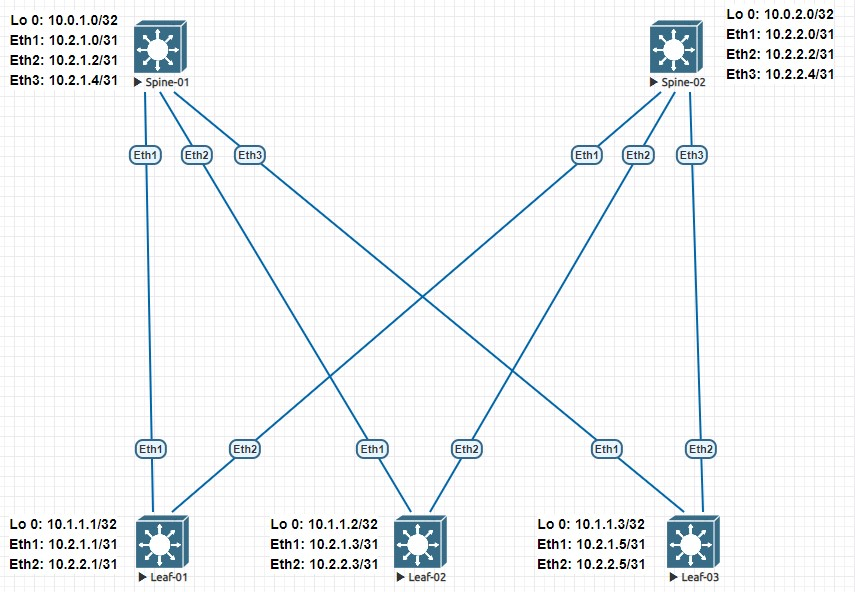

# LAB-02
# Основы проектирования сети
### Цели
- Настроить OSPF для Underlay сети.
### Схема сети

### Настройка оборудования
 <details>
<summary>  Настройка Spine-01: </summary>

```
hostname Spine-01
!
ip routing
!
interface Ethernet1
   description ### Link to Leaf-01 int Eth1 ###
   no switchport
   ip address 10.2.1.0/31
   ip ospf network point-to-point
   ip ospf area 0.0.0.0
!
interface Ethernet2
   description ### Link to Leaf-02 int Eth1 ###
   no switchport
   ip address 10.2.1.2/31
   ip ospf network point-to-point
   ip ospf area 0.0.0.0
!
interface Ethernet3
   description ### Link to Leaf-03 int Eth1 ###
   no switchport
   ip address 10.2.1.4/31
   ip ospf network point-to-point
   ip ospf area 0.0.0.0
!
interface Loopback1
   ip address 10.0.1.0/32
!
router ospf 1
   router-id 10.0.1.0
   passive-interface default
   no passive-interface Ethernet1
   no passive-interface Ethernet2
   no passive-interface Ethernet3
   network 10.0.0.0/16 area 0.0.0.0
   network 10.2.0.0/16 area 0.0.0.0
   max-lsa 12000
   maximum-paths 16
```
</details>
 <details>
<summary>  Настройка Spine-02: </summary>

```
hostname Spine-01
!
ip routing
!
interface Ethernet1
   description ### Link to Leaf-01 int Eth2 ###
   no switchport
   ip address 10.2.2.0/31
   ip ospf network point-to-point
   ip ospf area 0.0.0.0
!
interface Ethernet2
   description ### Link to Leaf-02 int Eth2 ###
   no switchport
   ip address 10.2.2.2/31
   ip ospf network point-to-point
   ip ospf area 0.0.0.0
!
interface Ethernet3
   description ### Link to Leaf-03 int Eth2 ###
   no switchport
   ip address 10.2.2.4/31
   ip ospf network point-to-point
   ip ospf area 0.0.0.0
!
interface Loopback1
   ip address 10.0.2.0/32
!
router ospf 1
   router-id 10.0.2.0
   passive-interface default
   no passive-interface Ethernet1
   no passive-interface Ethernet2
   no passive-interface Ethernet3
   network 10.0.0.0/16 area 0.0.0.0
   network 10.2.0.0/16 area 0.0.0.0
   max-lsa 12000
   maximum-paths 1 
```
</details>
 <details>
<summary>  Настройка Leaf-01: </summary>

```
hostname Leaf-01
!
ip routing
!
interface Ethernet1
   description ### Link to Spine-01 int Eth1 ###
   no switchport
   ip address 10.2.1.1/31
   ip ospf network point-to-point
   ip ospf area 0.0.0.0
!
interface Ethernet2
   description ### Link to Spine-02 int Eth1 ###
   no switchport
   ip address 10.2.2.1/31
   ip ospf network point-to-point
   ip ospf area 0.0.0.0
!
interface Loopback1
   ip address 10.1.1.1/32
!
router ospf 1
   router-id 10.1.1.1
   passive-interface default
   no passive-interface Ethernet1
   no passive-interface Ethernet2
   network 10.1.0.0/16 area 0.0.0.0
   network 10.2.0.0/16 area 0.0.0.0
   max-lsa 12000
   maximum-paths 16
```
</details>
 <details>
<summary>  Настройка Leaf-02: </summary>

```
hostname Leaf-02
!
ip routing
!
interface Ethernet1
   description ### Link to Spine-01 int Eth2 ###
   no switchport
   ip address 10.2.1.3/31
   ip ospf network point-to-point
   ip ospf area 0.0.0.0
!
interface Ethernet2
   description ### Link to Spine-02 int Eth2 ###
   no switchport
   ip address 10.2.2.3/31
   ip ospf network point-to-point
   ip ospf area 0.0.0.0
!
interface Loopback1
   ip address 10.1.1.2/32
!
router ospf 1
   router-id 10.1.1.2
   passive-interface default
   no passive-interface Ethernet1
   no passive-interface Ethernet2
   network 10.1.0.0/16 area 0.0.0.0
   network 10.2.0.0/16 area 0.0.0.0
   max-lsa 12000
   maximum-paths 16
```
</details>
 <details>
<summary>  Настройка Leaf-03: </summary>

```
hostname Leaf-03
!
ip routing
!
interface Ethernet1
   description ### Link to Spine-01 int Eth3 ###
   no switchport
   ip address 10.2.1.5/31
   ip ospf network point-to-point
   ip ospf area 0.0.0.0
!
interface Ethernet2
   description ### Link to Spine-02 int Eth3 ###
   no switchport
   ip address 10.2.2.5/31
   ip ospf network point-to-point
   ip ospf area 0.0.0.0
!
interface Loopback1
   ip address 10.1.1.3/32
!
router ospf 1
   router-id 10.1.1.3
   passive-interface default
   no passive-interface Ethernet1
   no passive-interface Ethernet2
   network 10.1.0.0/16 area 0.0.0.0
   network 10.2.0.0/16 area 0.0.0.0
   max-lsa 12000
   maximum-paths 16
```
</details>
### Проверка настроек
#### Leaf-01
```
Leaf-01#show ip ospf neighbor
Neighbor ID     Instance VRF      Pri State                  Dead Time   Address         Interface
10.0.1.0        1        default  0   FULL                   00:00:29    10.2.1.0        Ethernet1
10.0.2.0        1        default  0   FULL                   00:00:38    10.2.2.0        Ethernet2

Leaf-01#show ip route

VRF: default
Codes: C - connected, S - static, K - kernel,
       O - OSPF, IA - OSPF inter area, E1 - OSPF external type 1,
       E2 - OSPF external type 2, N1 - OSPF NSSA external type 1,
       N2 - OSPF NSSA external type2, B - BGP, B I - iBGP, B E - eBGP,
       R - RIP, I L1 - IS-IS level 1, I L2 - IS-IS level 2,
       O3 - OSPFv3, A B - BGP Aggregate, A O - OSPF Summary,
       NG - Nexthop Group Static Route, V - VXLAN Control Service,
       DH - DHCP client installed default route, M - Martian,
       DP - Dynamic Policy Route, L - VRF Leaked,
       G  - gRIBI, RC - Route Cache Route

Gateway of last resort is not set

 O        10.0.1.0/32 [110/20] via 10.2.1.0, Ethernet1
 O        10.0.2.0/32 [110/20] via 10.2.2.0, Ethernet2
 C        10.1.1.1/32 is directly connected, Loopback1
 O        10.1.1.2/32 [110/30] via 10.2.1.0, Ethernet1
                               via 10.2.2.0, Ethernet2
 O        10.1.1.3/32 [110/30] via 10.2.1.0, Ethernet1
                               via 10.2.2.0, Ethernet2
 C        10.2.1.0/31 is directly connected, Ethernet1
 O        10.2.1.2/31 [110/20] via 10.2.1.0, Ethernet1
 O        10.2.1.4/31 [110/20] via 10.2.1.0, Ethernet1
 C        10.2.2.0/31 is directly connected, Ethernet2
 O        10.2.2.2/31 [110/20] via 10.2.2.0, Ethernet2
 O        10.2.2.4/31 [110/20] via 10.2.2.0, Ethernet2

Leaf-01#ping 10.1.1.2
PING 10.1.1.2 (10.1.1.2) 72(100) bytes of data.
80 bytes from 10.1.1.2: icmp_seq=1 ttl=63 time=18.4 ms
80 bytes from 10.1.1.2: icmp_seq=2 ttl=63 time=12.6 ms
80 bytes from 10.1.1.2: icmp_seq=3 ttl=63 time=6.14 ms
80 bytes from 10.1.1.2: icmp_seq=4 ttl=63 time=7.29 ms
80 bytes from 10.1.1.2: icmp_seq=5 ttl=63 time=5.75 ms

--- 10.1.1.2 ping statistics ---
5 packets transmitted, 5 received, 0% packet loss, time 60ms
rtt min/avg/max/mdev = 5.759/10.048/18.431/4.858 ms, pipe 2, ipg/ewma 15.186/13.966 ms

Leaf-01#ping 10.1.1.3
PING 10.1.1.3 (10.1.1.3) 72(100) bytes of data.
80 bytes from 10.1.1.3: icmp_seq=1 ttl=63 time=14.2 ms
80 bytes from 10.1.1.3: icmp_seq=2 ttl=63 time=8.76 ms
80 bytes from 10.1.1.3: icmp_seq=3 ttl=63 time=6.86 ms
80 bytes from 10.1.1.3: icmp_seq=4 ttl=63 time=32.9 ms
80 bytes from 10.1.1.3: icmp_seq=5 ttl=63 time=7.99 ms

--- 10.1.1.3 ping statistics ---
5 packets transmitted, 5 received, 0% packet loss, time 77ms
rtt min/avg/max/mdev = 6.861/14.157/32.925/9.722 ms, pipe 2, ipg/ewma 19.273/14.341 ms1
```
