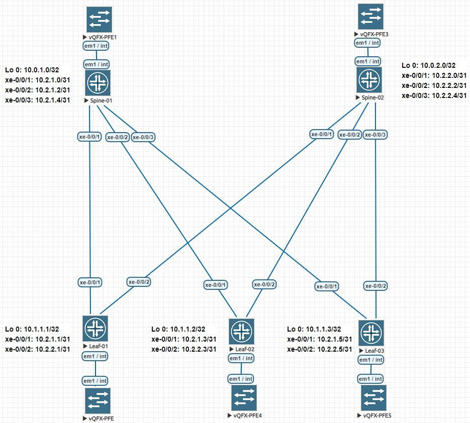

# LAB-02
# Underlay. IS-IS
### Цели
- Настроить IS-IS для Underlay сети.
### Схема сети

### Настройка оборудования
 <details>
<summary>  Настройка Spine-01: </summary>

```
#### Базовая настройка ####
set system host-name Spine-01
set interfaces xe-0/0/1 description "### Link to Leaf-01 int xe-0/0/1 ###"
set interfaces xe-0/0/1.0 family inet address 10.2.1.0/31
set interfaces xe-0/0/2 description "### Link to Leaf-02 int xe-0/0/1 ###"
set interfaces xe-0/0/2.0 family inet address 10.2.1.2/31
set interfaces xe-0/0/3 description "### Link to Leaf-03 int xe-0/0/1 ###"
set interfaces xe-0/0/3.0 family inet address 10.2.1.4/31
set interfaces em1 description "### Link to vQFX-PFE int em1 ###"
set interfaces em1.0 family inet address 169.254.0.2/24
set interfaces lo0.0 family inet address 10.0.1.0/32

#### Настройка IS-IS ####
set interfaces lo0.0 family iso address 49.0001.0100.0000.1000.00
set interfaces xe-0/0/1.0 family iso
set interfaces xe-0/0/2.0 family iso
set interfaces xe-0/0/3.0 family iso
set protocols isis level 2 wide-metrics-only
set protocols isis level 1 disable
set protocols isis interface xe-0/0/1.0 point-to-point
set protocols isis interface xe-0/0/1.0 family inet bfd-liveness-detection minimum-interval 200 multiplier 3
set protocols isis interface xe-0/0/1.0 level 2 metric 10
set protocols isis interface xe-0/0/1.0 level 2 hello-authentication-key "$9$5Q/tIRSleW36evWX-d5Qz6tu"
set protocols isis interface xe-0/0/1.0 level 2 hello-authentication-type md5
set protocols isis interface xe-0/0/2.0 point-to-point
set protocols isis interface xe-0/0/2.0 family inet bfd-liveness-detection minimum-interval 200 multiplier 3
set protocols isis interface xe-0/0/2.0 level 2 metric 10
set protocols isis interface xe-0/0/2.0 level 2 hello-authentication-key "$9$5Q/tIRSleW36evWX-d5Qz6tu"
set protocols isis interface xe-0/0/2.0 level 2 hello-authentication-type md5
set protocols isis interface xe-0/0/3.0 point-to-point
set protocols isis interface xe-0/0/3.0 family inet bfd-liveness-detection minimum-interval 200 multiplier 3
set protocols isis interface xe-0/0/3.0 level 2 metric 10
set protocols isis interface xe-0/0/3.0 level 2 hello-authentication-key "$9$5Q/tIRSleW36evWX-d5Qz6tu"
set protocols isis interface xe-0/0/3.0 level 2 hello-authentication-type md5
set protocols isis interface interface lo0.0 passive
```
</details>
 <details>
<summary>  Настройка Spine-02: </summary>

```
hostname Spine-01
!
ip routing
!
interface Ethernet1
   description ### Link to Leaf-01 int Eth2 ###
   no switchport
   ip address 10.2.2.0/31
   bfd interval 50 min-rx 50 multiplier 3
   ip ospf neighbor bfd
   ip ospf network point-to-point
   ip ospf authentication message-digest
   ip ospf area 0.0.0.0
   ip ospf message-digest-key 23 md5 7 yIINRhhDqQiAVT8QiEzWFg==
!
interface Ethernet2
   description ### Link to Leaf-02 int Eth2 ###
   no switchport
   ip address 10.2.2.2/31
   bfd interval 50 min-rx 50 multiplier 3
   ip ospf neighbor bfd
   ip ospf network point-to-point
   ip ospf authentication message-digest
   ip ospf area 0.0.0.0
   ip ospf message-digest-key 23 md5 7 yIINRhhDqQiAVT8QiEzWFg==
!
interface Ethernet3
   description ### Link to Leaf-03 int Eth2 ###
   no switchport
   ip address 10.2.2.4/31
   bfd interval 50 min-rx 50 multiplier 3
   ip ospf neighbor bfd
   ip ospf network point-to-point
   ip ospf authentication message-digest
   ip ospf area 0.0.0.0
   ip ospf message-digest-key 23 md5 7 yIINRhhDqQiAVT8QiEzWFg==
!
interface Loopback1
   ip address 10.0.2.0/32
!
router ospf 1
   router-id 10.0.2.0
   bfd default
   passive-interface default
   no passive-interface Ethernet1
   no passive-interface Ethernet2
   no passive-interface Ethernet3
   network 10.0.0.0/16 area 0.0.0.0
   network 10.2.0.0/16 area 0.0.0.0
   max-lsa 12000
   maximum-paths 1 
```
</details>
 <details>
<summary>  Настройка Leaf-01: </summary>

```
hostname Leaf-01
!
ip routing
!
interface Ethernet1
   description ### Link to Spine-01 int Eth1 ###
   no switchport
   ip address 10.2.1.1/31
   bfd interval 50 min-rx 50 multiplier 3
   ip ospf neighbor bfd
   ip ospf network point-to-point
   ip ospf authentication message-digest
   ip ospf area 0.0.0.0
   ip ospf message-digest-key 23 md5 7 yIINRhhDqQiAVT8QiEzWFg==
!
interface Ethernet2
   description ### Link to Spine-02 int Eth1 ###
   no switchport
   ip address 10.2.2.1/31
   bfd interval 50 min-rx 50 multiplier 3
   ip ospf neighbor bfd
   ip ospf network point-to-point
   ip ospf authentication message-digest
   ip ospf area 0.0.0.0
   ip ospf message-digest-key 23 md5 7 yIINRhhDqQiAVT8QiEzWFg==
!
interface Loopback1
   ip address 10.1.1.1/32
!
router ospf 1
   router-id 10.1.1.1
   bfd default
   passive-interface default
   no passive-interface Ethernet1
   no passive-interface Ethernet2
   network 10.1.0.0/16 area 0.0.0.0
   network 10.2.0.0/16 area 0.0.0.0
   max-lsa 12000
   maximum-paths 16
```
</details>
 <details>
<summary>  Настройка Leaf-02: </summary>

```
hostname Leaf-02
!
ip routing
!
interface Ethernet1
   description ### Link to Spine-01 int Eth2 ###
   no switchport
   ip address 10.2.1.3/31
   bfd interval 50 min-rx 50 multiplier 3
   ip ospf neighbor bfd
   ip ospf network point-to-point
   ip ospf authentication message-digest
   ip ospf area 0.0.0.0
   ip ospf message-digest-key 23 md5 7 yIINRhhDqQiAVT8QiEzWFg==
!
interface Ethernet2
   description ### Link to Spine-02 int Eth2 ###
   no switchport
   ip address 10.2.2.3/31
   bfd interval 50 min-rx 50 multiplier 3
   ip ospf neighbor bfd
   ip ospf network point-to-point
   ip ospf authentication message-digest
   ip ospf area 0.0.0.0
   ip ospf message-digest-key 23 md5 7 yIINRhhDqQiAVT8QiEzWFg==
!
interface Loopback1
   ip address 10.1.1.2/32
!
router ospf 1
   router-id 10.1.1.2
   bfd default
   passive-interface default
   no passive-interface Ethernet1
   no passive-interface Ethernet2
   network 10.1.0.0/16 area 0.0.0.0
   network 10.2.0.0/16 area 0.0.0.0
   max-lsa 12000
   maximum-paths 16
```
</details>
 <details>
<summary>  Настройка Leaf-03: </summary>

```
hostname Leaf-03
!
ip routing
!
interface Ethernet1
   description ### Link to Spine-01 int Eth3 ###
   no switchport
   bfd interval 50 min-rx 50 multiplier 3
   ip ospf neighbor bfd
   ip ospf network point-to-point
   ip ospf authentication message-digest
   ip ospf area 0.0.0.0
   ip ospf message-digest-key 23 md5 7 yIINRhhDqQiAVT8QiEzWFg==
!
interface Ethernet2
   description ### Link to Spine-02 int Eth3 ###
   no switchport
   ip address 10.2.2.5/31
   bfd interval 50 min-rx 50 multiplier 3
   ip ospf neighbor bfd
   ip ospf network point-to-point
   ip ospf authentication message-digest
   ip ospf area 0.0.0.0
   ip ospf message-digest-key 23 md5 7 yIINRhhDqQiAVT8QiEzWFg==
!
interface Loopback1
   ip address 10.1.1.3/32
!
router ospf 1
   router-id 10.1.1.3
   bfd default
   passive-interface default
   no passive-interface Ethernet1
   no passive-interface Ethernet2
   network 10.1.0.0/16 area 0.0.0.0
   network 10.2.0.0/16 area 0.0.0.0
   max-lsa 12000
   maximum-paths 16
```
</details>

### Проверка настроек  

 <details>
<summary> Leaf-01: </summary>

```
Leaf-01#show ip ospf neighbor  
Neighbor ID     Instance VRF      Pri State                  Dead Time   Address         Interface
10.0.1.0        1        default  0   FULL                   00:00:29    10.2.1.0        Ethernet1
10.0.2.0        1        default  0   FULL                   00:00:38    10.2.2.0        Ethernet2

Leaf-01#sh bfd peers
VRF name: default
-----------------
DstAddr       MyDisc    YourDisc  Interface/Transport    Type           LastUp
--------- ----------- ----------- -------------------- ------- ----------------
10.2.1.0  2408191980   114002610        Ethernet1(14)  normal   05/29/23 09:29
10.2.2.0  2603905089  1304567596        Ethernet2(15)  normal   05/29/23 09:18

   LastDown            LastDiag    State
-------------- ------------------- -----
         NA       No Diagnostic       Up
         NA       No Diagnostic       Up

Leaf-01#show ip route

VRF: default
Codes: C - connected, S - static, K - kernel,
       O - OSPF, IA - OSPF inter area, E1 - OSPF external type 1,
       E2 - OSPF external type 2, N1 - OSPF NSSA external type 1,
       N2 - OSPF NSSA external type2, B - BGP, B I - iBGP, B E - eBGP,
       R - RIP, I L1 - IS-IS level 1, I L2 - IS-IS level 2,
       O3 - OSPFv3, A B - BGP Aggregate, A O - OSPF Summary,
       NG - Nexthop Group Static Route, V - VXLAN Control Service,
       DH - DHCP client installed default route, M - Martian,
       DP - Dynamic Policy Route, L - VRF Leaked,
       G  - gRIBI, RC - Route Cache Route

Gateway of last resort is not set

 O        10.0.1.0/32 [110/20] via 10.2.1.0, Ethernet1
 O        10.0.2.0/32 [110/20] via 10.2.2.0, Ethernet2
 C        10.1.1.1/32 is directly connected, Loopback1
 O        10.1.1.2/32 [110/30] via 10.2.1.0, Ethernet1
                               via 10.2.2.0, Ethernet2
 O        10.1.1.3/32 [110/30] via 10.2.1.0, Ethernet1
                               via 10.2.2.0, Ethernet2
 C        10.2.1.0/31 is directly connected, Ethernet1
 O        10.2.1.2/31 [110/20] via 10.2.1.0, Ethernet1
 O        10.2.1.4/31 [110/20] via 10.2.1.0, Ethernet1
 C        10.2.2.0/31 is directly connected, Ethernet2
 O        10.2.2.2/31 [110/20] via 10.2.2.0, Ethernet2
 O        10.2.2.4/31 [110/20] via 10.2.2.0, Ethernet2

Leaf-01#ping 10.1.1.2
PING 10.1.1.2 (10.1.1.2) 72(100) bytes of data.
80 bytes from 10.1.1.2: icmp_seq=1 ttl=63 time=18.4 ms
80 bytes from 10.1.1.2: icmp_seq=2 ttl=63 time=12.6 ms
80 bytes from 10.1.1.2: icmp_seq=3 ttl=63 time=6.14 ms
80 bytes from 10.1.1.2: icmp_seq=4 ttl=63 time=7.29 ms
80 bytes from 10.1.1.2: icmp_seq=5 ttl=63 time=5.75 ms

--- 10.1.1.2 ping statistics ---
5 packets transmitted, 5 received, 0% packet loss, time 60ms
rtt min/avg/max/mdev = 5.759/10.048/18.431/4.858 ms, pipe 2, ipg/ewma 15.186/13.966 ms

Leaf-01#ping 10.1.1.3
PING 10.1.1.3 (10.1.1.3) 72(100) bytes of data.
80 bytes from 10.1.1.3: icmp_seq=1 ttl=63 time=14.2 ms
80 bytes from 10.1.1.3: icmp_seq=2 ttl=63 time=8.76 ms
80 bytes from 10.1.1.3: icmp_seq=3 ttl=63 time=6.86 ms
80 bytes from 10.1.1.3: icmp_seq=4 ttl=63 time=32.9 ms
80 bytes from 10.1.1.3: icmp_seq=5 ttl=63 time=7.99 ms

--- 10.1.1.3 ping statistics ---
5 packets transmitted, 5 received, 0% packet loss, time 77ms
rtt min/avg/max/mdev = 6.861/14.157/32.925/9.722 ms, pipe 2, ipg/ewma 19.273/14.341 ms
```
</details>

 <details>
<summary> Leaf-02: </summary>

```
Leaf-02#show ip ospf neighbor
Neighbor ID     Instance VRF      Pri State                  Dead Time   Address         Interface
10.0.2.0        1        default  0   FULL                   00:00:32    10.2.2.2        Ethernet2
10.0.1.0        1        default  0   FULL                   00:00:37    10.2.1.2        Ethernet1

Leaf-02#sh bfd peers
VRF name: default
-----------------
DstAddr       MyDisc    YourDisc  Interface/Transport    Type           LastUp
--------- ----------- ----------- -------------------- ------- ----------------
10.2.1.2  3462013340  1357145776        Ethernet1(13)  normal   05/29/23 09:19
10.2.2.2  3337484190  1943856877        Ethernet2(14)  normal   05/29/23 09:19

   LastDown            LastDiag    State
-------------- ------------------- -----
         NA       No Diagnostic       Up
         NA       No Diagnostic       Up

Leaf-02#show ip route

VRF: default
Codes: C - connected, S - static, K - kernel,
       O - OSPF, IA - OSPF inter area, E1 - OSPF external type 1,
       E2 - OSPF external type 2, N1 - OSPF NSSA external type 1,
       N2 - OSPF NSSA external type2, B - BGP, B I - iBGP, B E - eBGP,
       R - RIP, I L1 - IS-IS level 1, I L2 - IS-IS level 2,
       O3 - OSPFv3, A B - BGP Aggregate, A O - OSPF Summary,
       NG - Nexthop Group Static Route, V - VXLAN Control Service,
       DH - DHCP client installed default route, M - Martian,
       DP - Dynamic Policy Route, L - VRF Leaked,
       G  - gRIBI, RC - Route Cache Route

Gateway of last resort is not set

 O        10.0.1.0/32 [110/20] via 10.2.1.2, Ethernet1
 O        10.0.2.0/32 [110/20] via 10.2.2.2, Ethernet2
 O        10.1.1.1/32 [110/30] via 10.2.1.2, Ethernet1
                               via 10.2.2.2, Ethernet2
 C        10.1.1.2/32 is directly connected, Loopback1
 O        10.1.1.3/32 [110/30] via 10.2.1.2, Ethernet1
                               via 10.2.2.2, Ethernet2
 O        10.2.1.0/31 [110/20] via 10.2.1.2, Ethernet1
 C        10.2.1.2/31 is directly connected, Ethernet1
 O        10.2.1.4/31 [110/20] via 10.2.1.2, Ethernet1
 O        10.2.2.0/31 [110/20] via 10.2.2.2, Ethernet2
 C        10.2.2.2/31 is directly connected, Ethernet2
 O        10.2.2.4/31 [110/20] via 10.2.2.2, Ethernet2

Leaf-02#ping 10.1.1.1
PING 10.1.1.1 (10.1.1.1) 72(100) bytes of data.
80 bytes from 10.1.1.1: icmp_seq=1 ttl=63 time=9.98 ms
80 bytes from 10.1.1.1: icmp_seq=2 ttl=63 time=6.13 ms
80 bytes from 10.1.1.1: icmp_seq=3 ttl=63 time=7.16 ms
80 bytes from 10.1.1.1: icmp_seq=4 ttl=63 time=5.91 ms
80 bytes from 10.1.1.1: icmp_seq=5 ttl=63 time=5.15 ms

--- 10.1.1.1 ping statistics ---
5 packets transmitted, 5 received, 0% packet loss, time 41ms
rtt min/avg/max/mdev = 5.159/6.871/9.986/1.685 ms, ipg/ewma 10.409/8.344 ms

Leaf-02#ping 10.1.1.3
PING 10.1.1.3 (10.1.1.3) 72(100) bytes of data.
80 bytes from 10.1.1.3: icmp_seq=1 ttl=63 time=8.80 ms
80 bytes from 10.1.1.3: icmp_seq=2 ttl=63 time=5.67 ms
80 bytes from 10.1.1.3: icmp_seq=3 ttl=63 time=5.88 ms
80 bytes from 10.1.1.3: icmp_seq=4 ttl=63 time=8.60 ms
80 bytes from 10.1.1.3: icmp_seq=5 ttl=63 time=12.7 ms

--- 10.1.1.3 ping statistics ---
5 packets transmitted, 5 received, 0% packet loss, time 37ms
rtt min/avg/max/mdev = 5.672/8.339/12.742/2.565 ms, ipg/ewma 9.275/8.732 ms
```
</details>

 <details>
<summary> Leaf-03: </summary>

```
Leaf-03#sh ip ospf neighbor
Neighbor ID     Instance VRF      Pri State                  Dead Time   Address         Interface
10.0.1.0        1        default  0   FULL                   00:00:31    10.2.1.4        Ethernet1
10.0.2.0        1        default  0   FULL                   00:00:35    10.2.2.4        Ethernet2

Leaf-03#sh bfd peers
VRF name: default
-----------------
DstAddr       MyDisc    YourDisc  Interface/Transport    Type           LastUp
--------- ----------- ----------- -------------------- ------- ----------------
10.2.1.4  1649365958   761178781        Ethernet1(11)  normal   05/29/23 09:19
10.2.2.4  4117607006  2666863911        Ethernet2(12)  normal   05/29/23 09:19

   LastDown            LastDiag    State
-------------- ------------------- -----
         NA       No Diagnostic       Up
         NA       No Diagnostic       Up
         
Leaf-03#show ip route

VRF: default
Codes: C - connected, S - static, K - kernel,
       O - OSPF, IA - OSPF inter area, E1 - OSPF external type 1,
       E2 - OSPF external type 2, N1 - OSPF NSSA external type 1,
       N2 - OSPF NSSA external type2, B - BGP, B I - iBGP, B E - eBGP,
       R - RIP, I L1 - IS-IS level 1, I L2 - IS-IS level 2,
       O3 - OSPFv3, A B - BGP Aggregate, A O - OSPF Summary,
       NG - Nexthop Group Static Route, V - VXLAN Control Service,
       DH - DHCP client installed default route, M - Martian,
       DP - Dynamic Policy Route, L - VRF Leaked,
       G  - gRIBI, RC - Route Cache Route

Gateway of last resort is not set

 O        10.0.1.0/32 [110/20] via 10.2.1.4, Ethernet1
 O        10.0.2.0/32 [110/20] via 10.2.2.4, Ethernet2
 O        10.1.1.1/32 [110/30] via 10.2.1.4, Ethernet1
                               via 10.2.2.4, Ethernet2
 O        10.1.1.2/32 [110/30] via 10.2.1.4, Ethernet1
                               via 10.2.2.4, Ethernet2
 C        10.1.1.3/32 is directly connected, Loopback1
 O        10.2.1.0/31 [110/20] via 10.2.1.4, Ethernet1
 O        10.2.1.2/31 [110/20] via 10.2.1.4, Ethernet1
 C        10.2.1.4/31 is directly connected, Ethernet1
 O        10.2.2.0/31 [110/20] via 10.2.2.4, Ethernet2
 O        10.2.2.2/31 [110/20] via 10.2.2.4, Ethernet2
 C        10.2.2.4/31 is directly connected, Ethernet2

Leaf-03#ping 10.1.1.1
PING 10.1.1.1 (10.1.1.1) 72(100) bytes of data.
80 bytes from 10.1.1.1: icmp_seq=1 ttl=63 time=10.1 ms
80 bytes from 10.1.1.1: icmp_seq=2 ttl=63 time=7.44 ms
80 bytes from 10.1.1.1: icmp_seq=3 ttl=63 time=6.08 ms
80 bytes from 10.1.1.1: icmp_seq=4 ttl=63 time=5.85 ms
80 bytes from 10.1.1.1: icmp_seq=5 ttl=63 time=7.27 ms

--- 10.1.1.1 ping statistics ---
5 packets transmitted, 5 received, 0% packet loss, time 38ms
rtt min/avg/max/mdev = 5.856/7.362/10.147/1.527 ms, ipg/ewma 9.737/8.703 ms

Leaf-03#ping 10.1.1.2
PING 10.1.1.2 (10.1.1.2) 72(100) bytes of data.
80 bytes from 10.1.1.2: icmp_seq=1 ttl=63 time=8.56 ms
80 bytes from 10.1.1.2: icmp_seq=2 ttl=63 time=5.62 ms
80 bytes from 10.1.1.2: icmp_seq=3 ttl=63 time=7.04 ms
80 bytes from 10.1.1.2: icmp_seq=4 ttl=63 time=5.20 ms
80 bytes from 10.1.1.2: icmp_seq=5 ttl=63 time=5.96 ms

--- 10.1.1.2 ping statistics ---
5 packets transmitted, 5 received, 0% packet loss, time 38ms
rtt min/avg/max/mdev = 5.206/6.480/8.562/1.206 ms, ipg/ewma 9.596/7.479 ms
```
</details>
