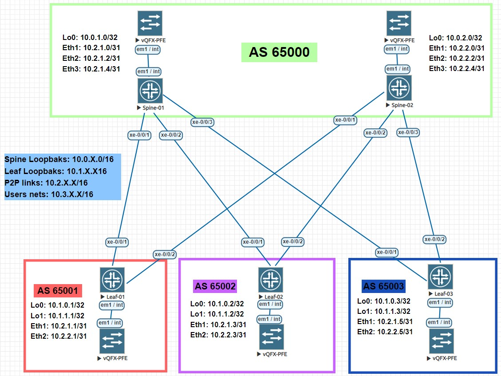

# LAB-04
# Underlay. BGP
### Цели
- Настроить BGP для Underlay сети.
### Схема сети

### Настройка оборудования
 <details>
<summary>  Настройка Spine-01: </summary>

```
#### Базовая настройка ####
set system host-name Spine-01
set system root-authentication encrypted-password "$6$hqZ84sgt$MfWryGCaFZwKx84RZiAwzBqbopiADxKrxv3Gz9It9BlkmA2E0f0wSCTCzC/ygyIXeINXOq6Pu5fPxyu4TgQ3L."

#### Настройка интерфейсов ####
set interfaces xe-0/0/1 description "### Link to Leaf-01 int xe-0/0/1 ###"
set interfaces xe-0/0/1 unit 0 family inet address 10.2.1.0/31
set interfaces xe-0/0/2 description "### Link to Leaf-02 int xe-0/0/1 ###"
set interfaces xe-0/0/2 unit 0 family inet address 10.2.1.2/31
set interfaces xe-0/0/3 description "### Link to Leaf-03 int xe-0/0/1 ###"
set interfaces xe-0/0/3 unit 0 family inet address 10.2.1.4/31
set interfaces em1 description "### Link to vQFX-PFE int em1 ###"
set interfaces em1 unit 0 family inet address 169.254.0.2/24
set interfaces lo0 unit 0 family inet address 10.0.1.0/32

#### Настройка eBGP ####
set routing-options router-id 10.0.1.0
set routing-options autonomous-system 65000
set policy-options policy-statement LOOPBACKS from family inet
set policy-options policy-statement LOOPBACKS from protocol direct
set policy-options policy-statement LOOPBACKS from route-filter 10.0.0.0/16 prefix-length-range /32-/32
set policy-options policy-statement LOOPBACKS then accept
set protocols bgp group UNDERLAY type external
set protocols bgp group UNDERLAY hold-time 15
set protocols bgp group UNDERLAY authentication-key "$9$dGbwgZGiP5F24PQF39CKMWxVw4aZ"
set protocols bgp group UNDERLAY export LOOPBACKS
set protocols bgp group UNDERLAY bfd-liveness-detection minimum-interval 200
set protocols bgp group UNDERLAY bfd-liveness-detection multiplier 3
set protocols bgp group UNDERLAY multipath multiple-as
set protocols bgp group UNDERLAY neighbor 10.2.1.1 peer-as 65001
set protocols bgp group UNDERLAY neighbor 10.2.1.3 peer-as 65002
set protocols bgp group UNDERLAY neighbor 10.2.1.5 peer-as 65003
```
</details>
 <details>
<summary>  Настройка Spine-02: </summary>

```
#### Базовая настройка ####
set system host-name Spine-02
set system root-authentication encrypted-password "$6$/AKK5DlV$InrdcbhZhwruBf5A.oLt1OmDpn95RtTOotNl.bZSbrS0q6bYDRJt7VMyXdqQaoRs.WWF1k7HLJDdN.fAZNHWC0"

#### Настройка интерфейсов ####
set interfaces xe-0/0/1 description "### Link to Leaf-01 int xe-0/0/2 ###"
set interfaces xe-0/0/1 unit 0 family inet address 10.2.2.0/31
set interfaces xe-0/0/2 description "### Link to Leaf-02 int xe-0/0/2 ###"
set interfaces xe-0/0/2 unit 0 family inet address 10.2.2.2/31
set interfaces xe-0/0/3 description "### Link to Leaf-03 int xe-0/0/2 ###"
set interfaces xe-0/0/3 unit 0 family inet address 10.2.2.4/31
set interfaces em1 description "### Link to vQFX-PFE int em1 ###"
set interfaces em1 unit 0 family inet address 169.254.0.2/24
set interfaces lo0 unit 0 family inet address 10.0.2.0/32

#### Настройка eBGP ####
set routing-options router-id 10.0.2.0
set routing-options autonomous-system 65000
set policy-options policy-statement LOOPBACKS from family inet
set policy-options policy-statement LOOPBACKS from protocol direct
set policy-options policy-statement LOOPBACKS from route-filter 10.0.0.0/16 prefix-length-range /32-/32
set policy-options policy-statement LOOPBACKS then accept
set protocols bgp group UNDERLAY type external
set protocols bgp group UNDERLAY hold-time 15
set protocols bgp group UNDERLAY authentication-key "$9$dGbwgZGiP5F24PQF39CKMWxVw4aZ"
set protocols bgp group UNDERLAY export LOOPBACKS
set protocols bgp group UNDERLAY bfd-liveness-detection minimum-interval 200
set protocols bgp group UNDERLAY bfd-liveness-detection multiplier 3
set protocols bgp group UNDERLAY multipath multiple-as
set protocols bgp group UNDERLAY neighbor 10.2.2.1 peer-as 65001
set protocols bgp group UNDERLAY neighbor 10.2.2.3 peer-as 65002
set protocols bgp group UNDERLAY neighbor 10.2.2.5 peer-as 65003
```
</details>
 <details>
<summary>  Настройка Leaf-01: </summary>

```
#### Базовая настройка ####
set system host-name Leaf-01
set system root-authentication encrypted-password "$6$C3utuWSm$iyj9X4bjJS3SlRSsvxnqB/ptTG63L66XHugTP7HaFViJnyY.ju3nYDXYoVAsoTpdA96BAI1h.DqvhByy5i1RP/"

#### Настройка интерфейсов ####
set interfaces xe-0/0/1 description "### Link to Spine-01 int xe-0/0/1 ###"
set interfaces xe-0/0/1 unit 0 family inet address 10.2.1.1/31
set interfaces xe-0/0/2 description "### Link to Spine-02 int xe-0/0/1 ###"
set interfaces xe-0/0/2 unit 0 family inet address 10.2.2.1/31
set interfaces em1 description "### Link to vQFX-PFE int em1 ###"
set interfaces em1 unit 0 family inet address 169.254.0.2/24
set interfaces lo0 unit 0 family inet address 10.1.0.1/32

#### Настройка eBGP и ECMP ####
set policy-options policy-statement LOAD_BALANCE then load-balance per-packet
set policy-options policy-statement LOAD_BALANCE then accept
set policy-options policy-statement LOOPBACKS from family inet
set policy-options policy-statement LOOPBACKS from protocol direct
set policy-options policy-statement LOOPBACKS from route-filter 10.1.0.0/16 prefix-length-range /32-/32
set policy-options policy-statement LOOPBACKS then accept
set routing-options router-id 10.1.0.1
set routing-options autonomous-system 65001
set routing-options forwarding-table export LOAD_BALANCE
set protocols bgp group UNDERLAY type external
set protocols bgp group UNDERLAY hold-time 15
set protocols bgp group UNDERLAY authentication-key "$9$aeZGimPQ/CujH/tu0IR-Vb2JGHqm"
set protocols bgp group UNDERLAY export LOOPBACKS
set protocols bgp group UNDERLAY bfd-liveness-detection minimum-interval 200
set protocols bgp group UNDERLAY bfd-liveness-detection multiplier 3
set protocols bgp group UNDERLAY multipath multiple-as
set protocols bgp group UNDERLAY neighbor 10.2.1.0 peer-as 65000
set protocols bgp group UNDERLAY neighbor 10.2.2.0 peer-as 65000
```
</details>
 <details>
<summary>  Настройка Leaf-02: </summary>

```
#### Базовая настройка ####
set system host-name Leaf-02
set system root-authentication encrypted-password "$6$8zmLFuf3$pAV26RgCBX7hIAuRPNGJagbYAmgiiPbUn/.C13Yeh3.RYL3N6nL60FVgvwpS3FVVyzMg2vxk3i9.yLfbTR1BO1"

#### Настройка интерфейсов ####
set interfaces xe-0/0/1 description "### Link to Spine-01 int xe-0/0/2 ###"
set interfaces xe-0/0/1 unit 0 family inet address 10.2.1.3/31
set interfaces xe-0/0/2 description "### Link to Spine-02 int xe-0/0/2 ###"
set interfaces xe-0/0/2 unit 0 family inet address 10.2.2.3/31
set interfaces em1 description "### Link to vQFX-PFE int em1 ###"
set interfaces em1 unit 0 family inet address 169.254.0.2/24
set interfaces lo0 unit 0 family inet address 10.1.0.2/32


#### Настройка eBGP и ECMP ####
set policy-options policy-statement LOAD_BALANCE then load-balance per-packet
set policy-options policy-statement LOAD_BALANCE then accept
set policy-options policy-statement LOOPBACKS from family inet
set policy-options policy-statement LOOPBACKS from protocol direct
set policy-options policy-statement LOOPBACKS from route-filter 10.1.0.0/16 prefix-length-range /32-/32
set policy-options policy-statement LOOPBACKS then accept
set routing-options router-id 10.1.0.2
set routing-options autonomous-system 65002
set routing-options forwarding-table export LOAD_BALANCE
set protocols bgp group UNDERLAY type external
set protocols bgp group UNDERLAY hold-time 15
set protocols bgp group UNDERLAY authentication-key "$9$O3F51IceK8-VYhS-wY2aJ36/tBISre"
set protocols bgp group UNDERLAY export LOOPBACKS
set protocols bgp group UNDERLAY bfd-liveness-detection minimum-interval 200
set protocols bgp group UNDERLAY bfd-liveness-detection multiplier 3
set protocols bgp group UNDERLAY multipath multiple-as
set protocols bgp group UNDERLAY neighbor 10.2.1.2 peer-as 65000
set protocols bgp group UNDERLAY neighbor 10.2.2.2 peer-as 65000
```
</details>
 <details>
<summary>  Настройка Leaf-03: </summary>

```
#### Базовая настройка ####
set system host-name Leaf-03
set system root-authentication encrypted-password "$6$9SmFzTVS$Qm1FZI/REBtmKMcVPG/wWhQP/GEvGOQRNq0/6KtfxNDOfyQQJctgcnHk6AwwCqGFj2TpPRJv8GRWeyz3iRdrK1"

#### Настройка интерфейсов ####
set interfaces xe-0/0/1 description "### Link to Spine-01 int xe-0/0/3 ###"
set interfaces xe-0/0/1 unit 0 family inet address 10.2.1.5/31
set interfaces xe-0/0/2 description "### Link to Spine-02 int xe-0/0/3 ###"
set interfaces xe-0/0/2 unit 0 family inet address 10.2.2.5/31
set interfaces em1 description "### Link to vQFX-PFE int em1 ###"
set interfaces em1 unit 0 family inet address 169.254.0.2/24
set interfaces lo0 unit 0 family inet address 10.1.0.3/32

#### Настройка BGP ####
set policy-options policy-statement LOAD_BALANCE then load-balance per-packet
set policy-options policy-statement LOAD_BALANCE then accept
set policy-options policy-statement LOOPBACKS from family inet
set policy-options policy-statement LOOPBACKS from protocol direct
set policy-options policy-statement LOOPBACKS from route-filter 10.1.0.0/16 prefix-length-range /32-/32
set policy-options policy-statement LOOPBACKS then accept
set routing-options router-id 10.1.0.3
set routing-options autonomous-system 65003
set routing-options forwarding-table export LOAD_BALANCE
set protocols bgp group UNDERLAY type external
set protocols bgp group UNDERLAY hold-time 15
set protocols bgp group UNDERLAY authentication-key "$9$aeZGimPQ/CujH/tu0IR-Vb2JGHqm"
set protocols bgp group UNDERLAY export LOOPBACKS
set protocols bgp group UNDERLAY bfd-liveness-detection minimum-interval 200
set protocols bgp group UNDERLAY bfd-liveness-detection multiplier 3
set protocols bgp group UNDERLAY multipath multiple-as
set protocols bgp group UNDERLAY neighbor 10.2.1.4 peer-as 65000
set protocols bgp group UNDERLAY neighbor 10.2.2.4 peer-as 65000
```
</details>

### Проверка настроек  

 <details>
<summary> Leaf-01: </summary>

```
root@Leaf-01> show bgp summary
Groups: 1 Peers: 2 Down peers: 0
Table          Tot Paths  Act Paths Suppressed    History Damp State    Pending
inet.0
                       6          6          0          0          0          0
Peer                     AS      InPkt     OutPkt    OutQ   Flaps Last Up/Dwn State|#Active/Received/Accepted/Damped...
10.2.1.0              65000      14421      14467       0       1    18:08:56 3/3/3/0              0/0/0/0
10.2.2.0              65000       4439       4458       0       4     5:35:28 3/3/3/0              0/0/0/0

{master:0}
root@Leaf-01> show bfd session
                                                  Detect   Transmit
Address                  State     Interface      Time     Interval  Multiplier
10.2.1.0                 Up        xe-0/0/1.0     0.600     0.200        3
10.2.2.0                 Up        xe-0/0/2.0     0.600     0.200        3

2 sessions, 2 clients
Cumulative transmit rate 10.0 pps, cumulative receive rate 10.0 pps

{master:0}
root@Leaf-01> show route protocol bgp

inet.0: 11 destinations, 13 routes (11 active, 0 holddown, 0 hidden)
+ = Active Route, - = Last Active, * = Both

10.0.1.0/32        *[BGP/170] 17:55:54, localpref 100
                      AS path: 65000 I, validation-state: unverified
                    > to 10.2.1.0 via xe-0/0/1.0
10.0.2.0/32        *[BGP/170] 05:35:37, localpref 100
                      AS path: 65000 I, validation-state: unverified
                    > to 10.2.2.0 via xe-0/0/2.0
10.1.0.2/32        *[BGP/170] 01:13:44, localpref 100
                      AS path: 65000 65002 I, validation-state: unverified
                      to 10.2.1.0 via xe-0/0/1.0
                    > to 10.2.2.0 via xe-0/0/2.0
                    [BGP/170] 01:13:44, localpref 100
                      AS path: 65000 65002 I, validation-state: unverified
                    > to 10.2.1.0 via xe-0/0/1.0
10.1.0.3/32        *[BGP/170] 05:35:37, localpref 100, from 10.2.1.0
                      AS path: 65000 65003 I, validation-state: unverified
                      to 10.2.1.0 via xe-0/0/1.0
                    > to 10.2.2.0 via xe-0/0/2.0
                    [BGP/170] 05:35:37, localpref 100
                      AS path: 65000 65003 I, validation-state: unverified
                    > to 10.2.2.0 via xe-0/0/2.0

inet6.0: 2 destinations, 2 routes (2 active, 0 holddown, 0 hidden)

{master:0}
root@Leaf-01> show route forwarding-table destination 10.1.0.2 table default
Routing table: default.inet
Internet:
Enabled protocols: Bridging,
Destination        Type RtRef Next hop           Type Index    NhRef Netif
10.1.0.2/32        user     0                    ulst   131070     3
                              10.2.1.0           ucst     1734     5 xe-0/0/1.0
                              10.2.2.0           ucst     1735     5 xe-0/0/2.0

{master:0}
root@Leaf-01> show route forwarding-table destination 10.1.0.3 table default
Routing table: default.inet
Internet:
Enabled protocols: Bridging,
Destination        Type RtRef Next hop           Type Index    NhRef Netif
10.1.0.3/32        user     0                    ulst   131070     3
                              10.2.1.0           ucst     1734     5 xe-0/0/1.0
                              10.2.2.0           ucst     1735     5 xe-0/0/2.0

{master:0}
root@Leaf-01> ping count 3 source 10.1.0.1 10.1.0.2
PING 10.1.0.2 (10.1.0.2): 56 data bytes
64 bytes from 10.1.0.2: icmp_seq=0 ttl=63 time=447.184 ms
64 bytes from 10.1.0.2: icmp_seq=1 ttl=63 time=557.027 ms
64 bytes from 10.1.0.2: icmp_seq=2 ttl=63 time=469.737 ms

--- 10.1.0.2 ping statistics ---
3 packets transmitted, 3 packets received, 0% packet loss
round-trip min/avg/max/stddev = 447.184/491.316/557.027/47.368 ms

{master:0}
root@Leaf-01> ping count 3 source 10.1.0.1 10.1.0.3
PING 10.1.0.3 (10.1.0.3): 56 data bytes
64 bytes from 10.1.0.3: icmp_seq=0 ttl=63 time=324.863 ms
64 bytes from 10.1.0.3: icmp_seq=1 ttl=63 time=326.041 ms
64 bytes from 10.1.0.3: icmp_seq=2 ttl=63 time=436.176 ms

--- 10.1.0.3 ping statistics ---
3 packets transmitted, 3 packets received, 0% packet loss
round-trip min/avg/max/stddev = 324.863/362.360/436.176/52.198 ms
```
</details>

 <details>
<summary> Leaf-02: </summary>

```
root@Leaf-02> show bgp summary
Groups: 1 Peers: 2 Down peers: 0
Table          Tot Paths  Act Paths Suppressed    History Damp State    Pending
inet.0
                       6          6          0          0          0          0
Peer                     AS      InPkt     OutPkt    OutQ   Flaps Last Up/Dwn State|#Active/Received/Accepted/Damped...
10.2.1.2              65000       1000       1000       0       1     1:15:15 3/3/3/0              0/0/0/0
10.2.2.2              65000       5853       5874       0       1     7:22:18 3/3/3/0              0/0/0/0

{master:0}
root@Leaf-02> show bfd session
                                                  Detect   Transmit
Address                  State     Interface      Time     Interval  Multiplier
10.2.1.2                 Up        xe-0/0/1.0     0.600     0.200        3
10.2.2.2                 Up        xe-0/0/2.0     0.600     0.200        3

2 sessions, 2 clients
Cumulative transmit rate 10.0 pps, cumulative receive rate 10.0 pps

{master:0}
root@Leaf-02> show route protocol bgp

inet.0: 11 destinations, 13 routes (11 active, 0 holddown, 0 hidden)
+ = Active Route, - = Last Active, * = Both

10.0.1.0/32        *[BGP/170] 01:15:24, localpref 100
                      AS path: 65000 I, validation-state: unverified
                    > to 10.2.1.2 via xe-0/0/1.0
10.0.2.0/32        *[BGP/170] 07:22:27, localpref 100
                      AS path: 65000 I, validation-state: unverified
                    > to 10.2.2.2 via xe-0/0/2.0
10.1.0.1/32        *[BGP/170] 01:15:24, localpref 100
                      AS path: 65000 65001 I, validation-state: unverified
                      to 10.2.1.2 via xe-0/0/1.0
                    > to 10.2.2.2 via xe-0/0/2.0
                    [BGP/170] 01:15:24, localpref 100
                      AS path: 65000 65001 I, validation-state: unverified
                    > to 10.2.1.2 via xe-0/0/1.0
10.1.0.3/32        *[BGP/170] 01:15:24, localpref 100
                      AS path: 65000 65003 I, validation-state: unverified
                      to 10.2.1.2 via xe-0/0/1.0
                    > to 10.2.2.2 via xe-0/0/2.0
                    [BGP/170] 01:15:24, localpref 100
                      AS path: 65000 65003 I, validation-state: unverified
                    > to 10.2.1.2 via xe-0/0/1.0

inet6.0: 2 destinations, 2 routes (2 active, 0 holddown, 0 hidden)

{master:0}
root@Leaf-02> ...able destination 10.1.0.1 table default
Routing table: default.inet
Internet:
Enabled protocols: Bridging,
Destination        Type RtRef Next hop           Type Index    NhRef Netif
10.1.0.1/32        user     0                    ulst   131070     3
                              10.2.1.2           ucst     1735     5 xe-0/0/1.0
                              10.2.2.2           ucst     1734     5 xe-0/0/2.0

{master:0}
root@Leaf-02> ...able destination 10.1.0.3 table default
Routing table: default.inet
Internet:
Enabled protocols: Bridging,
Destination        Type RtRef Next hop           Type Index    NhRef Netif
10.1.0.3/32        user     0                    ulst   131070     3
                              10.2.1.2           ucst     1735     5 xe-0/0/1.0
                              10.2.2.2           ucst     1734     5 xe-0/0/2.0

{master:0}
root@Leaf-02> ping count 3 source 10.1.0.2 10.1.0.1
PING 10.1.0.1 (10.1.0.1): 56 data bytes
64 bytes from 10.1.0.1: icmp_seq=0 ttl=63 time=334.942 ms
64 bytes from 10.1.0.1: icmp_seq=1 ttl=63 time=343.276 ms
64 bytes from 10.1.0.1: icmp_seq=2 ttl=63 time=346.507 ms

--- 10.1.0.1 ping statistics ---
3 packets transmitted, 3 packets received, 0% packet loss
round-trip min/avg/max/stddev = 334.942/341.575/346.507/4.872 ms

{master:0}
root@Leaf-02> ping count 3 source 10.1.0.2 10.1.0.3
PING 10.1.0.3 (10.1.0.3): 56 data bytes
64 bytes from 10.1.0.3: icmp_seq=0 ttl=63 time=331.235 ms
64 bytes from 10.1.0.3: icmp_seq=1 ttl=63 time=342.144 ms
64 bytes from 10.1.0.3: icmp_seq=2 ttl=63 time=356.837 ms

--- 10.1.0.3 ping statistics ---
3 packets transmitted, 3 packets received, 0% packet loss
round-trip min/avg/max/stddev = 331.235/343.405/356.837/10.490 ms
```
</details>

 <details>
<summary> Leaf-03: </summary>

```
root@Leaf-03> show bgp summary
Groups: 1 Peers: 2 Down peers: 0
Table          Tot Paths  Act Paths Suppressed    History Damp State    Pending
inet.0
                       6          6          0          0          0          0
Peer                     AS      InPkt     OutPkt    OutQ   Flaps Last Up/Dwn State|#Active/Received/Accepted/Damped...
10.2.1.4              65000      13451      13492       0       0    16:56:11 3/3/3/0              0/0/0/0
10.2.2.4              65000      10820      10839       0       1    13:36:41 3/3/3/0              0/0/0/0

{master:0}
root@Leaf-03> show bfd session
                                                  Detect   Transmit
Address                  State     Interface      Time     Interval  Multiplier
10.2.1.4                 Up        xe-0/0/1.0     0.600     0.200        3
10.2.2.4                 Up        xe-0/0/2.0     0.600     0.200        3

2 sessions, 2 clients
Cumulative transmit rate 10.0 pps, cumulative receive rate 10.0 pps

{master:0}
root@Leaf-03> show route protocol bgp

inet.0: 11 destinations, 13 routes (11 active, 0 holddown, 0 hidden)
+ = Active Route, - = Last Active, * = Both

10.0.1.0/32        *[BGP/170] 16:56:17, localpref 100
                      AS path: 65000 I, validation-state: unverified
                    > to 10.2.1.4 via xe-0/0/1.0
10.0.2.0/32        *[BGP/170] 13:36:48, localpref 100
                      AS path: 65000 I, validation-state: unverified
                    > to 10.2.2.4 via xe-0/0/2.0
10.1.0.1/32        *[BGP/170] 00:00:31, localpref 100, from 10.2.1.4
                      AS path: 65000 65001 I, validation-state: unverified
                      to 10.2.1.4 via xe-0/0/1.0
                    > to 10.2.2.4 via xe-0/0/2.0
                    [BGP/170] 00:00:31, localpref 100
                      AS path: 65000 65001 I, validation-state: unverified
                    > to 10.2.2.4 via xe-0/0/2.0
10.1.0.2/32        *[BGP/170] 01:17:24, localpref 100
                      AS path: 65000 65002 I, validation-state: unverified
                      to 10.2.1.4 via xe-0/0/1.0
                    > to 10.2.2.4 via xe-0/0/2.0
                    [BGP/170] 01:17:24, localpref 100
                      AS path: 65000 65002 I, validation-state: unverified
                    > to 10.2.1.4 via xe-0/0/1.0

inet6.0: 2 destinations, 2 routes (2 active, 0 holddown, 0 hidden)

{master:0}
root@Leaf-03> ...able destination 10.1.0.1 table default
Routing table: default.inet
Internet:
Enabled protocols: Bridging,
Destination        Type RtRef Next hop           Type Index    NhRef Netif
10.1.0.1/32        user     0                    ulst   131070     3
                              10.2.1.4           ucst     1734     5 xe-0/0/1.0
                              10.2.2.4           ucst     1735     5 xe-0/0/2.0

{master:0}
root@Leaf-03> ...able destination 10.1.0.2 table default
Routing table: default.inet
Internet:
Enabled protocols: Bridging,
Destination        Type RtRef Next hop           Type Index    NhRef Netif
10.1.0.2/32        user     0                    ulst   131070     3
                              10.2.1.4           ucst     1734     5 xe-0/0/1.0
                              10.2.2.4           ucst     1735     5 xe-0/0/2.0

{master:0}
root@Leaf-03> ping count 3 source 10.1.0.3 10.1.0.1
PING 10.1.0.1 (10.1.0.1): 56 data bytes
64 bytes from 10.1.0.1: icmp_seq=0 ttl=63 time=467.729 ms
64 bytes from 10.1.0.1: icmp_seq=1 ttl=63 time=378.116 ms
64 bytes from 10.1.0.1: icmp_seq=2 ttl=63 time=387.135 ms

--- 10.1.0.1 ping statistics ---
3 packets transmitted, 3 packets received, 0% packet loss
round-trip min/avg/max/stddev = 378.116/410.993/467.729/40.287 ms

{master:0}
root@Leaf-03> ping count 3 source 10.1.0.3 10.1.0.2
PING 10.1.0.2 (10.1.0.2): 56 data bytes
64 bytes from 10.1.0.2: icmp_seq=0 ttl=63 time=433.043 ms
64 bytes from 10.1.0.2: icmp_seq=1 ttl=63 time=343.014 ms
64 bytes from 10.1.0.2: icmp_seq=2 ttl=63 time=359.168 ms

--- 10.1.0.2 ping statistics ---
3 packets transmitted, 3 packets received, 0% packet loss
round-trip min/avg/max/stddev = 343.014/378.408/433.043/39.191 ms
```
</details>
