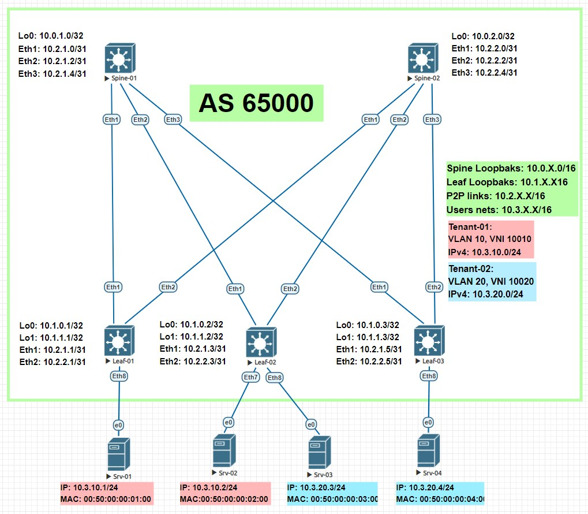

# LAB-05
# VxLAN. EVPN L2
### Цели
- Настроить Overlay на основе VxLAN EVPN для L2 связанности между клиентами.
### Схема сети

### Настройка оборудования
 <details>
<summary>  Настройка Spine-01: </summary>

```
#### Базовая настройка ####
hostname Spine-01
terminal width 250
username admin privilege 15 role network-admin secret sha512 $6$V/UTnBIIFB18Cw1L$RE5uJmJfjGnLeLRqERxwBH3lJ/YidTa2O/5oviIYzLb1dzkz/rAEzn91Qvyx7eIR5aHTQ/dtAGxyebZy7jnMt/
aaa authorization serial-console
aaa authorization exec default local
ip routing
route-map LOOPBAKS permit 10
   match interface Loopback0

#### Настройка интерфейсов ####
interface Ethernet1
   description ### Link to Leaf-01 int Eth1 ###
   no switchport
   ip address 10.2.1.0/31
   bfd interval 50 min-rx 50 multiplier 3
interface Ethernet2
   description ### Link to Leaf-02 int Eth1 ###
   no switchport
   ip address 10.2.1.2/31
   bfd interval 50 min-rx 50 multiplier 3
interface Ethernet3
   description ### Link to Leaf-03 int Eth1 ###
   no switchport
   ip address 10.2.1.4/31
   bfd interval 50 min-rx 50 multiplier 3
interface Loopback0
   ip address 10.0.1.0/32

#### Настройка BGP ####
router bgp 65000
   router-id 10.0.1.0
   bgp listen range 10.2.0.0/16 peer-group LEAF remote-as 65000
   bgp listen range 10.1.0.0/16 peer-group VXLAN remote-as 65000
   neighbor LEAF peer group
   neighbor LEAF next-hop-self
   neighbor LEAF bfd
   neighbor LEAF route-reflector-client
   neighbor LEAF timers 5 15
   neighbor LEAF password 7 n1ehpTkR6OzDbuUgsQd1sQ==
   neighbor VXLAN peer group
   neighbor VXLAN update-source Loopback0
   neighbor VXLAN bfd
   neighbor VXLAN route-reflector-client
   neighbor VXLAN timers 5 15
   neighbor VXLAN password 7 BBGRh1MqInmF4hdb+bokKg==
   neighbor VXLAN send-community
   redistribute connected route-map LOOPBAKS
   address-family evpn
      neighbor VXLAN activate
   address-family ipv4
      no neighbor VXLAN activate
```
</details>
 <details>
<summary>  Настройка Spine-02: </summary>

```
#### Базовая настройка ####
set system host-name Spine-02
delete interfaces
set interfaces xe-0/0/1 description "### Link to Leaf-01 int xe-0/0/2 ###"
set interfaces xe-0/0/1.0 family inet address 10.2.2.0/31
set interfaces xe-0/0/2 description "### Link to Leaf-02 int xe-0/0/2 ###"
set interfaces xe-0/0/2.0 family inet address 10.2.2.2/31
set interfaces xe-0/0/3 description "### Link to Leaf-03 int xe-0/0/2 ###"
set interfaces xe-0/0/3.0 family inet address 10.2.2.4/31
set interfaces em1 description "### Link to vQFX-PFE int em1 ###"
set interfaces em1.0 family inet address 169.254.0.2/24
set interfaces lo0.0 family inet address 10.0.2.0/32

#### Настройка IS-IS ####
set interfaces lo0.0 family iso address 49.0001.0100.0000.2000.00
set interfaces xe-0/0/1.0 family iso
set interfaces xe-0/0/2.0 family iso
set interfaces xe-0/0/3.0 family iso
set protocols isis level 2 wide-metrics-only
set protocols isis level 1 disable
set protocols isis interface xe-0/0/1.0 point-to-point
set protocols isis interface xe-0/0/1.0 family inet bfd-liveness-detection minimum-interval 200 multiplier 3
set protocols isis interface xe-0/0/1.0 level 2 metric 10
set protocols isis interface xe-0/0/1.0 level 2 hello-authentication-key "$9$rO9eLNY2aGUHM8UjH.5TreK8Nd"
set protocols isis interface xe-0/0/1.0 level 2 hello-authentication-type md5
set protocols isis interface xe-0/0/2.0 point-to-point
set protocols isis interface xe-0/0/2.0 family inet bfd-liveness-detection minimum-interval 200 multiplier 3
set protocols isis interface xe-0/0/2.0 level 2 metric 10
set protocols isis interface xe-0/0/2.0 level 2 hello-authentication-key "$9$rO9eLNY2aGUHM8UjH.5TreK8Nd"
set protocols isis interface xe-0/0/2.0 level 2 hello-authentication-type md5
set protocols isis interface xe-0/0/3.0 point-to-point
set protocols isis interface xe-0/0/3.0 family inet bfd-liveness-detection minimum-interval 200 multiplier 3
set protocols isis interface xe-0/0/3.0 level 2 metric 10
set protocols isis interface xe-0/0/3.0 level 2 hello-authentication-key "$9$rO9eLNY2aGUHM8UjH.5TreK8Nd"
set protocols isis interface xe-0/0/3.0 level 2 hello-authentication-type md5
set protocols isis interface interface lo0.0 passive
```
</details>
 <details>
<summary>  Настройка Leaf-01: </summary>

```
#### Базовая настройка ####
set system host-name Leaf-01
delete interfaces
set interfaces xe-0/0/1 "### Link to Spine-01 int xe-0/0/1 ###"
set interfaces xe-0/0/1.0 family inet address 10.2.1.1/31
set interfaces xe-0/0/2 "### Link to Spine-02 int xe-0/0/1 ###"
set interfaces xe-0/0/2.0 family inet address 10.2.2.1/31
set interfaces em1 description "### Link to vQFX-PFE int em1 ###"
set interfaces em1.0 family inet address 169.254.0.2/24
set interfaces lo0.0 family inet address 10.1.1.1/32

#### Настройка IS-IS ####
set interfaces lo0.0 family iso address 49.0001.0100.0100.1001.00
set interfaces xe-0/0/1.0 family iso
set interfaces xe-0/0/2.0 family iso
set protocols isis level 2 wide-metrics-only
set protocols isis level 1 disable
set protocols isis interface xe-0/0/1.0 point-to-point
set protocols isis interface xe-0/0/1.0 family inet bfd-liveness-detection minimum-interval 200 multiplier 3
set protocols isis interface xe-0/0/1.0 level 2 metric 10
set protocols isis interface xe-0/0/1.0 level 2 hello-authentication-key "$9$t0AHuRSMWx-dsBIdbsgJZtu0ISr"
set protocols isis interface xe-0/0/1.0 level 2 hello-authentication-type md5
set protocols isis interface xe-0/0/2.0 point-to-point
set protocols isis interface xe-0/0/2.0 family inet bfd-liveness-detection minimum-interval 200 multiplier 3
set protocols isis interface xe-0/0/2.0 level 2 metric 10
set protocols isis interface xe-0/0/2.0 level 2 hello-authentication-key "$9$t0AHuRSMWx-dsBIdbsgJZtu0ISr"
set protocols isis interface xe-0/0/2.0 level 2 hello-authentication-type md5
set protocols isis interface interface lo0.0 passive
```
</details>
 <details>
<summary>  Настройка Leaf-02: </summary>

```
#### Базовая настройка ####
set system host-name Leaf-02
delete interfaces
set interfaces xe-0/0/1 "### Link to Spine-01 int xe-0/0/2 ###"
set interfaces xe-0/0/1.0 family inet address 10.2.1.3/31
set interfaces xe-0/0/2 "### Link to Spine-02 int xe-0/0/2 ###"
set interfaces xe-0/0/2.0 family inet address 10.2.2.3/31
set interfaces em1 description "### Link to vQFX-PFE int em1 ###"
set interfaces em1.0 family inet address 169.254.0.2/24
set interfaces lo0.0 family inet address 10.1.1.2/32

#### Настройка IS-IS ####
set interfaces lo0.0 family iso address 49.0001.0100.0100.1002.00
set interfaces xe-0/0/1.0 family iso
set interfaces xe-0/0/2.0 family iso
set protocols isis level 2 wide-metrics-only
set protocols isis level 1 disable
set protocols isis interface xe-0/0/1.0 point-to-point
set protocols isis interface xe-0/0/1.0 family inet bfd-liveness-detection minimum-interval 200 multiplier 3
set protocols isis interface xe-0/0/1.0 level 2 metric 10
set protocols isis interface xe-0/0/1.0 level 2 hello-authentication-key "$9$Q835FCuEhrKvL69vWL7VbQF39uO"
set protocols isis interface xe-0/0/1.0 level 2 hello-authentication-type md5
set protocols isis interface xe-0/0/2.0 point-to-point
set protocols isis interface xe-0/0/2.0 family inet bfd-liveness-detection minimum-interval 200 multiplier 3
set protocols isis interface xe-0/0/2.0 level 2 metric 10
set protocols isis interface xe-0/0/2.0 level 2 hello-authentication-key "$9$Q835FCuEhrKvL69vWL7VbQF39uO"
set protocols isis interface xe-0/0/2.0 level 2 hello-authentication-type md5
set protocols isis interface interface lo0.0 passive
```
</details>
 <details>
<summary>  Настройка Leaf-03: </summary>

```
#### Базовая настройка ####
set system host-name Leaf-03
delete interfaces
set interfaces xe-0/0/1 "### Link to Spine-01 int xe-0/0/3 ###"
set interfaces xe-0/0/1.0 family inet address 10.2.1.5/31
set interfaces xe-0/0/2 "### Link to Spine-02 int xe-0/0/3 ###"
set interfaces xe-0/0/2.0 family inet address 10.2.2.5/31
set interfaces em1 description "### Link to vQFX-PFE int em1 ###"
set interfaces em1.0 family inet address 169.254.0.2/24
set interfaces lo0.0 family inet address 10.1.1.3/32

#### Настройка IS-IS ####
set interfaces lo0.0 family iso address 49.0001.0100.0100.1003.00
set interfaces xe-0/0/1.0 family iso
set interfaces xe-0/0/2.0 family iso
set protocols isis level 2 wide-metrics-only
set protocols isis level 1 disable
set protocols isis interface xe-0/0/1.0 point-to-point
set protocols isis interface xe-0/0/1.0 family inet bfd-liveness-detection minimum-interval 200 multiplier 3
set protocols isis interface xe-0/0/1.0 level 2 metric 10
set protocols isis interface xe-0/0/1.0 level 2 hello-authentication-key "$9$ojJi.zF/AtOUjtuOIcSoJZj.P"
set protocols isis interface xe-0/0/1.0 level 2 hello-authentication-type md5
set protocols isis interface xe-0/0/2.0 point-to-point
set protocols isis interface xe-0/0/2.0 family inet bfd-liveness-detection minimum-interval 200 multiplier 3
set protocols isis interface xe-0/0/2.0 level 2 metric 10
set protocols isis interface xe-0/0/2.0 level 2 hello-authentication-key "$9$ojJi.zF/AtOUjtuOIcSoJZj.P"
set protocols isis interface xe-0/0/2.0 level 2 hello-authentication-type md5
set protocols isis interface interface lo0.0 passive
```
</details>

### Проверка настроек  

 <details>
<summary> Leaf-01: </summary>

```
root@Leaf-01> show isis adjacency
Interface             System         L State        Hold (secs) SNPA
xe-0/0/1.0            Spine-01       2  Up                   20
xe-0/0/2.0            Spine-02       2  Up                   26

{master:0}
root@Leaf-01> show bfd session
                                                  Detect   Transmit
Address                  State     Interface      Time     Interval  Multiplier
10.2.1.0                 Up        xe-0/0/1.0     0.600     0.200        3
10.2.2.0                 Up        xe-0/0/2.0     0.600     0.200        3

2 sessions, 2 clients
Cumulative transmit rate 10.0 pps, cumulative receive rate 10.0 pps

{master:0}
root@Leaf-01> show route protocol isis

inet.0: 15 destinations, 15 routes (15 active, 0 holddown, 0 hidden)
+ = Active Route, - = Last Active, * = Both

10.0.1.0/32        *[IS-IS/18] 16:17:34, metric 10
                    > to 10.2.1.0 via xe-0/0/1.0
10.0.2.0/32        *[IS-IS/18] 09:40:55, metric 10
                    > to 10.2.2.0 via xe-0/0/2.0
10.1.1.2/32        *[IS-IS/18] 09:40:55, metric 20
                      to 10.2.1.0 via xe-0/0/1.0
                    > to 10.2.2.0 via xe-0/0/2.0
10.1.1.3/32        *[IS-IS/18] 05:23:44, metric 20
                      to 10.2.1.0 via xe-0/0/1.0
                    > to 10.2.2.0 via xe-0/0/2.0
10.2.1.2/31        *[IS-IS/18] 16:17:34, metric 20
                    > to 10.2.1.0 via xe-0/0/1.0
10.2.1.4/31        *[IS-IS/18] 16:17:34, metric 20
                    > to 10.2.1.0 via xe-0/0/1.0
10.2.2.2/31        *[IS-IS/18] 09:40:55, metric 20
                    > to 10.2.2.0 via xe-0/0/2.0
10.2.2.4/31        *[IS-IS/18] 09:40:55, metric 20
                    > to 10.2.2.0 via xe-0/0/2.0

iso.0: 1 destinations, 1 routes (1 active, 0 holddown, 0 hidden)

inet6.0: 2 destinations, 2 routes (2 active, 0 holddown, 0 hidden)

{master:0}
root@Leaf-01> ping 10.1.1.2 count 3
PING 10.1.1.2 (10.1.1.2): 56 data bytes
64 bytes from 10.1.1.2: icmp_seq=0 ttl=63 time=369.098 ms
64 bytes from 10.1.1.2: icmp_seq=1 ttl=63 time=377.741 ms
64 bytes from 10.1.1.2: icmp_seq=2 ttl=63 time=286.931 ms

--- 10.1.1.2 ping statistics ---
3 packets transmitted, 3 packets received, 0% packet loss
round-trip min/avg/max/stddev = 286.931/344.590/377.741/40.923 ms

{master:0}
root@Leaf-01> ping 10.1.1.3 count 3
PING 10.1.1.3 (10.1.1.3): 56 data bytes
64 bytes from 10.1.1.3: icmp_seq=0 ttl=63 time=404.894 ms
64 bytes from 10.1.1.3: icmp_seq=1 ttl=63 time=326.446 ms
64 bytes from 10.1.1.3: icmp_seq=2 ttl=63 time=340.421 ms

--- 10.1.1.3 ping statistics ---
3 packets transmitted, 3 packets received, 0% packet loss
round-trip min/avg/max/stddev = 326.446/357.254/404.894/34.167 ms
```
</details>

 <details>
<summary> Leaf-02: </summary>

```
root@Leaf-02> show isis adjacency
Interface             System         L State        Hold (secs) SNPA
xe-0/0/1.0            Spine-01       2  Up                   25
xe-0/0/2.0            Spine-02       2  Up                   24

{master:0}
root@Leaf-02> show bfd session
                                                  Detect   Transmit
Address                  State     Interface      Time     Interval  Multiplier
10.2.1.2                 Up        xe-0/0/1.0     0.600     0.200        3
10.2.2.2                 Up        xe-0/0/2.0     0.600     0.200        3

2 sessions, 2 clients
Cumulative transmit rate 10.0 pps, cumulative receive rate 10.0 pps

{master:0}
root@Leaf-02> show route protocol isis

inet.0: 15 destinations, 15 routes (15 active, 0 holddown, 0 hidden)
+ = Active Route, - = Last Active, * = Both

10.0.1.0/32        *[IS-IS/18] 14:02:32, metric 10
                    > to 10.2.1.2 via xe-0/0/1.0
10.0.2.0/32        *[IS-IS/18] 10:14:29, metric 10
                    > to 10.2.2.2 via xe-0/0/2.0
10.1.1.1/32        *[IS-IS/18] 09:43:40, metric 20
                      to 10.2.1.2 via xe-0/0/1.0
                    > to 10.2.2.2 via xe-0/0/2.0
10.1.1.3/32        *[IS-IS/18] 05:26:30, metric 20
                      to 10.2.1.2 via xe-0/0/1.0
                    > to 10.2.2.2 via xe-0/0/2.0
10.2.1.0/31        *[IS-IS/18] 14:02:32, metric 20
                    > to 10.2.1.2 via xe-0/0/1.0
10.2.1.4/31        *[IS-IS/18] 14:02:32, metric 20
                    > to 10.2.1.2 via xe-0/0/1.0
10.2.2.0/31        *[IS-IS/18] 10:14:29, metric 20
                    > to 10.2.2.2 via xe-0/0/2.0
10.2.2.4/31        *[IS-IS/18] 10:14:29, metric 20
                    > to 10.2.2.2 via xe-0/0/2.0

iso.0: 1 destinations, 1 routes (1 active, 0 holddown, 0 hidden)

inet6.0: 2 destinations, 2 routes (2 active, 0 holddown, 0 hidden)

{master:0}
root@Leaf-02> ping 10.1.1.1 count 3
PING 10.1.1.1 (10.1.1.1): 56 data bytes
64 bytes from 10.1.1.1: icmp_seq=0 ttl=63 time=478.965 ms
64 bytes from 10.1.1.1: icmp_seq=1 ttl=63 time=386.188 ms
64 bytes from 10.1.1.1: icmp_seq=2 ttl=63 time=397.866 ms

--- 10.1.1.1 ping statistics ---
3 packets transmitted, 3 packets received, 0% packet loss
round-trip min/avg/max/stddev = 386.188/421.006/478.965/41.259 ms

{master:0}
root@Leaf-02> ping 10.1.1.3 count 3
PING 10.1.1.3 (10.1.1.3): 56 data bytes
64 bytes from 10.1.1.3: icmp_seq=0 ttl=63 time=429.469 ms
64 bytes from 10.1.1.3: icmp_seq=1 ttl=63 time=446.259 ms
64 bytes from 10.1.1.3: icmp_seq=2 ttl=63 time=447.246 ms

--- 10.1.1.3 ping statistics ---
3 packets transmitted, 3 packets received, 0% packet loss
round-trip min/avg/max/stddev = 429.469/440.991/447.246/8.157 ms
```
</details>

 <details>
<summary> Leaf-03: </summary>

```
root@Leaf-03> show isis adjacency
Interface             System         L State        Hold (secs) SNPA
xe-0/0/1.0            Spine-01       2  Up                   19
xe-0/0/2.0            Spine-02       2  Up                   20

{master:0}
root@Leaf-03> show bfd session
                                                  Detect   Transmit
Address                  State     Interface      Time     Interval  Multiplier
10.2.1.4                 Up        xe-0/0/1.0     0.600     0.200        3
10.2.2.4                 Up        xe-0/0/2.0     0.600     0.200        3

2 sessions, 2 clients
Cumulative transmit rate 10.0 pps, cumulative receive rate 10.0 pps

{master:0}
root@Leaf-03> show route protocol isis

inet.0: 15 destinations, 15 routes (15 active, 0 holddown, 0 hidden)
+ = Active Route, - = Last Active, * = Both

10.0.1.0/32        *[IS-IS/18] 05:28:31, metric 10
                    > to 10.2.1.4 via xe-0/0/1.0
10.0.2.0/32        *[IS-IS/18] 23:10:20, metric 10
                    > to 10.2.2.4 via xe-0/0/2.0
10.1.1.1/32        *[IS-IS/18] 05:28:31, metric 20
                      to 10.2.1.4 via xe-0/0/1.0
                    > to 10.2.2.4 via xe-0/0/2.0
10.1.1.2/32        *[IS-IS/18] 05:28:31, metric 20
                      to 10.2.1.4 via xe-0/0/1.0
                    > to 10.2.2.4 via xe-0/0/2.0
10.2.1.0/31        *[IS-IS/18] 05:28:31, metric 20
                    > to 10.2.1.4 via xe-0/0/1.0
10.2.1.2/31        *[IS-IS/18] 05:28:31, metric 20
                    > to 10.2.1.4 via xe-0/0/1.0
10.2.2.0/31        *[IS-IS/18] 23:10:20, metric 20
                    > to 10.2.2.4 via xe-0/0/2.0
10.2.2.2/31        *[IS-IS/18] 23:10:20, metric 20
                    > to 10.2.2.4 via xe-0/0/2.0

iso.0: 1 destinations, 1 routes (1 active, 0 holddown, 0 hidden)

inet6.0: 2 destinations, 2 routes (2 active, 0 holddown, 0 hidden)

{master:0}
root@Leaf-03> ping 10.1.1.1 count 3
PING 10.1.1.1 (10.1.1.1): 56 data bytes
64 bytes from 10.1.1.1: icmp_seq=0 ttl=63 time=415.650 ms
64 bytes from 10.1.1.1: icmp_seq=1 ttl=63 time=321.459 ms
64 bytes from 10.1.1.1: icmp_seq=2 ttl=63 time=331.700 ms

--- 10.1.1.1 ping statistics ---
3 packets transmitted, 3 packets received, 0% packet loss
round-trip min/avg/max/stddev = 321.459/356.270/415.650/42.196 ms

{master:0}
root@Leaf-03> ping 10.1.1.2 count 3
PING 10.1.1.2 (10.1.1.2): 56 data bytes
64 bytes from 10.1.1.2: icmp_seq=0 ttl=63 time=325.547 ms
64 bytes from 10.1.1.2: icmp_seq=1 ttl=63 time=332.095 ms
64 bytes from 10.1.1.2: icmp_seq=2 ttl=63 time=342.325 ms

--- 10.1.1.2 ping statistics ---
3 packets transmitted, 3 packets received, 0% packet loss
round-trip min/avg/max/stddev = 325.547/333.322/342.325/6.904 ms
```
</details>
