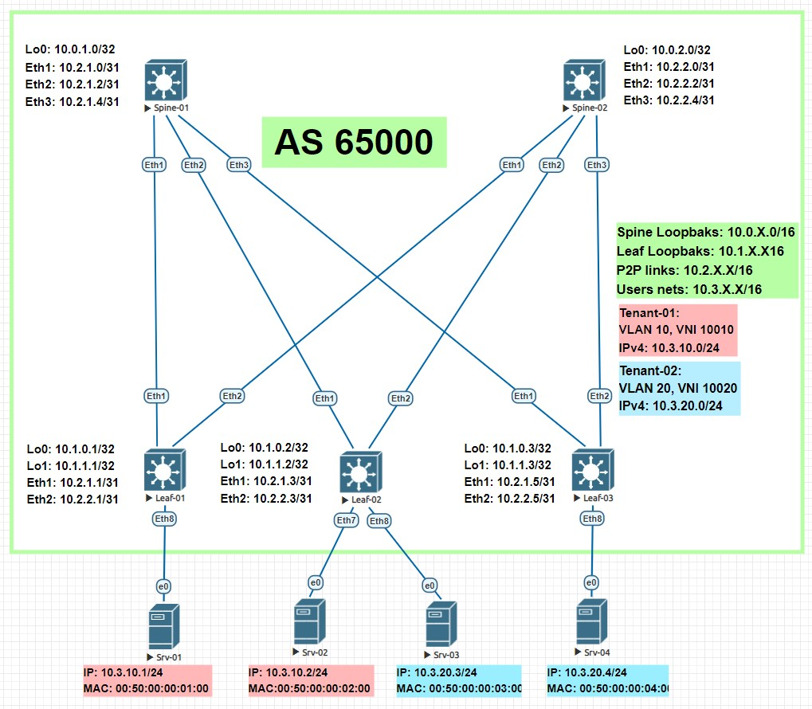

# LAB-05
# VxLAN. EVPN L2
### Цели
- Настроить Overlay на основе VxLAN EVPN для L2 связанности между клиентами.
### Схема сети

### Настройка оборудования
 <details>
<summary>  Настройка Spine-01: </summary>

```
#### Базовая настройка ####
hostname Spine-01
service routing protocols model multi-agent
terminal width 250
username admin privilege 15 role network-admin secret sha512 $6$V/UTnBIIFB18Cw1L$RE5uJmJfjGnLeLRqERxwBH3lJ/YidTa2O/5oviIYzLb1dzkz/rAEzn91Qvyx7eIR5aHTQ/dtAGxyebZy7jnMt/
aaa authorization serial-console
aaa authorization exec default local
ip routing
route-map LOOPBAKS permit 10
   match interface Loopback0

#### Настройка интерфейсов ####
interface Ethernet1
   description ### Link to Leaf-01 int Eth1 ###
   no switchport
   ip address 10.2.1.0/31
   bfd interval 50 min-rx 50 multiplier 3
interface Ethernet2
   description ### Link to Leaf-02 int Eth1 ###
   no switchport
   ip address 10.2.1.2/31
   bfd interval 50 min-rx 50 multiplier 3
interface Ethernet3
   description ### Link to Leaf-03 int Eth1 ###
   no switchport
   ip address 10.2.1.4/31
   bfd interval 50 min-rx 50 multiplier 3
interface Loopback0
   ip address 10.0.1.0/32

#### Настройка BGP ####
router bgp 65000
   router-id 10.0.1.0
   bgp listen range 10.2.0.0/16 peer-group LEAF remote-as 65000
   bgp listen range 10.1.0.0/16 peer-group VXLAN remote-as 65000
   neighbor LEAF peer group
   neighbor LEAF next-hop-self
   neighbor LEAF bfd
   neighbor LEAF route-reflector-client
   neighbor LEAF timers 5 15
   neighbor LEAF password 7 n1ehpTkR6OzDbuUgsQd1sQ==
   neighbor VXLAN peer group
   neighbor VXLAN update-source Loopback0
   neighbor VXLAN bfd
   neighbor VXLAN route-reflector-client
   neighbor VXLAN timers 5 15
   neighbor VXLAN password 7 BBGRh1MqInmF4hdb+bokKg==
   neighbor VXLAN send-community
   redistribute connected route-map LOOPBAKS
   address-family evpn
      neighbor VXLAN activate
   address-family ipv4
      no neighbor VXLAN activate
```
</details>
 <details>
<summary>  Настройка Spine-02: </summary>

```
#### Базовая настройка ####
hostname Spine-02
service routing protocols model multi-agent
terminal width 250
username admin privilege 15 role network-admin secret sha512 $6$V/UTnBIIFB18Cw1L$RE5uJmJfjGnLeLRqERxwBH3lJ/YidTa2O/5oviIYzLb1dzkz/rAEzn91Qvyx7eIR5aHTQ/dtAGxyebZy7jnMt/
aaa authorization serial-console
aaa authorization exec default local
ip routing
route-map LOOPBAKS permit 10
   match interface Loopback0

#### Настройка интерфейсов ####
interface Ethernet1
   description ### Link to Leaf-01 int Eth2 ###
   no switchport
   ip address 10.2.2.0/31
   bfd interval 50 min-rx 50 multiplier 3
interface Ethernet2
   description ### Link to Leaf-02 int Eth2 ###
   no switchport
   ip address 10.2.2.2/31
   bfd interval 50 min-rx 50 multiplier 3
interface Ethernet3
   description ### Link to Leaf-03 int Eth2 ###
   no switchport
   ip address 10.2.2.4/31
   bfd interval 50 min-rx 50 multiplier 3
interface Loopback0
   ip address 10.0.2.0/32

#### Настройка BGP ####
router bgp 65000
   router-id 10.0.2.0
   bgp listen range 10.2.0.0/16 peer-group LEAF remote-as 65000
   bgp listen range 10.1.0.0/16 peer-group VXLAN remote-as 65000
   neighbor LEAF peer group
   neighbor LEAF next-hop-self
   neighbor LEAF bfd
   neighbor LEAF route-reflector-client
   neighbor LEAF timers 5 15
   neighbor LEAF password 7 n1ehpTkR6OzDbuUgsQd1sQ==
   neighbor VXLAN peer group
   neighbor VXLAN update-source Loopback0
   neighbor VXLAN bfd
   neighbor VXLAN route-reflector-client
   neighbor VXLAN timers 5 15
   neighbor VXLAN password 7 BBGRh1MqInmF4hdb+bokKg==
   neighbor VXLAN send-community
   redistribute connected route-map LOOPBAKS
   address-family evpn
      neighbor VXLAN activate
   address-family ipv4
      no neighbor VXLAN activate
```
</details>
 <details>
<summary>  Настройка Leaf-01: </summary>

```
#### Базовая настройка ####
hostname Leaf-01
service routing protocols model multi-agent
terminal width 250
username admin privilege 15 role network-admin secret sha512 $6$V/UTnBIIFB18Cw1L$RE5uJmJfjGnLeLRqERxwBH3lJ/YidTa2O/5oviIYzLb1dzkz/rAEzn91Qvyx7eIR5aHTQ/dtAGxyebZy7jnMt/
aaa authorization serial-console
aaa authorization exec default local
ip routing
route-map LOOPBAKS permit 10
   match interface Loopback0
route-map LOOPBAKS permit 20
   match interface Loopback1
vlan 10

#### Настройка интерфейсов ####
interface Ethernet1
   description ### Link to Spine-01 int Eth1 ###
   no switchport
   ip address 10.2.1.1/31
   bfd interval 50 min-rx 50 multiplier 3
interface Ethernet2
   description ### Link to Spine-02 int Eth1 ###
   no switchport
   ip address 10.2.2.1/31
   bfd interval 50 min-rx 50 multiplier 3
interface Loopback0
   ip address 10.1.0.1/32
interface Loopback1
   ip address 10.1.1.1/32
interface Vxlan1
   vxlan source-interface Loopback1
   vxlan udp-port 4789
   vxlan vlan 10 vni 10010

#### Настройка BGP ####
router bgp 65000
   router-id 10.1.0.1
   maximum-paths 32
   neighbor SPINE peer group
   neighbor SPINE remote-as 65000
   neighbor SPINE bfd
   neighbor SPINE timers 5 15
   neighbor SPINE password 7 46uUt2hZxViJORtPt/8sQQ==
   neighbor VXLAN peer group
   neighbor VXLAN remote-as 65000
   neighbor VXLAN update-source Loopback0
   neighbor VXLAN bfd
   neighbor VXLAN timers 5 15
   neighbor VXLAN password 7 BBGRh1MqInmF4hdb+bokKg==
   neighbor VXLAN send-community
   neighbor 10.0.1.0 peer group VXLAN
   neighbor 10.0.2.0 peer group VXLAN
   neighbor 10.2.1.0 peer group SPINE
   neighbor 10.2.2.0 peer group SPINE
   redistribute connected route-map LOOPBAKS
   vlan 10
      rd 10.1.0.1:10010
      route-target both 65000:10010
      redistribute learned
   address-family evpn
      neighbor VXLAN activate
   address-family ipv4
      no neighbor VXLAN activate
```
</details>
 <details>
<summary>  Настройка Leaf-02: </summary>

```
#### Базовая настройка ####
hostname Leaf-02
service routing protocols model multi-agent
terminal width 250
username admin privilege 15 role network-admin secret sha512 $6$V/UTnBIIFB18Cw1L$RE5uJmJfjGnLeLRqERxwBH3lJ/YidTa2O/5oviIYzLb1dzkz/rAEzn91Qvyx7eIR5aHTQ/dtAGxyebZy7jnMt/
aaa authorization serial-console
aaa authorization exec default local
ip routing
route-map LOOPBAKS permit 10
   match interface Loopback0
route-map LOOPBAKS permit 20
   match interface Loopback1
vlan 10,20

#### Настройка интерфейсов ####
interface Ethernet1
   description ### Link to Spine-01 int Eth2 ###
   no switchport 
   ip address 10.2.1.3/31
   bfd interval 50 min-rx 50 multiplier 3
interface Ethernet2
   description ### Link to Spine-02 int Eth2 ###
   no switchport
   ip address 10.2.2.3/31
   bfd interval 50 min-rx 50 multiplier 3
interface Loopback0
   ip address 10.1.0.2/32
interface Loopback1
   ip address 10.1.1.2/32
interface Vxlan1
   vxlan source-interface Loopback1
   vxlan udp-port 4789
   vxlan vlan 10 vni 10010
   vxlan vlan 20 vni 10020


#### Настройка BGP ####
router bgp 65000
   router-id 10.1.0.2
   maximum-paths 32
   neighbor SPINE peer group
   neighbor SPINE remote-as 65000
   neighbor SPINE bfd
   neighbor SPINE timers 5 15
   neighbor SPINE password 7 46uUt2hZxViJORtPt/8sQQ==
   neighbor VXLAN peer group
   neighbor VXLAN remote-as 65000
   neighbor VXLAN update-source Loopback0
   neighbor VXLAN bfd
   neighbor VXLAN timers 5 15
   neighbor VXLAN password 7 BBGRh1MqInmF4hdb+bokKg==
   neighbor VXLAN send-community
   neighbor 10.0.1.0 peer group VXLAN
   neighbor 10.0.2.0 peer group VXLAN
   neighbor 10.2.1.2 peer group SPINE
   neighbor 10.2.2.2 peer group SPINE
   redistribute connected route-map LOOPBAKS
   vlan 10
      rd 10.1.0.2:10010
      route-target both 65000:10010
      redistribute learned
   vlan 20
      rd 10.1.0.2:10010
      route-target both 65000:10020
      redistribute learned
   address-family evpn
      neighbor VXLAN activate
   address-family ipv4
      no neighbor VXLAN activate
```
</details>
 <details>
<summary>  Настройка Leaf-03: </summary>

```
#### Базовая настройка ####
hostname Leaf-03
service routing protocols model multi-agent
terminal width 250
username admin privilege 15 role network-admin secret sha512 $6$V/UTnBIIFB18Cw1L$RE5uJmJfjGnLeLRqERxwBH3lJ/YidTa2O/5oviIYzLb1dzkz/rAEzn91Qvyx7eIR5aHTQ/dtAGxyebZy7jnMt/
aaa authorization serial-console
aaa authorization exec default local
ip routing
route-map LOOPBAKS permit 10
   match interface Loopback0
route-map LOOPBAKS permit 20
   match interface Loopback1
vlan 20

#### Настройка интерфейсов ####
   description ### Link to Spine-01 int Eth3 ###
   no switchport
   ip address 10.2.1.5/31
   bfd interval 50 min-rx 50 multiplier 3
interface Ethernet2
   description ### Link to Spine-02 int Eth3 ###
   no switchport
   ip address 10.2.2.5/31
   bfd interval 50 min-rx 50 multiplier 3
interface Loopback0
   ip address 10.1.0.3/32
interface Loopback1
   ip address 10.1.1.3/32
interface Vxlan1
   vxlan source-interface Loopback1
   vxlan udp-port 4789
   vxlan vlan 20 vni 10020


#### Настройка BGP ####
outer bgp 65000
   router-id 10.1.0.3
   maximum-paths 32
   neighbor SPINE peer group
   neighbor SPINE remote-as 65000
   neighbor SPINE bfd
   neighbor SPINE timers 5 15
   neighbor SPINE password 7 46uUt2hZxViJORtPt/8sQQ==
   neighbor VXLAN peer group
   neighbor VXLAN remote-as 65000
   neighbor VXLAN update-source Loopback0
   neighbor VXLAN bfd
   neighbor VXLAN timers 5 15
   neighbor VXLAN password 7 BBGRh1MqInmF4hdb+bokKg==
   neighbor VXLAN send-community
   neighbor 10.0.1.0 peer group VXLAN
   neighbor 10.0.2.0 peer group VXLAN
   neighbor 10.2.1.4 peer group SPINE
   neighbor 10.2.2.4 peer group SPINE
   redistribute connected route-map LOOPBAKS
   !
   vlan 20
      rd 10.1.0.3:10020
      route-target both 65000:10020
      redistribute learned
   !
   address-family evpn
      neighbor VXLAN activate
   !
   address-family ipv4
      no neighbor VXLAN activate

```
</details>

### Проверка настроек  

 <details>
<summary> Leaf-01: </summary>

```
BGP routing table information for VRF default
Router identifier 10.1.0.1, local AS number 65000
Route status codes: s - suppressed, * - valid, > - active, E - ECMP head, e - ECMP
                    S - Stale, c - Contributing to ECMP, b - backup
                    % - Pending BGP convergence
Origin codes: i - IGP, e - EGP, ? - incomplete
AS Path Attributes: Or-ID - Originator ID, C-LST - Cluster List, LL Nexthop - Link Local Nexthop

          Network                Next Hop              Metric  LocPref Weight  Path
 * >     RD: 10.1.0.1:10010 imet 10.1.1.1
                                 -                     -       -       0       i
 * >Ec   RD: 10.1.0.2:10010 imet 10.1.1.2
                                 10.1.1.2              -       100     0       i Or-ID: 10.1.0.2 C-LST: 10.0.2.0
 *  ec   RD: 10.1.0.2:10010 imet 10.1.1.2
                                 10.1.1.2              -       100     0       i Or-ID: 10.1.0.2 C-LST: 10.0.1.0
 * >Ec   RD: 10.1.0.3:10020 imet 10.1.1.3
                                 10.1.1.3              -       100     0       i Or-ID: 10.1.0.3 C-LST: 10.0.1.0
 *  ec   RD: 10.1.0.3:10020 imet 10.1.1.3
                                 10.1.1.3              -       100     0       i Or-ID: 10.1.0.3 C-LST: 10.0.2.0


Leaf-01#show bgp evpn route-type mac-ip
BGP routing table information for VRF default
Router identifier 10.1.0.1, local AS number 65000
Route status codes: s - suppressed, * - valid, > - active, E - ECMP head, e - ECMP
                    S - Stale, c - Contributing to ECMP, b - backup
                    % - Pending BGP convergence
Origin codes: i - IGP, e - EGP, ? - incomplete
AS Path Attributes: Or-ID - Originator ID, C-LST - Cluster List, LL Nexthop - Link Local Nexthop

          Network                Next Hop              Metric  LocPref Weight  Path
 * >     RD: 10.1.0.1:10010 mac-ip 0050.0000.0100
                                 -                     -       -       0       i
 * >Ec   RD: 10.1.0.2:10010 mac-ip 0050.0000.0200
                                 10.1.1.2              -       100     0       i Or-ID: 10.1.0.2 C-LST: 10.0.2.0
 *  ec   RD: 10.1.0.2:10010 mac-ip 0050.0000.0200
                                 10.1.1.2              -       100     0       i Or-ID: 10.1.0.2 C-LST: 10.0.1.0
 * >Ec   RD: 10.1.0.2:10010 mac-ip 0050.0000.0300
                                 10.1.1.2              -       100     0       i Or-ID: 10.1.0.2 C-LST: 10.0.2.0
 *  ec   RD: 10.1.0.2:10010 mac-ip 0050.0000.0300
                                 10.1.1.2              -       100     0       i Or-ID: 10.1.0.2 C-LST: 10.0.1.0
 * >Ec   RD: 10.1.0.3:10020 mac-ip 0050.0000.0400
                                 10.1.1.3              -       100     0       i Or-ID: 10.1.0.3 C-LST: 10.0.1.0
 *  ec   RD: 10.1.0.3:10020 mac-ip 0050.0000.0400
                                 10.1.1.3              -       100     0       i Or-ID: 10.1.0.3 C-LST: 10.0.2.0


Leaf-01#sh vxlan vtep
Remote VTEPS for Vxlan1:

VTEP           Tunnel Type(s)
-------------- --------------
10.1.1.2       unicast, flood

Total number of remote VTEPS:  1


Leaf-01#sh vxlan vni
VNI to VLAN Mapping for Vxlan1
VNI         VLAN       Source       Interface       802.1Q Tag
----------- ---------- ------------ --------------- ----------
10010       10         static       Ethernet8       untagged
                                    Vxlan1          10


Leaf-01#show mac address-table vlan 10
          Mac Address Table
------------------------------------------------------------------

Vlan    Mac Address       Type        Ports      Moves   Last Move
----    -----------       ----        -----      -----   ---------
  10    0050.0000.0100    DYNAMIC     Et8        1       0:43:11 ago
  10    0050.0000.0200    DYNAMIC     Vx1        1       0:13:34 ago
Total Mac Addresses for this criterion: 2


Leaf-01#show bfd peers
VRF name: default
-----------------
DstAddr               MyDisc         YourDisc       Interface/Transport           Type               LastUp             LastDown            LastDiag    State
-------------- ---------------- ---------------- ------------------------- -------------- -------------------- -------------------- ------------------- -----
10.0.1.0           862731166       2254670486                        NA       multihop       07/19/23 05:17       07/19/23 05:17       No Diagnostic       Up
10.0.2.0          3798212470       3720827591                        NA       multihop       07/19/23 05:17       07/19/23 05:17       No Diagnostic       Up
10.2.1.0          1854986126       1727769550             Ethernet1(14)         normal       07/19/23 05:17       07/19/23 05:17       No Diagnostic       Up
10.2.2.0          1476292841       3661412075             Ethernet2(15)         normal       07/19/23 05:17       07/19/23 05:17       No Diagnostic       Up
```
</details>

 <details>
<summary> Leaf-02: </summary>

```
Leaf-02#show ip bgp summary
BGP summary information for VRF default
Router identifier 10.1.0.2, local AS number 65000
Neighbor Status Codes: m - Under maintenance
  Neighbor         V AS           MsgRcvd   MsgSent  InQ OutQ  Up/Down State   PfxRcd PfxAcc
  10.2.1.2         4 65000          14336     14294    0    0 00:17:45 Estab   5      5
  10.2.2.2         4 65000          14326     14243    0    0 00:17:45 Estab   5      5


Leaf-02#sh ip route

VRF: default
Codes: C - connected, S - static, K - kernel,
       O - OSPF, IA - OSPF inter area, E1 - OSPF external type 1,
       E2 - OSPF external type 2, N1 - OSPF NSSA external type 1,
       N2 - OSPF NSSA external type2, B - BGP, B I - iBGP, B E - eBGP,
       R - RIP, I L1 - IS-IS level 1, I L2 - IS-IS level 2,
       O3 - OSPFv3, A B - BGP Aggregate, A O - OSPF Summary,
       NG - Nexthop Group Static Route, V - VXLAN Control Service,
       DH - DHCP client installed default route, M - Martian,
       DP - Dynamic Policy Route, L - VRF Leaked,
       G  - gRIBI, RC - Route Cache Route

Gateway of last resort is not set

 B I      10.0.1.0/32 [200/0] via 10.2.1.2, Ethernet1
 B I      10.0.2.0/32 [200/0] via 10.2.2.2, Ethernet2
 B I      10.1.0.1/32 [200/0] via 10.2.1.2, Ethernet1
                              via 10.2.2.2, Ethernet2
 C        10.1.0.2/32 is directly connected, Loopback0
 B I      10.1.0.3/32 [200/0] via 10.2.1.2, Ethernet1
                              via 10.2.2.2, Ethernet2
 B I      10.1.1.1/32 [200/0] via 10.2.1.2, Ethernet1
                              via 10.2.2.2, Ethernet2
 C        10.1.1.2/32 is directly connected, Loopback1
 B I      10.1.1.3/32 [200/0] via 10.2.1.2, Ethernet1
                              via 10.2.2.2, Ethernet2
 C        10.2.1.2/31 is directly connected, Ethernet1
 C        10.2.2.2/31 is directly connected, Ethernet2


Leaf-02#sh bgp evpn summary
BGP summary information for VRF default
Router identifier 10.1.0.2, local AS number 65000
Neighbor Status Codes: m - Under maintenance
  Neighbor         V AS           MsgRcvd   MsgSent  InQ OutQ  Up/Down State   PfxRcd PfxAcc
  10.0.1.0         4 65000          14182     14178    0    0 00:17:44 Estab   4      4
  10.0.2.0         4 65000          14190     14196    0    0 00:17:44 Estab   4      4


Leaf-02#show bgp evpn route-type imet
BGP routing table information for VRF default
Router identifier 10.1.0.2, local AS number 65000
Route status codes: s - suppressed, * - valid, > - active, E - ECMP head, e - ECMP
                    S - Stale, c - Contributing to ECMP, b - backup
                    % - Pending BGP convergence
Origin codes: i - IGP, e - EGP, ? - incomplete
AS Path Attributes: Or-ID - Originator ID, C-LST - Cluster List, LL Nexthop - Link Local Nexthop

          Network                Next Hop              Metric  LocPref Weight  Path
 * >Ec   RD: 10.1.0.1:10010 imet 10.1.1.1
                                 10.1.1.1              -       100     0       i Or-ID: 10.1.0.1 C-LST: 10.0.2.0
 *  ec   RD: 10.1.0.1:10010 imet 10.1.1.1
                                 10.1.1.1              -       100     0       i Or-ID: 10.1.0.1 C-LST: 10.0.1.0
 * >Ec   RD: 10.1.0.2:10010 imet 10.1.1.2
                                 -                     -       -       0       i
 *  ec   RD: 10.1.0.2:10010 imet 10.1.1.2
                                 -                     -       -       0       i
 * >Ec   RD: 10.1.0.3:10020 imet 10.1.1.3
                                 10.1.1.3              -       100     0       i Or-ID: 10.1.0.3 C-LST: 10.0.1.0
 *  ec   RD: 10.1.0.3:10020 imet 10.1.1.3
                                 10.1.1.3              -       100     0       i Or-ID: 10.1.0.3 C-LST: 10.0.2.0


Leaf-02#show bgp evpn route-type mac-ip
BGP routing table information for VRF default
Router identifier 10.1.0.2, local AS number 65000
Route status codes: s - suppressed, * - valid, > - active, E - ECMP head, e - ECMP
                    S - Stale, c - Contributing to ECMP, b - backup
                    % - Pending BGP convergence
Origin codes: i - IGP, e - EGP, ? - incomplete
AS Path Attributes: Or-ID - Originator ID, C-LST - Cluster List, LL Nexthop - Link Local Nexthop

          Network                Next Hop              Metric  LocPref Weight  Path
 * >Ec   RD: 10.1.0.1:10010 mac-ip 0050.0000.0100
                                 10.1.1.1              -       100     0       i Or-ID: 10.1.0.1 C-LST: 10.0.2.0
 *  ec   RD: 10.1.0.1:10010 mac-ip 0050.0000.0100
                                 10.1.1.1              -       100     0       i Or-ID: 10.1.0.1 C-LST: 10.0.1.0
 * >     RD: 10.1.0.2:10010 mac-ip 0050.0000.0200
                                 -                     -       -       0       i
 * >     RD: 10.1.0.2:10010 mac-ip 0050.0000.0300
                                 -                     -       -       0       i
 * >Ec   RD: 10.1.0.3:10020 mac-ip 0050.0000.0400
                                 10.1.1.3              -       100     0       i Or-ID: 10.1.0.3 C-LST: 10.0.1.0
 *  ec   RD: 10.1.0.3:10020 mac-ip 0050.0000.0400
                                 10.1.1.3              -       100     0       i Or-ID: 10.1.0.3 C-LST: 10.0.2.0


Leaf-02#sh vxlan vtep
Remote VTEPS for Vxlan1:

VTEP           Tunnel Type(s)
-------------- --------------
10.1.1.1       flood, unicast
10.1.1.3       flood, unicast

Total number of remote VTEPS:  2


Leaf-02#sh vxlan vni
VNI to VLAN Mapping for Vxlan1
VNI         VLAN       Source       Interface       802.1Q Tag
----------- ---------- ------------ --------------- ----------
10010       10         static       Ethernet7       untagged
                                    Vxlan1          10
10020       20         static       Ethernet8       untagged
                                    Vxlan1          20


Leaf-02#show mac address-table vlan 10
          Mac Address Table
------------------------------------------------------------------

Vlan    Mac Address       Type        Ports      Moves   Last Move
----    -----------       ----        -----      -----   ---------
  10    0050.0000.0100    DYNAMIC     Vx1        1       0:17:43 ago
  10    0050.0000.0200    DYNAMIC     Et7        1       0:47:23 ago
Total Mac Addresses for this criterion: 2


Total Mac Addresses for this criterion: 0
Leaf-02#show mac address-table vlan 20
          Mac Address Table
------------------------------------------------------------------

Vlan    Mac Address       Type        Ports      Moves   Last Move
----    -----------       ----        -----      -----   ---------
  20    0050.0000.0300    DYNAMIC     Et8        1       0:47:23 ago
  20    0050.0000.0400    DYNAMIC     Vx1        1       0:14:43 ago
Total Mac Addresses for this criterion: 2


Leaf-02#show bfd peers
VRF name: default
-----------------
DstAddr               MyDisc         YourDisc       Interface/Transport           Type               LastUp             LastDown            LastDiag    State
-------------- ---------------- ---------------- ------------------------- -------------- -------------------- -------------------- ------------------- -----
10.0.1.0          2565670243       2919875080                        NA       multihop       07/19/23 05:20       07/19/23 05:20       No Diagnostic       Up
10.0.2.0          2132240366        971400428                        NA       multihop       07/19/23 05:20       07/19/23 05:20       No Diagnostic       Up
10.2.1.2          3294616926       3636286554             Ethernet1(14)         normal       07/19/23 05:20       07/19/23 05:20       No Diagnostic       Up
10.2.2.2           601339831        740636767             Ethernet2(15)         normal       07/19/23 05:20       07/19/23 05:20       No Diagnostic       Up
```
</details>

 <details>
<summary> Leaf-03: </summary>

```
Leaf-03#show ip bgp summary
BGP summary information for VRF default
Router identifier 10.1.0.3, local AS number 65000
Neighbor Status Codes: m - Under maintenance
  Neighbor         V AS           MsgRcvd   MsgSent  InQ OutQ  Up/Down State   PfxRcd PfxAcc
  10.2.1.4         4 65000          14384     14333    0    0 00:17:25 Estab   5      5
  10.2.2.4         4 65000          14346     14308    0    0 00:17:25 Estab   5      5


Leaf-03#sh ip route

VRF: default
Codes: C - connected, S - static, K - kernel,
       O - OSPF, IA - OSPF inter area, E1 - OSPF external type 1,
       E2 - OSPF external type 2, N1 - OSPF NSSA external type 1,
       N2 - OSPF NSSA external type2, B - BGP, B I - iBGP, B E - eBGP,
       R - RIP, I L1 - IS-IS level 1, I L2 - IS-IS level 2,
       O3 - OSPFv3, A B - BGP Aggregate, A O - OSPF Summary,
       NG - Nexthop Group Static Route, V - VXLAN Control Service,
       DH - DHCP client installed default route, M - Martian,
       DP - Dynamic Policy Route, L - VRF Leaked,
       G  - gRIBI, RC - Route Cache Route

Gateway of last resort is not set

 B I      10.0.1.0/32 [200/0] via 10.2.1.4, Ethernet1
 B I      10.0.2.0/32 [200/0] via 10.2.2.4, Ethernet2
 B I      10.1.0.1/32 [200/0] via 10.2.1.4, Ethernet1
                              via 10.2.2.4, Ethernet2
 B I      10.1.0.2/32 [200/0] via 10.2.1.4, Ethernet1
                              via 10.2.2.4, Ethernet2
 C        10.1.0.3/32 is directly connected, Loopback0
 B I      10.1.1.1/32 [200/0] via 10.2.1.4, Ethernet1
                              via 10.2.2.4, Ethernet2
 B I      10.1.1.2/32 [200/0] via 10.2.1.4, Ethernet1
                              via 10.2.2.4, Ethernet2
 C        10.1.1.3/32 is directly connected, Loopback1
 C        10.2.1.4/31 is directly connected, Ethernet1
 C        10.2.2.4/31 is directly connected, Ethernet2


Leaf-03#sh bgp evpn summary
BGP summary information for VRF default
Router identifier 10.1.0.3, local AS number 65000
Neighbor Status Codes: m - Under maintenance
  Neighbor         V AS           MsgRcvd   MsgSent  InQ OutQ  Up/Down State   PfxRcd PfxAcc
  10.0.1.0         4 65000          14212     14178    0    0 00:17:24 Estab   5      5
  10.0.2.0         4 65000          14240     14211    0    0 00:17:24 Estab   5      5


Leaf-03#show bgp evpn route-type imet
BGP routing table information for VRF default
Router identifier 10.1.0.3, local AS number 65000
Route status codes: s - suppressed, * - valid, > - active, E - ECMP head, e - ECMP
                    S - Stale, c - Contributing to ECMP, b - backup
                    % - Pending BGP convergence
Origin codes: i - IGP, e - EGP, ? - incomplete
AS Path Attributes: Or-ID - Originator ID, C-LST - Cluster List, LL Nexthop - Link Local Nexthop

          Network                Next Hop              Metric  LocPref Weight  Path
 * >Ec   RD: 10.1.0.1:10010 imet 10.1.1.1
                                 10.1.1.1              -       100     0       i Or-ID: 10.1.0.1 C-LST: 10.0.1.0
 *  ec   RD: 10.1.0.1:10010 imet 10.1.1.1
                                 10.1.1.1              -       100     0       i Or-ID: 10.1.0.1 C-LST: 10.0.2.0
 * >Ec   RD: 10.1.0.2:10010 imet 10.1.1.2
                                 10.1.1.2              -       100     0       i Or-ID: 10.1.0.2 C-LST: 10.0.1.0
 *  ec   RD: 10.1.0.2:10010 imet 10.1.1.2
                                 10.1.1.2              -       100     0       i Or-ID: 10.1.0.2 C-LST: 10.0.2.0
 * >     RD: 10.1.0.3:10020 imet 10.1.1.3
                                 -                     -       -       0       i


Leaf-03#show bgp evpn route-type mac-ip
BGP routing table information for VRF default
Router identifier 10.1.0.3, local AS number 65000
Route status codes: s - suppressed, * - valid, > - active, E - ECMP head, e - ECMP
                    S - Stale, c - Contributing to ECMP, b - backup
                    % - Pending BGP convergence
Origin codes: i - IGP, e - EGP, ? - incomplete
AS Path Attributes: Or-ID - Originator ID, C-LST - Cluster List, LL Nexthop - Link Local Nexthop

          Network                Next Hop              Metric  LocPref Weight  Path
 * >Ec   RD: 10.1.0.1:10010 mac-ip 0050.0000.0100
                                 10.1.1.1              -       100     0       i Or-ID: 10.1.0.1 C-LST: 10.0.1.0
 *  ec   RD: 10.1.0.1:10010 mac-ip 0050.0000.0100
                                 10.1.1.1              -       100     0       i Or-ID: 10.1.0.1 C-LST: 10.0.2.0
 * >Ec   RD: 10.1.0.2:10010 mac-ip 0050.0000.0200
                                 10.1.1.2              -       100     0       i Or-ID: 10.1.0.2 C-LST: 10.0.1.0
 *  ec   RD: 10.1.0.2:10010 mac-ip 0050.0000.0200
                                 10.1.1.2              -       100     0       i Or-ID: 10.1.0.2 C-LST: 10.0.2.0
 * >Ec   RD: 10.1.0.2:10010 mac-ip 0050.0000.0300
                                 10.1.1.2              -       100     0       i Or-ID: 10.1.0.2 C-LST: 10.0.1.0
 *  ec   RD: 10.1.0.2:10010 mac-ip 0050.0000.0300
                                 10.1.1.2              -       100     0       i Or-ID: 10.1.0.2 C-LST: 10.0.2.0
 * >     RD: 10.1.0.3:10020 mac-ip 0050.0000.0400
                                 -                     -       -       0       i


Leaf-03#sh vxlan vtep
Remote VTEPS for Vxlan1:

VTEP           Tunnel Type(s)
-------------- --------------
10.1.1.2       unicast

Total number of remote VTEPS:  1


Leaf-03#sh vxlan vni
VNI to VLAN Mapping for Vxlan1
VNI         VLAN       Source       Interface       802.1Q Tag
----------- ---------- ------------ --------------- ----------
10020       20         static       Ethernet8       untagged
                                    Vxlan1          20


Leaf-03#show mac address-table vlan 20
          Mac Address Table
------------------------------------------------------------------

Vlan    Mac Address       Type        Ports      Moves   Last Move
----    -----------       ----        -----      -----   ---------
  20    0050.0000.0300    DYNAMIC     Vx1        1       0:17:23 ago
  20    0050.0000.0400    DYNAMIC     Et8        1       0:50:04 ago
Total Mac Addresses for this criterion: 2


Total Mac Addresses for this criterion: 0
Leaf-03#show bfd peers
VRF name: default
-----------------
DstAddr               MyDisc         YourDisc       Interface/Transport           Type               LastUp             LastDown            LastDiag    State
-------------- ---------------- ---------------- ------------------------- -------------- -------------------- -------------------- ------------------- -----
10.0.1.0          1579112925        827709169                        NA       multihop       07/19/23 05:23       07/19/23 05:23       No Diagnostic       Up
10.0.2.0          1913612640       1384503254                        NA       multihop       07/19/23 05:23       07/19/23 05:23       No Diagnostic       Up
10.2.1.4          1374574741       2534370159             Ethernet1(14)         normal       07/19/23 05:23       07/19/23 05:23       No Diagnostic       Up
10.2.2.4          2340849870       3574004050             Ethernet2(15)         normal       07/19/23 05:23       07/19/23 05:23       No Diagnostic       Up
```
</details>

 <details>
<summary> Srv-01: </summary>

```
root@Srv-01:~# ping 10.3.10.2
PING 10.3.10.2 (10.3.10.2) 56(84) bytes of data.
64 bytes from 10.3.10.2: icmp_seq=1 ttl=64 time=36.1 ms
64 bytes from 10.3.10.2: icmp_seq=2 ttl=64 time=11.5 ms
64 bytes from 10.3.10.2: icmp_seq=3 ttl=64 time=12.0 ms
^C
--- 10.3.10.2 ping statistics ---
3 packets transmitted, 3 received, 0% packet loss, time 2003ms
rtt min/avg/max/mdev = 11.461/19.861/36.077/11.468 ms


root@Srv-01:~# ip nei
10.3.10.2 dev ens3 lladdr 00:50:00:00:02:00 REACHABLE
```
</details>

 <details>
<summary> Srv-03: </summary>

```
root@Srv-03:~# ping 10.3.20.4
PING 10.3.20.4 (10.3.20.4) 56(84) bytes of data.
64 bytes from 10.3.20.4: icmp_seq=1 ttl=64 time=28.4 ms
64 bytes from 10.3.20.4: icmp_seq=2 ttl=64 time=11.2 ms
^C
--- 10.3.20.4 ping statistics ---
2 packets transmitted, 2 received, 0% packet loss, time 1002ms
rtt min/avg/max/mdev = 11.205/19.781/28.358/8.576 ms
 
 
root@Srv-03:~# ip nei
10.3.20.254 dev ens3  INCOMPLETE
10.3.20.4 dev ens3 lladdr 00:50:00:00:04:00 REACHABLE
```
</details>

