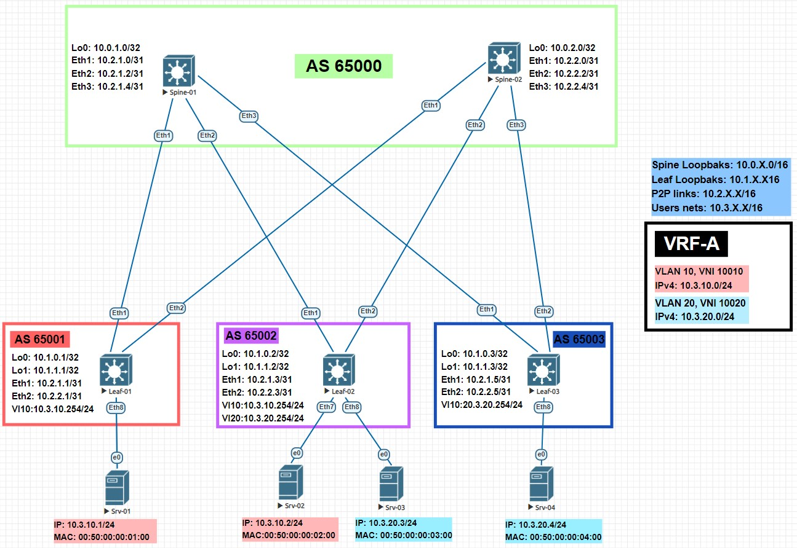

# LAB-06
# VxLAN. EVPN L3
### Цели
- Настроить маршрутизацию в рамках Overlay между клиентами.
### Схема сети

### Настройка оборудования
 <details>
<summary>  Настройка Spine-01: </summary>

```
#### Базовая настройка ####
hostname Spine-01
service routing protocols model multi-agent
terminal width 250
username admin privilege 15 role network-admin secret sha512 $6$V/UTnBIIFB18Cw1L$RE5uJmJfjGnLeLRqERxwBH3lJ/YidTa2O/5oviIYzLb1dzkz/rAEzn91Qvyx7eIR5aHTQ/dtAGxyebZy7jnMt/
aaa authorization serial-console
aaa authorization exec default local
ip routing
route-map LOOPBAKS permit 10
   match interface Loopback0
peer-filter AS-FILTER
   10 match as-range 65001 result accept
   20 match as-range 65002 result accept
   30 match as-range 65003 result accept

#### Настройка интерфейсов ####
interface Ethernet1
   description ### Link to Leaf-01 int Eth1 ###
   no switchport
   ip address 10.2.1.0/31
   bfd interval 50 min-rx 50 multiplier 3
interface Ethernet2
   description ### Link to Leaf-02 int Eth1 ###
   no switchport
   ip address 10.2.1.2/31
   bfd interval 50 min-rx 50 multiplier 3
interface Ethernet3
   description ### Link to Leaf-03 int Eth1 ###
   no switchport
   ip address 10.2.1.4/31
   bfd interval 50 min-rx 50 multiplier 3
interface Loopback0
   ip address 10.0.1.0/32

#### Настройка BGP ####
router bgp 65000
   router-id 10.0.1.0
   maximum-paths 32
   bgp listen range 10.1.0.0/16 peer-group OVERLAY peer-filter AS-FILTER
   bgp listen range 10.2.0.0/16 peer-group UNDERLAY peer-filter AS-FILTER
   neighbor OVERLAY peer group
   neighbor OVERLAY update-source Loopback0
   neighbor OVERLAY bfd
   neighbor OVERLAY ebgp-multihop 2
   neighbor OVERLAY timers 5 15
   neighbor OVERLAY password 7 uOE+oO5B97YK28lH6OwjCQ==
   neighbor OVERLAY send-community
   neighbor UNDERLAY peer group
   neighbor UNDERLAY bfd
   neighbor UNDERLAY timers 5 15
   neighbor UNDERLAY password 7 ZcyyQF+TaMkNnh+RPCdLHA==
   redistribute connected route-map LOOPBAKS
   address-family evpn
      neighbor OVERLAY activate
   address-family ipv4
      no neighbor OVERLAY activate
```
</details>
 <details>
<summary>  Настройка Spine-02: </summary>

```
#### Базовая настройка ####
hostname Spine-02
service routing protocols model multi-agent
terminal width 250
username admin privilege 15 role network-admin secret sha512 $6$V/UTnBIIFB18Cw1L$RE5uJmJfjGnLeLRqERxwBH3lJ/YidTa2O/5oviIYzLb1dzkz/rAEzn91Qvyx7eIR5aHTQ/dtAGxyebZy7jnMt/
aaa authorization serial-console
aaa authorization exec default local
ip routing
route-map LOOPBAKS permit 10
   match interface Loopback0
peer-filter AS-FILTER
   10 match as-range 65001 result accept
   20 match as-range 65002 result accept
   30 match as-range 65003 result accept

#### Настройка интерфейсов ####
interface Ethernet1
   description ### Link to Leaf-01 int Eth2 ###
   no switchport
   ip address 10.2.2.0/31
   bfd interval 50 min-rx 50 multiplier 3
interface Ethernet2
   description ### Link to Leaf-02 int Eth2 ###
   no switchport
   ip address 10.2.2.2/31
   bfd interval 50 min-rx 50 multiplier 3
interface Ethernet3
   description ### Link to Leaf-03 int Eth2 ###
   no switchport
   ip address 10.2.2.4/31
   bfd interval 50 min-rx 50 multiplier 3
interface Loopback0
   ip address 10.0.2.0/32

#### Настройка BGP ####
router bgp 65000
   router-id 10.0.2.0
   maximum-paths 32
   bgp listen range 10.1.0.0/16 peer-group OVERLAY peer-filter AS-FILTER
   bgp listen range 10.2.0.0/16 peer-group UNDERLAY peer-filter AS-FILTER
   neighbor OVERLAY peer group
   neighbor OVERLAY update-source Loopback0
   neighbor OVERLAY bfd
   neighbor OVERLAY ebgp-multihop 2
   neighbor OVERLAY timers 5 15
   neighbor OVERLAY password 7 uOE+oO5B97YK28lH6OwjCQ==
   neighbor OVERLAY send-community
   neighbor UNDERLAY peer group
   neighbor UNDERLAY bfd
   neighbor UNDERLAY timers 5 15
   neighbor UNDERLAY password 7 ZcyyQF+TaMkNnh+RPCdLHA==
   redistribute connected route-map LOOPBAKS
   address-family evpn
      neighbor OVERLAY activate
   address-family ipv4
      no neighbor OVERLAY activate
```
</details>
 <details>
<summary>  Настройка Leaf-01: </summary>

```
#### Базовая настройка ####
hostname Leaf-01
service routing protocols model multi-agent
terminal width 250
username admin privilege 15 role network-admin secret sha512 $6$V/UTnBIIFB18Cw1L$RE5uJmJfjGnLeLRqERxwBH3lJ/YidTa2O/5oviIYzLb1dzkz/rAEzn91Qvyx7eIR5aHTQ/dtAGxyebZy7jnMt/
aaa authorization serial-console
aaa authorization exec default local
vrf instance VRF-A
ip virtual-router mac-address 00:00:11:11:11:11
ip routing
ip routing vrf VRF-A
route-map LOOPBAKS permit 10
   match interface Loopback0
route-map LOOPBAKS permit 20
   match interface Loopback1
vlan 10

#### Настройка интерфейсов ####
interface Ethernet1
   description ### Link to Spine-01 int Eth1 ###
   no switchport
   ip address 10.2.1.1/31
   bfd interval 50 min-rx 50 multiplier 3
interface Ethernet2
   description ### Link to Spine-02 int Eth1 ###
   no switchport
   ip address 10.2.2.1/31
   bfd interval 50 min-rx 50 multiplier 3
interface Ethernet8
   description ### Link to Srv-01 int e0 ###
   switchport access vlan 10
interface Loopback0
   ip address 10.1.0.1/32
interface Loopback1
   ip address 10.1.1.1/32
interface Vxlan1
   vxlan source-interface Loopback1
   vxlan udp-port 4789
   vxlan vlan 10 vni 10010
   vxlan vrf VRF-A vni 10000
interface Vlan10
   vrf VRF-A
   ip address virtual 10.3.10.254/24

#### Настройка BGP ####
router bgp 65001
   router-id 10.1.0.1
   maximum-paths 32
   neighbor OVERLAY peer group
   neighbor OVERLAY remote-as 65000
   neighbor OVERLAY update-source Loopback0
   neighbor OVERLAY bfd
   neighbor OVERLAY ebgp-multihop 2
   neighbor OVERLAY timers 5 15
   neighbor OVERLAY password 7 uOE+oO5B97YK28lH6OwjCQ==
   neighbor OVERLAY send-community
   neighbor UNDERLAY peer group
   neighbor UNDERLAY remote-as 65000
   neighbor UNDERLAY bfd
   neighbor UNDERLAY timers 5 15
   neighbor UNDERLAY password 7 ZcyyQF+TaMkNnh+RPCdLHA==
   neighbor 10.0.1.0 peer group OVERLAY
   neighbor 10.0.2.0 peer group OVERLAY
   neighbor 10.2.1.0 peer group UNDERLAY
   neighbor 10.2.2.0 peer group UNDERLAY
   redistribute connected route-map LOOPBAKS
   vlan 10
      rd 10.1.0.1:10010
      route-target both 65000:10010
      redistribute learned
   address-family evpn
      neighbor OVERLAY activate
   address-family ipv4
      no neighbor OVERLAY activate
   vrf VRF-A
      rd 10.1.0.1:65000
      route-target import evpn 65000:10000
      route-target export evpn 65000:10000
```
</details>
 <details>
<summary>  Настройка Leaf-02: </summary>

```
#### Базовая настройка ####
hostname Leaf-02
service routing protocols model multi-agent
terminal width 250
username admin privilege 15 role network-admin secret sha512 $6$V/UTnBIIFB18Cw1L$RE5uJmJfjGnLeLRqERxwBH3lJ/YidTa2O/5oviIYzLb1dzkz/rAEzn91Qvyx7eIR5aHTQ/dtAGxyebZy7jnMt/
aaa authorization serial-console
aaa authorization exec default local
vrf instance VRF-A
ip virtual-router mac-address 00:00:11:11:11:11
ip routing
ip routing vrf VRF-A
route-map LOOPBAKS permit 10
   match interface Loopback0
route-map LOOPBAKS permit 20
   match interface Loopback1
vlan 10,20

#### Настройка интерфейсов ####
interface Ethernet1
   description ### Link to Spine-01 int Eth2 ###
   no switchport
   ip address 10.2.1.3/31
   bfd interval 50 min-rx 50 multiplier 3
interface Ethernet2
   description ### Link to Spine-02 int Eth2 ###
   no switchport
   ip address 10.2.2.3/31
   bfd interval 50 min-rx 50 multiplier 3
interface Ethernet7
   description ### Link to Srv-02 int e0 ###
   switchport access vlan 10
interface Ethernet8
   description ### Link to Srv-03 int e0 ###
   switchport access vlan 20
interface Loopback0
   ip address 10.1.0.2/32
interface Loopback1
   ip address 10.1.1.2/32
interface Vlan10
   vrf VRF-A
   ip address virtual 10.3.10.254/24
interface Vlan20
   vrf VRF-A
   ip address virtual 10.3.20.254/24
interface Vxlan1
   vxlan source-interface Loopback1
   vxlan udp-port 4789
   vxlan vlan 10 vni 10010
   vxlan vlan 20 vni 10020
   vxlan vrf VRF-A vni 10000

#### Настройка BGP ####
router bgp 65002
   router-id 10.1.0.2
   maximum-paths 32
   neighbor OVERLAY peer group
   neighbor OVERLAY remote-as 65000
   neighbor OVERLAY update-source Loopback0
   neighbor OVERLAY bfd
   neighbor OVERLAY ebgp-multihop 2
   neighbor OVERLAY timers 5 15
   neighbor OVERLAY password 7 uOE+oO5B97YK28lH6OwjCQ==
   neighbor OVERLAY send-community
   neighbor UNDERLAY peer group
   neighbor UNDERLAY remote-as 65000
   neighbor UNDERLAY bfd
   neighbor UNDERLAY timers 5 15
   neighbor UNDERLAY password 7 ZcyyQF+TaMkNnh+RPCdLHA==
   neighbor 10.0.1.0 peer group OVERLAY
   neighbor 10.0.2.0 peer group OVERLAY
   neighbor 10.2.1.2 peer group UNDERLAY
   neighbor 10.2.2.2 peer group UNDERLAY
   redistribute connected route-map LOOPBAKS
   vlan 10
      rd 10.1.0.2:10010
      route-target both 65000:10010
      redistribute learned
   vlan 20
      rd 10.1.0.2:10020
      route-target both 65000:10020
      redistribute learned
   address-family evpn
      neighbor OVERLAY activate
   address-family ipv4
      no neighbor OVERLAY activate
   vrf VRF-A
      rd 10.1.0.2:65000
      route-target import evpn 65000:10000
      route-target export evpn 65000:10000
```
</details>
 <details>
<summary>  Настройка Leaf-03: </summary>

```
#### Базовая настройка ####
hostname Leaf-03
service routing protocols model multi-agent
terminal width 250
username admin privilege 15 role network-admin secret sha512 $6$V/UTnBIIFB18Cw1L$RE5uJmJfjGnLeLRqERxwBH3lJ/YidTa2O/5oviIYzLb1dzkz/rAEzn91Qvyx7eIR5aHTQ/dtAGxyebZy7jnMt/
aaa authorization serial-console
aaa authorization exec default local
vrf instance VRF-A
ip virtual-router mac-address 00:00:11:11:11:11
ip routing
ip routing vrf VRF-A
route-map LOOPBAKS permit 10
   match interface Loopback0
route-map LOOPBAKS permit 20
   match interface Loopback1
vlan 20

#### Настройка интерфейсов ####
   description ### Link to Spine-01 int Eth3 ###
   no switchport
   ip address 10.2.1.5/31
   bfd interval 50 min-rx 50 multiplier 3
interface Ethernet2
   description ### Link to Spine-02 int Eth3 ###
   no switchport
   ip address 10.2.2.5/31
   bfd interval 50 min-rx 50 multiplier 3
interface Ethernet8
   description ### Link to Srv-04 int e0 ###
   switchport access vlan 20
interface Loopback0
   ip address 10.1.0.3/32
interface Loopback1
   ip address 10.1.1.3/32
interface Vlan20
   vrf VRF-A
   ip address virtual 10.3.20.254/24
interface Vxlan1
   vxlan source-interface Loopback1
   vxlan udp-port 4789
   vxlan vlan 20 vni 10020
   vxlan vrf VRF-A vni 10000

#### Настройка BGP ####
router bgp 65003
   router-id 10.1.0.3
   maximum-paths 32
   neighbor OVERLAY peer group
   neighbor OVERLAY remote-as 65000
   neighbor OVERLAY update-source Loopback0
   neighbor OVERLAY bfd
   neighbor OVERLAY ebgp-multihop 2
   neighbor OVERLAY timers 5 15
   neighbor OVERLAY password 7 uOE+oO5B97YK28lH6OwjCQ==
   neighbor OVERLAY send-community
   neighbor UNDERLAY peer group
   neighbor UNDERLAY remote-as 65000
   neighbor UNDERLAY bfd
   neighbor UNDERLAY timers 5 15
   neighbor UNDERLAY password 7 ZcyyQF+TaMkNnh+RPCdLHA==
   neighbor 10.0.1.0 peer group OVERLAY
   neighbor 10.0.2.0 peer group OVERLAY
   neighbor 10.2.1.4 peer group UNDERLAY
   neighbor 10.2.2.4 peer group UNDERLAY
   redistribute connected route-map LOOPBAKS
   vlan 20
      rd 10.1.0.3:10020
      route-target both 65000:10020
      redistribute learned
   address-family evpn
      neighbor OVERLAY activate
   address-family ipv4
      no neighbor OVERLAY activate
   vrf VRF-A
      rd 10.1.0.3:65000
      route-target import evpn 65000:10000
      route-target export evpn 65000:10000
```
</details>

### Проверка настроек  

 <details>
<summary> Leaf-01: </summary>

```
Leaf-01#show ip bgp summary
BGP summary information for VRF default
Router identifier 10.1.0.1, local AS number 65001
Neighbor Status Codes: m - Under maintenance
  Neighbor         V AS           MsgRcvd   MsgSent  InQ OutQ  Up/Down State   PfxRcd PfxAcc
  10.2.1.0         4 65000          16416     16685    0    0 00:12:33 Estab   5      5
  10.2.2.0         4 65000          16436     16710    0    0 00:12:26 Estab   5      5
Leaf-01#sh ip route

VRF: default
Codes: C - connected, S - static, K - kernel,
       O - OSPF, IA - OSPF inter area, E1 - OSPF external type 1,
       E2 - OSPF external type 2, N1 - OSPF NSSA external type 1,
       N2 - OSPF NSSA external type2, B - BGP, B I - iBGP, B E - eBGP,
       R - RIP, I L1 - IS-IS level 1, I L2 - IS-IS level 2,
       O3 - OSPFv3, A B - BGP Aggregate, A O - OSPF Summary,
       NG - Nexthop Group Static Route, V - VXLAN Control Service,
       DH - DHCP client installed default route, M - Martian,
       DP - Dynamic Policy Route, L - VRF Leaked,
       G  - gRIBI, RC - Route Cache Route

Gateway of last resort is not set

 B E      10.0.1.0/32 [200/0] via 10.2.1.0, Ethernet1
 B E      10.0.2.0/32 [200/0] via 10.2.2.0, Ethernet2
 C        10.1.0.1/32 is directly connected, Loopback0
 B E      10.1.0.2/32 [200/0] via 10.2.1.0, Ethernet1
 B E      10.1.0.3/32 [200/0] via 10.2.1.0, Ethernet1
 C        10.1.1.1/32 is directly connected, Loopback1
 B E      10.1.1.2/32 [200/0] via 10.2.1.0, Ethernet1
 B E      10.1.1.3/32 [200/0] via 10.2.1.0, Ethernet1
 C        10.2.1.0/31 is directly connected, Ethernet1
 C        10.2.2.0/31 is directly connected, Ethernet2


Leaf-01#sh bgp evpn summary
BGP summary information for VRF default
Router identifier 10.1.0.1, local AS number 65001
Neighbor Status Codes: m - Under maintenance
  Neighbor         V AS           MsgRcvd   MsgSent  InQ OutQ  Up/Down State   PfxRcd PfxAcc
  10.0.1.0         4 65000          16136     16337    0    0 00:12:32 Estab   9      9
  10.0.2.0         4 65000          16242     16348    0    0 00:12:25 Estab   9      9


Leaf-01#show bgp evpn route-type imet
BGP routing table information for VRF default
Router identifier 10.1.0.1, local AS number 65001
Route status codes: s - suppressed, * - valid, > - active, E - ECMP head, e - ECMP
                    S - Stale, c - Contributing to ECMP, b - backup
                    % - Pending BGP convergence
Origin codes: i - IGP, e - EGP, ? - incomplete
AS Path Attributes: Or-ID - Originator ID, C-LST - Cluster List, LL Nexthop - Link Local Nexthop

          Network                Next Hop              Metric  LocPref Weight  Path
 * >     RD: 10.1.0.1:10010 imet 10.1.1.1
                                 -                     -       -       0       i
 * >Ec   RD: 10.1.0.2:10010 imet 10.1.1.2
                                 10.1.1.2              -       100     0       65000 65002 i
 *  ec   RD: 10.1.0.2:10010 imet 10.1.1.2
                                 10.1.1.2              -       100     0       65000 65002 i
 * >Ec   RD: 10.1.0.2:10020 imet 10.1.1.2
                                 10.1.1.2              -       100     0       65000 65002 i
 *  ec   RD: 10.1.0.2:10020 imet 10.1.1.2
                                 10.1.1.2              -       100     0       65000 65002 i
 * >Ec   RD: 10.1.0.3:10020 imet 10.1.1.3
                                 10.1.1.3              -       100     0       65000 65003 i
 *  ec   RD: 10.1.0.3:10020 imet 10.1.1.3
                                 10.1.1.3              -       100     0       65000 65003 i


Leaf-01#show bgp evpn route-type mac-ip
BGP routing table information for VRF default
Router identifier 10.1.0.1, local AS number 65001
Route status codes: s - suppressed, * - valid, > - active, E - ECMP head, e - ECMP
                    S - Stale, c - Contributing to ECMP, b - backup
                    % - Pending BGP convergence
Origin codes: i - IGP, e - EGP, ? - incomplete
AS Path Attributes: Or-ID - Originator ID, C-LST - Cluster List, LL Nexthop - Link Local Nexthop

          Network                Next Hop              Metric  LocPref Weight  Path
 * >     RD: 10.1.0.1:10010 mac-ip 0050.0000.0100
                                 -                     -       -       0       i
 * >     RD: 10.1.0.1:10010 mac-ip 0050.0000.0100 10.3.10.1
                                 -                     -       -       0       i
 * >Ec   RD: 10.1.0.2:10010 mac-ip 0050.0000.0200
                                 10.1.1.2              -       100     0       65000 65002 i
 *  ec   RD: 10.1.0.2:10010 mac-ip 0050.0000.0200
                                 10.1.1.2              -       100     0       65000 65002 i
 * >Ec   RD: 10.1.0.2:10010 mac-ip 0050.0000.0200 10.3.10.2
                                 10.1.1.2              -       100     0       65000 65002 i
 *  ec   RD: 10.1.0.2:10010 mac-ip 0050.0000.0200 10.3.10.2
                                 10.1.1.2              -       100     0       65000 65002 i
 * >Ec   RD: 10.1.0.2:10020 mac-ip 0050.0000.0300
                                 10.1.1.2              -       100     0       65000 65002 i
 *  ec   RD: 10.1.0.2:10020 mac-ip 0050.0000.0300
                                 10.1.1.2              -       100     0       65000 65002 i
 * >Ec   RD: 10.1.0.2:10020 mac-ip 0050.0000.0300 10.3.20.3
                                 10.1.1.2              -       100     0       65000 65002 i
 *  ec   RD: 10.1.0.2:10020 mac-ip 0050.0000.0300 10.3.20.3
                                 10.1.1.2              -       100     0       65000 65002 i
 * >Ec   RD: 10.1.0.3:10020 mac-ip 0050.0000.0400
                                 10.1.1.3              -       100     0       65000 65003 i
 *  ec   RD: 10.1.0.3:10020 mac-ip 0050.0000.0400
                                 10.1.1.3              -       100     0       65000 65003 i
 * >Ec   RD: 10.1.0.3:10020 mac-ip 0050.0000.0400 10.3.20.4
                                 10.1.1.3              -       100     0       65000 65003 i
 *  ec   RD: 10.1.0.3:10020 mac-ip 0050.0000.0400 10.3.20.4
                                 10.1.1.3              -       100     0       65000 65003 i


Leaf-01#sh vxlan vtep
Remote VTEPS for Vxlan1:

VTEP           Tunnel Type(s)
-------------- --------------
10.1.1.2       flood, unicast
10.1.1.3       unicast

Total number of remote VTEPS:  2


Leaf-01#sh vxlan address-table
          Vxlan Mac Address Table
----------------------------------------------------------------------

VLAN  Mac Address     Type      Prt  VTEP             Moves   Last Move
----  -----------     ----      ---  ----             -----   ---------
  10  0050.0000.0200  EVPN      Vx1  10.1.1.2         1       0:00:00 ago
4094  5000.0000.5183  EVPN      Vx1  10.1.1.3         1       0:00:01 ago
4094  5000.006b.0f11  EVPN      Vx1  10.1.1.2         1       0:00:01 ago
Total Remote Mac Addresses for this criterion: 3


Leaf-01#sh mac address-table
          Mac Address Table
------------------------------------------------------------------

Vlan    Mac Address       Type        Ports      Moves   Last Move
----    -----------       ----        -----      -----   ---------
  10    0050.0000.0100    DYNAMIC     Et8        1       18:10:13 ago
  10    0050.0000.0200    DYNAMIC     Vx1        1       0:00:08 ago
4094    5000.0000.5183    DYNAMIC     Vx1        1       0:00:08 ago
4094    5000.006b.0f11    DYNAMIC     Vx1        1       0:00:08 ago
Total Mac Addresses for this criterion: 4

          Multicast Mac Address Table
------------------------------------------------------------------

Vlan    Mac Address       Type        Ports
----    -----------       ----        -----
Total Mac Addresses for this criterion: 0


Leaf-01#show bfd peers
VRF name: default
-----------------
DstAddr               MyDisc         YourDisc       Interface/Transport           Type               LastUp             LastDown            LastDiag    State
-------------- ---------------- ---------------- ------------------------- -------------- -------------------- -------------------- ------------------- -----
10.0.1.0           220598722       2335403897                        NA       multihop       07/20/23 07:18       07/20/23 07:18       No Diagnostic       Up
10.0.2.0          2067137186        687954056                        NA       multihop       07/20/23 07:18       07/20/23 07:18       No Diagnostic       Up
10.2.1.0          3584724434       2835167711             Ethernet1(11)         normal       07/20/23 07:18       07/20/23 07:18       No Diagnostic       Up
10.2.2.0          3624234627        148785667             Ethernet2(12)         normal       07/20/23 07:18       07/20/23 07:18       No Diagnostic       Up
```
</details>

 <details>
<summary> Leaf-02: </summary>

```
Leaf-02#show ip bgp summary
BGP summary information for VRF default
Router identifier 10.1.0.2, local AS number 65002
Neighbor Status Codes: m - Under maintenance
  Neighbor         V AS           MsgRcvd   MsgSent  InQ OutQ  Up/Down State   PfxRcd PfxAcc
  10.2.1.2         4 65000          16512     16687    0    0 00:17:23 Estab   5      5
  10.2.2.2         4 65000          16594     16837    0    0 00:17:23 Estab   5      5


Leaf-02#sh ip route

VRF: default
Codes: C - connected, S - static, K - kernel,
       O - OSPF, IA - OSPF inter area, E1 - OSPF external type 1,
       E2 - OSPF external type 2, N1 - OSPF NSSA external type 1,
       N2 - OSPF NSSA external type2, B - BGP, B I - iBGP, B E - eBGP,
       R - RIP, I L1 - IS-IS level 1, I L2 - IS-IS level 2,
       O3 - OSPFv3, A B - BGP Aggregate, A O - OSPF Summary,
       NG - Nexthop Group Static Route, V - VXLAN Control Service,
       DH - DHCP client installed default route, M - Martian,
       DP - Dynamic Policy Route, L - VRF Leaked,
       G  - gRIBI, RC - Route Cache Route

Gateway of last resort is not set

 B E      10.0.1.0/32 [200/0] via 10.2.1.2, Ethernet1
 B E      10.0.2.0/32 [200/0] via 10.2.2.2, Ethernet2
 B E      10.1.0.1/32 [200/0] via 10.2.1.2, Ethernet1
 C        10.1.0.2/32 is directly connected, Loopback0
 B E      10.1.0.3/32 [200/0] via 10.2.1.2, Ethernet1
 B E      10.1.1.1/32 [200/0] via 10.2.1.2, Ethernet1
 C        10.1.1.2/32 is directly connected, Loopback1
 B E      10.1.1.3/32 [200/0] via 10.2.1.2, Ethernet1
 C        10.2.1.2/31 is directly connected, Ethernet1
 C        10.2.2.2/31 is directly connected, Ethernet2


Leaf-02#sh bgp evpn summary
BGP summary information for VRF default
Router identifier 10.1.0.2, local AS number 65002
Neighbor Status Codes: m - Under maintenance
  Neighbor         V AS           MsgRcvd   MsgSent  InQ OutQ  Up/Down State   PfxRcd PfxAcc
  10.0.1.0         4 65000          16035     16511    0    0 00:17:22 Estab   6      6
  10.0.2.0         4 65000          16156     16714    0    0 00:17:22 Estab   6      6


Leaf-02#show bgp evpn route-type imet
BGP routing table information for VRF default
Router identifier 10.1.0.2, local AS number 65002
Route status codes: s - suppressed, * - valid, > - active, E - ECMP head, e - ECMP
                    S - Stale, c - Contributing to ECMP, b - backup
                    % - Pending BGP convergence
Origin codes: i - IGP, e - EGP, ? - incomplete
AS Path Attributes: Or-ID - Originator ID, C-LST - Cluster List, LL Nexthop - Link Local Nexthop

          Network                Next Hop              Metric  LocPref Weight  Path
 * >Ec   RD: 10.1.0.1:10010 imet 10.1.1.1
                                 10.1.1.1              -       100     0       65000 65001 i
 *  ec   RD: 10.1.0.1:10010 imet 10.1.1.1
                                 10.1.1.1              -       100     0       65000 65001 i
 * >     RD: 10.1.0.2:10010 imet 10.1.1.2
                                 -                     -       -       0       i
 * >     RD: 10.1.0.2:10020 imet 10.1.1.2
                                 -                     -       -       0       i
 * >Ec   RD: 10.1.0.3:10020 imet 10.1.1.3
                                 10.1.1.3              -       100     0       65000 65003 i
 *  ec   RD: 10.1.0.3:10020 imet 10.1.1.3
                                 10.1.1.3              -       100     0       65000 65003 i


Leaf-02#show bgp evpn route-type mac-ip
BGP routing table information for VRF default
Router identifier 10.1.0.2, local AS number 65002
Route status codes: s - suppressed, * - valid, > - active, E - ECMP head, e - ECMP
                    S - Stale, c - Contributing to ECMP, b - backup
                    % - Pending BGP convergence
Origin codes: i - IGP, e - EGP, ? - incomplete
AS Path Attributes: Or-ID - Originator ID, C-LST - Cluster List, LL Nexthop - Link Local Nexthop

          Network                Next Hop              Metric  LocPref Weight  Path
 * >Ec   RD: 10.1.0.1:10010 mac-ip 0050.0000.0100
                                 10.1.1.1              -       100     0       65000 65001 i
 *  ec   RD: 10.1.0.1:10010 mac-ip 0050.0000.0100
                                 10.1.1.1              -       100     0       65000 65001 i
 * >Ec   RD: 10.1.0.1:10010 mac-ip 0050.0000.0100 10.3.10.1
                                 10.1.1.1              -       100     0       65000 65001 i
 *  ec   RD: 10.1.0.1:10010 mac-ip 0050.0000.0100 10.3.10.1
                                 10.1.1.1              -       100     0       65000 65001 i
 * >     RD: 10.1.0.2:10010 mac-ip 0050.0000.0200
                                 -                     -       -       0       i
 * >     RD: 10.1.0.2:10010 mac-ip 0050.0000.0200 10.3.10.2
                                 -                     -       -       0       i
 * >     RD: 10.1.0.2:10020 mac-ip 0050.0000.0300
                                 -                     -       -       0       i
 * >     RD: 10.1.0.2:10020 mac-ip 0050.0000.0300 10.3.20.3
                                 -                     -       -       0       i
 * >Ec   RD: 10.1.0.3:10020 mac-ip 0050.0000.0400
                                 10.1.1.3              -       100     0       65000 65003 i
 *  ec   RD: 10.1.0.3:10020 mac-ip 0050.0000.0400
                                 10.1.1.3              -       100     0       65000 65003 i
 * >Ec   RD: 10.1.0.3:10020 mac-ip 0050.0000.0400 10.3.20.4
                                 10.1.1.3              -       100     0       65000 65003 i
 *  ec   RD: 10.1.0.3:10020 mac-ip 0050.0000.0400 10.3.20.4
                                 10.1.1.3              -       100     0       65000 65003 i


Leaf-02#sh vxlan vtep
Remote VTEPS for Vxlan1:

VTEP           Tunnel Type(s)
-------------- --------------
10.1.1.1       flood, unicast
10.1.1.3       flood, unicast

Total number of remote VTEPS:  2


Leaf-02#sh vxlan address-table
          Vxlan Mac Address Table
----------------------------------------------------------------------

VLAN  Mac Address     Type      Prt  VTEP             Moves   Last Move
----  -----------     ----      ---  ----             -----   ---------
  10  0050.0000.0100  EVPN      Vx1  10.1.1.1         1       0:17:21 ago
  20  0050.0000.0400  EVPN      Vx1  10.1.1.3         1       0:17:20 ago
4069  5000.0000.5183  EVPN      Vx1  10.1.1.3         1       0:17:21 ago
4069  5000.00ca.39cc  EVPN      Vx1  10.1.1.1         1       0:17:21 ago
Total Remote Mac Addresses for this criterion: 4


Leaf-02#show mac address-table
          Mac Address Table
------------------------------------------------------------------

Vlan    Mac Address       Type        Ports      Moves   Last Move
----    -----------       ----        -----      -----   ---------
  10    0050.0000.0100    DYNAMIC     Vx1        1       0:01:45 ago
  10    0050.0000.0200    DYNAMIC     Et7        1       18:01:38 ago
  20    0050.0000.0300    DYNAMIC     Et8        1       18:01:21 ago
  20    0050.0000.0400    DYNAMIC     Vx1        1       0:01:45 ago
4069    5000.0000.5183    DYNAMIC     Vx1        1       0:01:46 ago
4069    5000.00ca.39cc    DYNAMIC     Vx1        1       0:01:45 ago
Total Mac Addresses for this criterion: 6

          Multicast Mac Address Table
------------------------------------------------------------------

Vlan    Mac Address       Type        Ports
----    -----------       ----        -----
Total Mac Addresses for this criterion: 0


Leaf-02#show bfd peers
VRF name: default
-----------------
DstAddr               MyDisc         YourDisc       Interface/Transport           Type               LastUp             LastDown            LastDiag    State
-------------- ---------------- ---------------- ------------------------- -------------- -------------------- -------------------- ------------------- -----
10.0.1.0           784324212       1923922068                        NA       multihop       07/20/23 07:18       07/20/23 07:18       No Diagnostic       Up
10.0.2.0          3460721294       3076751324                        NA       multihop       07/20/23 07:18       07/20/23 07:18       No Diagnostic       Up
10.2.1.2          1361029817        446577332             Ethernet1(11)         normal       07/20/23 07:18       07/20/23 07:18       No Diagnostic       Up
10.2.2.2           207568505       1925687257             Ethernet2(12)         normal       07/20/23 07:18       07/20/23 07:18       No Diagnostic       Up
```
</details>

 <details>
<summary> Leaf-03: </summary>

```
Leaf-03#show ip bgp summary
BGP summary information for VRF default
Router identifier 10.1.0.3, local AS number 65003
Neighbor Status Codes: m - Under maintenance
  Neighbor         V AS           MsgRcvd   MsgSent  InQ OutQ  Up/Down State   PfxRcd PfxAcc
  10.2.1.4         4 65000          16560     16814    0    0 00:03:23 Estab   5      5
  10.2.2.4         4 65000          16636     16906    0    0 00:03:20 Estab   5      5


Leaf-03#sh ip route

VRF: default
Codes: C - connected, S - static, K - kernel,
       O - OSPF, IA - OSPF inter area, E1 - OSPF external type 1,
       E2 - OSPF external type 2, N1 - OSPF NSSA external type 1,
       N2 - OSPF NSSA external type2, B - BGP, B I - iBGP, B E - eBGP,
       R - RIP, I L1 - IS-IS level 1, I L2 - IS-IS level 2,
       O3 - OSPFv3, A B - BGP Aggregate, A O - OSPF Summary,
       NG - Nexthop Group Static Route, V - VXLAN Control Service,
       DH - DHCP client installed default route, M - Martian,
       DP - Dynamic Policy Route, L - VRF Leaked,
       G  - gRIBI, RC - Route Cache Route

Gateway of last resort is not set

 B E      10.0.1.0/32 [200/0] via 10.2.1.4, Ethernet1
 B E      10.0.2.0/32 [200/0] via 10.2.2.4, Ethernet2
 B E      10.1.0.1/32 [200/0] via 10.2.1.4, Ethernet1
 B E      10.1.0.2/32 [200/0] via 10.2.1.4, Ethernet1
 C        10.1.0.3/32 is directly connected, Loopback0
 B E      10.1.1.1/32 [200/0] via 10.2.1.4, Ethernet1
 B E      10.1.1.2/32 [200/0] via 10.2.1.4, Ethernet1
 C        10.1.1.3/32 is directly connected, Loopback1
 C        10.2.1.4/31 is directly connected, Ethernet1
 C        10.2.2.4/31 is directly connected, Ethernet2


Leaf-03#sh bgp evpn summary
BGP summary information for VRF default
Router identifier 10.1.0.3, local AS number 65003
Neighbor Status Codes: m - Under maintenance
  Neighbor         V AS           MsgRcvd   MsgSent  InQ OutQ  Up/Down State   PfxRcd PfxAcc
  10.0.1.0         4 65000          16454     16588    0    0 00:03:22 Estab   9      9
  10.0.2.0         4 65000          16563     16548    0    0 00:03:19 Estab   9      9


Leaf-03#show bgp evpn route-type imet
BGP routing table information for VRF default
Router identifier 10.1.0.3, local AS number 65003
Route status codes: s - suppressed, * - valid, > - active, E - ECMP head, e - ECMP
                    S - Stale, c - Contributing to ECMP, b - backup
                    % - Pending BGP convergence
Origin codes: i - IGP, e - EGP, ? - incomplete
AS Path Attributes: Or-ID - Originator ID, C-LST - Cluster List, LL Nexthop - Link Local Nexthop

          Network                Next Hop              Metric  LocPref Weight  Path
 * >Ec   RD: 10.1.0.1:10010 imet 10.1.1.1
                                 10.1.1.1              -       100     0       65000 65001 i
 *  ec   RD: 10.1.0.1:10010 imet 10.1.1.1
                                 10.1.1.1              -       100     0       65000 65001 i
 * >Ec   RD: 10.1.0.2:10010 imet 10.1.1.2
                                 10.1.1.2              -       100     0       65000 65002 i
 *  ec   RD: 10.1.0.2:10010 imet 10.1.1.2
                                 10.1.1.2              -       100     0       65000 65002 i
 * >Ec   RD: 10.1.0.2:10020 imet 10.1.1.2
                                 10.1.1.2              -       100     0       65000 65002 i
 *  ec   RD: 10.1.0.2:10020 imet 10.1.1.2
                                 10.1.1.2              -       100     0       65000 65002 i
 * >     RD: 10.1.0.3:10020 imet 10.1.1.3
                                 -                     -       -       0       i


Leaf-03#show bgp evpn route-type mac-ip
BGP routing table information for VRF default
Router identifier 10.1.0.3, local AS number 65003
Route status codes: s - suppressed, * - valid, > - active, E - ECMP head, e - ECMP
                    S - Stale, c - Contributing to ECMP, b - backup
                    % - Pending BGP convergence
Origin codes: i - IGP, e - EGP, ? - incomplete
AS Path Attributes: Or-ID - Originator ID, C-LST - Cluster List, LL Nexthop - Link Local Nexthop

          Network                Next Hop              Metric  LocPref Weight  Path
 * >Ec   RD: 10.1.0.1:10010 mac-ip 0050.0000.0100
                                 10.1.1.1              -       100     0       65000 65001 i
 *  ec   RD: 10.1.0.1:10010 mac-ip 0050.0000.0100
                                 10.1.1.1              -       100     0       65000 65001 i
 * >Ec   RD: 10.1.0.1:10010 mac-ip 0050.0000.0100 10.3.10.1
                                 10.1.1.1              -       100     0       65000 65001 i
 *  ec   RD: 10.1.0.1:10010 mac-ip 0050.0000.0100 10.3.10.1
                                 10.1.1.1              -       100     0       65000 65001 i
 * >Ec   RD: 10.1.0.2:10010 mac-ip 0050.0000.0200
                                 10.1.1.2              -       100     0       65000 65002 i
 *  ec   RD: 10.1.0.2:10010 mac-ip 0050.0000.0200
                                 10.1.1.2              -       100     0       65000 65002 i
 * >Ec   RD: 10.1.0.2:10010 mac-ip 0050.0000.0200 10.3.10.2
                                 10.1.1.2              -       100     0       65000 65002 i
 *  ec   RD: 10.1.0.2:10010 mac-ip 0050.0000.0200 10.3.10.2
                                 10.1.1.2              -       100     0       65000 65002 i
 * >Ec   RD: 10.1.0.2:10020 mac-ip 0050.0000.0300
                                 10.1.1.2              -       100     0       65000 65002 i
 *  ec   RD: 10.1.0.2:10020 mac-ip 0050.0000.0300
                                 10.1.1.2              -       100     0       65000 65002 i
 * >Ec   RD: 10.1.0.2:10020 mac-ip 0050.0000.0300 10.3.20.3
                                 10.1.1.2              -       100     0       65000 65002 i
 *  ec   RD: 10.1.0.2:10020 mac-ip 0050.0000.0300 10.3.20.3
                                 10.1.1.2              -       100     0       65000 65002 i
 * >     RD: 10.1.0.3:10020 mac-ip 0050.0000.0400
                                 -                     -       -       0       i
 * >     RD: 10.1.0.3:10020 mac-ip 0050.0000.0400 10.3.20.4
                                 -                     -       -       0       i


Leaf-03#sh vxlan vtep
Remote VTEPS for Vxlan1:

VTEP           Tunnel Type(s)
-------------- --------------
10.1.1.1       unicast
10.1.1.2       flood, unicast

Total number of remote VTEPS:  2


Leaf-03#sh vxlan address-table
          Vxlan Mac Address Table
----------------------------------------------------------------------

VLAN  Mac Address     Type      Prt  VTEP             Moves   Last Move
----  -----------     ----      ---  ----             -----   ---------
  20  0050.0000.0300  EVPN      Vx1  10.1.1.2         1       0:03:19 ago
4056  5000.006b.0f11  EVPN      Vx1  10.1.1.2         1       0:03:19 ago
4056  5000.00ca.39cc  EVPN      Vx1  10.1.1.1         1       0:03:18 ago
Total Remote Mac Addresses for this criterion: 3
Leaf-03#show mac address-table
          Mac Address Table
------------------------------------------------------------------

Vlan    Mac Address       Type        Ports      Moves   Last Move
----    -----------       ----        -----      -----   ---------
  20    0050.0000.0300    DYNAMIC     Vx1        1       0:03:19 ago
  20    0050.0000.0400    DYNAMIC     Et8        1       1:06:59 ago
4056    5000.006b.0f11    DYNAMIC     Vx1        1       0:03:19 ago
4056    5000.00ca.39cc    DYNAMIC     Vx1        1       0:03:18 ago
Total Mac Addresses for this criterion: 4

          Multicast Mac Address Table
------------------------------------------------------------------

Vlan    Mac Address       Type        Ports
----    -----------       ----        -----
Total Mac Addresses for this criterion: 0


Leaf-03#show bfd peers
VRF name: default
-----------------
DstAddr               MyDisc         YourDisc       Interface/Transport           Type               LastUp             LastDown            LastDiag    State
-------------- ---------------- ---------------- ------------------------- -------------- -------------------- -------------------- ------------------- -----
10.0.1.0          2168146709         16546822                        NA       multihop       07/20/23 07:39       07/20/23 07:39       No Diagnostic       Up
10.0.2.0          4274052878       2880064287                        NA       multihop       07/20/23 07:39       07/20/23 07:39       No Diagnostic       Up
10.2.1.4          1155352672       1805198150             Ethernet1(11)         normal       07/20/23 07:39       07/20/23 07:39       No Diagnostic       Up
10.2.2.4          3378185624        738324301             Ethernet2(12)         normal       07/20/23 07:39       07/20/23 07:39       No Diagnostic       Up
```
</details>

 <details>
<summary> Srv-01: </summary>

```
root@Srv-01:~# ping 10.3.10.2 -c 3
PING 10.3.10.2 (10.3.10.2) 56(84) bytes of data.
64 bytes from 10.3.10.2: icmp_seq=1 ttl=64 time=14.0 ms
64 bytes from 10.3.10.2: icmp_seq=2 ttl=64 time=13.4 ms
64 bytes from 10.3.10.2: icmp_seq=3 ttl=64 time=12.6 ms

--- 10.3.10.2 ping statistics ---
3 packets transmitted, 3 received, 0% packet loss, time 2003ms
rtt min/avg/max/mdev = 12.597/13.355/14.039/0.591 ms
root@Srv-01:~#
root@Srv-01:~#
root@Srv-01:~# ping 10.3.20.3 -c 3
PING 10.3.20.3 (10.3.20.3) 56(84) bytes of data.
64 bytes from 10.3.20.3: icmp_seq=1 ttl=62 time=17.3 ms
64 bytes from 10.3.20.3: icmp_seq=2 ttl=62 time=21.6 ms
64 bytes from 10.3.20.3: icmp_seq=3 ttl=62 time=16.9 ms

--- 10.3.20.3 ping statistics ---
3 packets transmitted, 3 received, 0% packet loss, time 2004ms
rtt min/avg/max/mdev = 16.924/18.610/21.609/2.125 ms
root@Srv-01:~# ping 10.3.20.3 -c 4
PING 10.3.20.3 (10.3.20.3) 56(84) bytes of data.
64 bytes from 10.3.20.3: icmp_seq=1 ttl=62 time=13.4 ms
64 bytes from 10.3.20.3: icmp_seq=2 ttl=62 time=72.7 ms
64 bytes from 10.3.20.3: icmp_seq=3 ttl=62 time=14.1 ms
64 bytes from 10.3.20.3: icmp_seq=4 ttl=62 time=18.1 ms

--- 10.3.20.3 ping statistics ---
4 packets transmitted, 4 received, 0% packet loss, time 3004ms
rtt min/avg/max/mdev = 13.446/29.583/72.695/24.954 ms
root@Srv-01:~#
root@Srv-01:~#
root@Srv-01:~# ip nei
10.3.10.2 dev ens3 lladdr 00:50:00:00:02:00 REACHABLE
10.3.10.254 dev ens3 lladdr 00:00:11:11:11:11 REACHABLE

```
</details>

 <details>
<summary> Srv-03: </summary>

```
root@Srv-03:~# ping 10.3.10.1 -c3
PING 10.3.10.1 (10.3.10.1) 56(84) bytes of data.
64 bytes from 10.3.10.1: icmp_seq=1 ttl=62 time=76.9 ms
64 bytes from 10.3.10.1: icmp_seq=2 ttl=62 time=15.2 ms
64 bytes from 10.3.10.1: icmp_seq=3 ttl=62 time=14.1 ms

--- 10.3.10.1 ping statistics ---
3 packets transmitted, 3 received, 0% packet loss, time 2003ms
rtt min/avg/max/mdev = 14.086/35.393/76.902/29.354 ms
root@Srv-03:~#
root@Srv-03:~#
root@Srv-03:~# ping 10.3.10.2 -c3
PING 10.3.10.2 (10.3.10.2) 56(84) bytes of data.
64 bytes from 10.3.10.2: icmp_seq=1 ttl=63 time=7.31 ms
64 bytes from 10.3.10.2: icmp_seq=2 ttl=63 time=6.48 ms
64 bytes from 10.3.10.2: icmp_seq=3 ttl=63 time=7.07 ms

--- 10.3.10.2 ping statistics ---
3 packets transmitted, 3 received, 0% packet loss, time 2002ms
rtt min/avg/max/mdev = 6.475/6.950/7.305/0.349 ms
root@Srv-03:~#
root@Srv-03:~#
root@Srv-03:~# ping 10.3.20.4 -c3
PING 10.3.20.4 (10.3.20.4) 56(84) bytes of data.
64 bytes from 10.3.20.4: icmp_seq=1 ttl=64 time=13.2 ms
64 bytes from 10.3.20.4: icmp_seq=2 ttl=64 time=13.5 ms
64 bytes from 10.3.20.4: icmp_seq=3 ttl=64 time=14.5 ms

--- 10.3.20.4 ping statistics ---
3 packets transmitted, 3 received, 0% packet loss, time 2003ms
rtt min/avg/max/mdev = 13.210/13.747/14.545/0.575 ms
root@Srv-03:~#
root@Srv-03:~#
root@Srv-03:~# ip ne
10.3.20.254 dev ens3 lladdr 00:00:11:11:11:11 REACHABLE
10.3.20.4 dev ens3 lladdr 00:50:00:00:04:00 REACHABLE

```
</details>