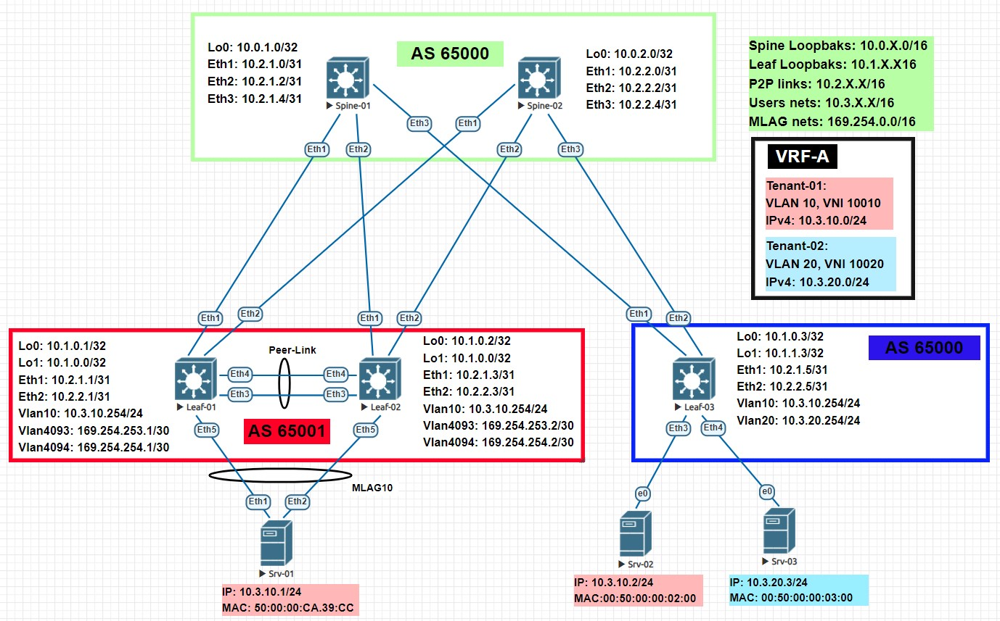

# LAB-07
# VxLAN. MLAG
### Цели
- Настроить отказоустойчивое подключение клиентов с использованием MLAG.
### Схема сети

### Настройка оборудования
 <details>
<summary>  Настройка Spine-01: </summary>

```
#### Базовая настройка ####
hostname Spine-01
service routing protocols model multi-agent
terminal width 250
username admin privilege 15 role network-admin secret sha512 $6$V/UTnBIIFB18Cw1L$RE5uJmJfjGnLeLRqERxwBH3lJ/YidTa2O/5oviIYzLb1dzkz/rAEzn91Qvyx7eIR5aHTQ/dtAGxyebZy7jnMt/
aaa authorization serial-console
aaa authorization exec default local
ip routing
route-map LOOPBAKS permit 10
   match interface Loopback0
peer-filter AS-FILTER
   10 match as-range 65001 result accept
   20 match as-range 65002 result accept
   30 match as-range 65003 result accept

#### Настройка интерфейсов ####
interface Ethernet1
   description ### Link to Leaf-01 int Eth1 ###
   no switchport
   ip address 10.2.1.0/31
   bfd interval 50 min-rx 50 multiplier 3
interface Ethernet2
   description ### Link to Leaf-02 int Eth1 ###
   no switchport
   ip address 10.2.1.2/31
   bfd interval 50 min-rx 50 multiplier 3
interface Ethernet3
   description ### Link to Leaf-03 int Eth1 ###
   no switchport
   ip address 10.2.1.4/31
   bfd interval 50 min-rx 50 multiplier 3
interface Loopback0
   ip address 10.0.1.0/32

#### Настройка BGP ####
router bgp 65000
   router-id 10.0.1.0
   maximum-paths 32
   bgp listen range 10.1.0.0/16 peer-group OVERLAY peer-filter AS-FILTER
   bgp listen range 10.2.0.0/16 peer-group UNDERLAY peer-filter AS-FILTER
   neighbor OVERLAY peer group
   neighbor OVERLAY update-source Loopback0
   neighbor OVERLAY bfd
   neighbor OVERLAY ebgp-multihop 2
   neighbor OVERLAY timers 5 15
   neighbor OVERLAY password 7 uOE+oO5B97YK28lH6OwjCQ==
   neighbor OVERLAY send-community
   neighbor UNDERLAY peer group
   neighbor UNDERLAY bfd
   neighbor UNDERLAY timers 5 15
   neighbor UNDERLAY password 7 ZcyyQF+TaMkNnh+RPCdLHA==
   redistribute connected route-map LOOPBAKS
   address-family evpn
      neighbor OVERLAY activate
   address-family ipv4
      no neighbor OVERLAY activate
```
</details>
 <details>
<summary>  Настройка Spine-02: </summary>

```
#### Базовая настройка ####
hostname Spine-02
service routing protocols model multi-agent
terminal width 250
username admin privilege 15 role network-admin secret sha512 $6$V/UTnBIIFB18Cw1L$RE5uJmJfjGnLeLRqERxwBH3lJ/YidTa2O/5oviIYzLb1dzkz/rAEzn91Qvyx7eIR5aHTQ/dtAGxyebZy7jnMt/
aaa authorization serial-console
aaa authorization exec default local
ip routing
route-map LOOPBAKS permit 10
   match interface Loopback0
peer-filter AS-FILTER
   10 match as-range 65001 result accept
   20 match as-range 65002 result accept
   30 match as-range 65003 result accept

#### Настройка интерфейсов ####
interface Ethernet1
   description ### Link to Leaf-01 int Eth2 ###
   no switchport
   ip address 10.2.2.0/31
   bfd interval 50 min-rx 50 multiplier 3
interface Ethernet2
   description ### Link to Leaf-02 int Eth2 ###
   no switchport
   ip address 10.2.2.2/31
   bfd interval 50 min-rx 50 multiplier 3
interface Ethernet3
   description ### Link to Leaf-03 int Eth2 ###
   no switchport
   ip address 10.2.2.4/31
   bfd interval 50 min-rx 50 multiplier 3
interface Loopback0
   ip address 10.0.2.0/32

#### Настройка BGP ####
router bgp 65000
   router-id 10.0.2.0
   maximum-paths 32
   bgp listen range 10.1.0.0/16 peer-group OVERLAY peer-filter AS-FILTER
   bgp listen range 10.2.0.0/16 peer-group UNDERLAY peer-filter AS-FILTER
   neighbor OVERLAY peer group
   neighbor OVERLAY update-source Loopback0
   neighbor OVERLAY bfd
   neighbor OVERLAY ebgp-multihop 2
   neighbor OVERLAY timers 5 15
   neighbor OVERLAY password 7 uOE+oO5B97YK28lH6OwjCQ==
   neighbor OVERLAY send-community
   neighbor UNDERLAY peer group
   neighbor UNDERLAY bfd
   neighbor UNDERLAY timers 5 15
   neighbor UNDERLAY password 7 ZcyyQF+TaMkNnh+RPCdLHA==
   redistribute connected route-map LOOPBAKS
   address-family evpn
      neighbor OVERLAY activate
   address-family ipv4
      no neighbor OVERLAY activate
```
</details>
 <details>
<summary>  Настройка Leaf-01: </summary>

```
#### Базовая настройка ####
hostname Leaf-01
service routing protocols model multi-agent
terminal width 250
username admin privilege 15 role network-admin secret sha512 $6$V/UTnBIIFB18Cw1L$RE5uJmJfjGnLeLRqERxwBH3lJ/YidTa2O/5oviIYzLb1dzkz/rAEzn91Qvyx7eIR5aHTQ/dtAGxyebZy7jnMt/
aaa authorization serial-console
aaa authorization exec default local
vrf instance VRF-A
ip virtual-router mac-address 00:00:11:11:11:11
ip routing
ip routing vrf VRF-A
route-map LOOPBAKS permit 10
   match interface Loopback0
route-map LOOPBAKS permit 20
   match interface Loopback1
vlan 10

#### Настройка интерфейсов ####
interface Ethernet1
   description ### Link to Spine-01 int Eth1 ###
   no switchport
   ip address 10.2.1.1/31
   bfd interval 50 min-rx 50 multiplier 3
interface Ethernet2
   description ### Link to Spine-02 int Eth1 ###
   no switchport
   ip address 10.2.2.1/31
   bfd interval 50 min-rx 50 multiplier 3
interface Loopback0
   ip address 10.1.0.1/32
   description ### For RID/eBGP ###
interface Loopback1
   ip address 10.1.0.0/32
   description ### For VxLAN ###
interface Vxlan1
   vxlan source-interface Loopback1
   vxlan udp-port 4789
   vxlan vlan 10 vni 10010
   vxlan vrf VRF-A vni 10000
interface Vlan10
   vrf VRF-A
   ip address virtual 10.3.10.254/24

#### Настройка BGP ####
router bgp 65001
   router-id 10.1.0.1
   maximum-paths 32
   neighbor OVERLAY peer group
   neighbor OVERLAY remote-as 65000
   neighbor OVERLAY update-source Loopback0
   neighbor OVERLAY bfd
   neighbor OVERLAY ebgp-multihop 2
   neighbor OVERLAY timers 5 15
   neighbor OVERLAY password 7 uOE+oO5B97YK28lH6OwjCQ==
   neighbor OVERLAY send-community
   neighbor UNDERLAY peer group
   neighbor UNDERLAY remote-as 65000
   neighbor UNDERLAY bfd
   neighbor UNDERLAY timers 5 15
   neighbor UNDERLAY password 7 ZcyyQF+TaMkNnh+RPCdLHA==
   neighbor 10.0.1.0 peer group OVERLAY
   neighbor 10.0.2.0 peer group OVERLAY
   neighbor 10.2.1.0 peer group UNDERLAY
   neighbor 10.2.2.0 peer group UNDERLAY
   redistribute connected route-map LOOPBAKS
   vlan 10
      rd 10.1.0.1:10010
      route-target both 65000:10010
      redistribute learned
   address-family evpn
      neighbor OVERLAY activate
   address-family ipv4
      no neighbor OVERLAY activate
   vrf VRF-A
      rd 10.1.0.1:65000
      route-target import evpn 65000:10000
      route-target export evpn 65000:10000
	  
#### Настройка MLAG ####
interface Ethernet3
   description ### Po1 to Leaf-02 int Eth3 ###
   channel-group 1 mode active
interface Ethernet4
   description ### Po1 to Leaf-02 int Eth4 ###
   channel-group 1 mode active
vlan 4093-4094
   trunk group mlagpeer
no spanning-tree vlan-id 4093-4094
interface Port-Channel1
   description ### PeerLink to Leaf-02 int Po1 ###
   switchport mode trunk
   switchport trunk group mlagpeer
interface Vlan4093
   description ### For iBGP ###
   ip address 169.254.253.1/30
interface Vlan4094
   description ### MLAG Peer-address ###
   ip address 169.254.254.1/30
mlag configuration
   domain-id mlag-01
   local-interface Vlan4094
   peer-address 169.254.254.2
   peer-link Port-Channel1
router bgp 65001
   neighbor 169.254.253.2 next-hop-self
   neighbor 169.254.253.2 remote-as 65001
interface Ethernet5
   description ### Po10 to Srv-01 int Eth1 ###
   channel-group 10 mode active
interface Port-Channel10
   description ### Link to Srv-01 int Po10 ###
   switchport access vlan 10
   mlag 10   
```
</details>
 <details>
<summary>  Настройка Leaf-02: </summary>

```
#### Базовая настройка ####
hostname Leaf-02
service routing protocols model multi-agent
terminal width 250
username admin privilege 15 role network-admin secret sha512 $6$V/UTnBIIFB18Cw1L$RE5uJmJfjGnLeLRqERxwBH3lJ/YidTa2O/5oviIYzLb1dzkz/rAEzn91Qvyx7eIR5aHTQ/dtAGxyebZy7jnMt/
aaa authorization serial-console
aaa authorization exec default local
vrf instance VRF-A
ip virtual-router mac-address 00:00:11:11:11:11
ip routing
ip routing vrf VRF-A
route-map LOOPBAKS permit 10
   match interface Loopback0
route-map LOOPBAKS permit 20
   match interface Loopback1
vlan 10

#### Настройка интерфейсов ####
interface Ethernet1
   description ### Link to Spine-01 int Eth2 ###
   no switchport
   ip address 10.2.1.3/31
   bfd interval 50 min-rx 50 multiplier 3
interface Ethernet2
   description ### Link to Spine-02 int Eth2 ###
   no switchport
   ip address 10.2.2.3/31
   bfd interval 50 min-rx 50 multiplier 3
interface Loopback0
   ip address 10.1.0.2/32
   description ### For RID/eBGP ###
interface Loopback1
   ip address 10.1.1.2/32
   description ### For VxLAN ###
interface Vlan10
   vrf VRF-A
   ip address virtual 10.3.10.254/24
interface Vxlan1
   vxlan source-interface Loopback1
   vxlan udp-port 4789
   vxlan vlan 10 vni 10010
   vxlan vrf VRF-A vni 10000

#### Настройка BGP ####
router bgp 65001
   router-id 10.1.0.2
   maximum-paths 32
   neighbor OVERLAY peer group
   neighbor OVERLAY remote-as 65000
   neighbor OVERLAY update-source Loopback0
   neighbor OVERLAY bfd
   neighbor OVERLAY ebgp-multihop 2
   neighbor OVERLAY timers 5 15
   neighbor OVERLAY password 7 uOE+oO5B97YK28lH6OwjCQ==
   neighbor OVERLAY send-community
   neighbor UNDERLAY peer group
   neighbor UNDERLAY remote-as 65000
   neighbor UNDERLAY bfd
   neighbor UNDERLAY timers 5 15
   neighbor UNDERLAY password 7 ZcyyQF+TaMkNnh+RPCdLHA==
   neighbor 10.0.1.0 peer group OVERLAY
   neighbor 10.0.2.0 peer group OVERLAY
   neighbor 10.2.1.2 peer group UNDERLAY
   neighbor 10.2.2.2 peer group UNDERLAY
   redistribute connected route-map LOOPBAKS
   vlan 10
      rd 10.1.0.2:10010
      route-target both 65000:10010
      redistribute learned
   address-family evpn
      neighbor OVERLAY activate
   address-family ipv4
      no neighbor OVERLAY activate
   vrf VRF-A
      rd 10.1.0.2:65000
      route-target import evpn 65000:10000
      route-target export evpn 65000:10000

#### Настройка MLAG ####
interface Ethernet3
   description ### Po1 to Leaf-01 int Eth3 ###
   channel-group 1 mode active
interface Ethernet4
   description ### Po1 to Leaf-01 int Eth4 ###
   channel-group 1 mode active
vlan 4093-4094
   trunk group mlagpeer
no spanning-tree vlan-id 4093-4094
interface Port-Channel1
   description ### PeerLink to Leaf-01 int Po1 ###
   switchport mode trunk
   switchport trunk group mlagpeer
interface Vlan4093
   description ### For iBGP ###
   ip address 169.254.253.2/30
interface Vlan4094
   description ### MLAG Peer-address ###
   ip address 169.254.254.2/30
mlag configuration
   domain-id mlag-01
   local-interface Vlan4094
   peer-address 169.254.254.1
   peer-link Port-Channel1
router bgp 65001
   neighbor 169.254.253.1 next-hop-self
   neighbor 169.254.253.1 remote-as 65001
interface Ethernet5
   description ### Po10 to Srv-01 int Eth2 ###
   channel-group 10 mode active
interface Port-Channel10
   description ### Link to Srv-01 int Po10 ###
   switchport access vlan 10
   mlag 10
```
</details>
 <details>
<summary>  Настройка Leaf-03: </summary>

```
#### Базовая настройка ####
hostname Leaf-03
service routing protocols model multi-agent
terminal width 250
username admin privilege 15 role network-admin secret sha512 $6$V/UTnBIIFB18Cw1L$RE5uJmJfjGnLeLRqERxwBH3lJ/YidTa2O/5oviIYzLb1dzkz/rAEzn91Qvyx7eIR5aHTQ/dtAGxyebZy7jnMt/
aaa authorization serial-console
aaa authorization exec default local
vrf instance VRF-A
ip virtual-router mac-address 00:00:11:11:11:11
ip routing
ip routing vrf VRF-A
route-map LOOPBAKS permit 10
   match interface Loopback0
route-map LOOPBAKS permit 20
   match interface Loopback1
vlan 10,20

#### Настройка интерфейсов ####
interface Ethernet1
   description ### Link to Spine-01 int Eth3 ###
   no switchport
   ip address 10.2.1.5/31
   bfd interval 50 min-rx 50 multiplier 3
interface Ethernet2
   description ### Link to Spine-02 int Eth3 ###
   no switchport
   ip address 10.2.2.5/31
   bfd interval 50 min-rx 50 multiplier 3
interface Ethernet3
   description ### Link to Srv-02 int e0 ###
   switchport access vlan 10
interface Ethernet4
   switchport access vlan 20
   description ### Link to Srv-03 int e0 ###
interface Loopback0
   ip address 10.1.0.3/32
   description ### For RID/eBGP ###
interface Loopback1
   ip address 10.1.1.3/32
   description ### For VxLAN ###
interface Vlan10
   vrf VRF-A
   ip address virtual 10.3.10.254/24
interface Vlan20
   vrf VRF-A
   ip address virtual 10.3.20.254/24
interface Vxlan1
   vxlan source-interface Loopback1
   vxlan udp-port 4789
   vxlan vlan 10 vni 10010
   vxlan vlan 20 vni 10020
   vxlan vrf VRF-A vni 10000

#### Настройка BGP ####
router bgp 65003
   router-id 10.1.0.3
   maximum-paths 32
   neighbor OVERLAY peer group
   neighbor OVERLAY remote-as 65000
   neighbor OVERLAY update-source Loopback0
   neighbor OVERLAY bfd
   neighbor OVERLAY ebgp-multihop 2
   neighbor OVERLAY timers 5 15
   neighbor OVERLAY password 7 uOE+oO5B97YK28lH6OwjCQ==
   neighbor OVERLAY send-community
   neighbor UNDERLAY peer group
   neighbor UNDERLAY remote-as 65000
   neighbor UNDERLAY bfd
   neighbor UNDERLAY timers 5 15
   neighbor UNDERLAY password 7 ZcyyQF+TaMkNnh+RPCdLHA==
   neighbor 10.0.1.0 peer group OVERLAY
   neighbor 10.0.2.0 peer group OVERLAY
   neighbor 10.2.1.4 peer group UNDERLAY
   neighbor 10.2.2.4 peer group UNDERLAY
   redistribute connected route-map LOOPBAKS
   vlan 10
      rd 10.1.0.3:10010
      route-target both 65000:10010
      redistribute learned
   vlan 20
      rd 10.1.0.3:10020
      route-target both 65000:10020
      redistribute learned
   address-family evpn
      neighbor OVERLAY activate
   address-family ipv4
      no neighbor OVERLAY activate
   vrf VRF-A
      rd 10.1.0.3:65000
      route-target import evpn 65000:10000
      route-target export evpn 65000:10000
```
</details>

### Проверка настроек  

 <details>
<summary> Leaf-01: </summary>

```
Leaf-01#show ip bgp
BGP routing table information for VRF default
Router identifier 10.1.0.1, local AS number 65001
Route status codes: s - suppressed, * - valid, > - active, E - ECMP head, e - ECMP
                    S - Stale, c - Contributing to ECMP, b - backup, L - labeled-unicast
                    % - Pending BGP convergence
Origin codes: i - IGP, e - EGP, ? - incomplete
RPKI Origin Validation codes: V - valid, I - invalid, U - unknown
AS Path Attributes: Or-ID - Originator ID, C-LST - Cluster List, LL Nexthop - Link Local Nexthop

          Network                Next Hop              Metric  AIGP       LocPref Weight  Path
 * >      10.0.1.0/32            10.2.1.0              0       -          100     0       65000 i
 *        10.0.1.0/32            169.254.253.2         0       -          100     0       65000 i
 * >      10.0.2.0/32            10.2.2.0              0       -          100     0       65000 i
 *        10.0.2.0/32            169.254.253.2         0       -          100     0       65000 i
 * >      10.1.0.0/32            -                     -       -          -       0       i
 *        10.1.0.0/32            169.254.253.2         0       -          100     0       i
 * >      10.1.0.1/32            -                     -       -          -       0       i
 * >      10.1.0.2/32            169.254.253.2         0       -          100     0       i
 * >Ec    10.1.0.3/32            10.2.2.0              0       -          100     0       65000 65003 i
 *  ec    10.1.0.3/32            10.2.1.0              0       -          100     0       65000 65003 i
 *        10.1.0.3/32            169.254.253.2         0       -          100     0       65000 65003 i
 * >Ec    10.1.1.3/32            10.2.2.0              0       -          100     0       65000 65003 i
 *  ec    10.1.1.3/32            10.2.1.0              0       -          100     0       65000 65003 i
 *        10.1.1.3/32            169.254.253.2         0       -          100     0       65000 65003 i
Leaf-01#
Leaf-01#
Leaf-01#show bgp evpn
BGP routing table information for VRF default
Router identifier 10.1.0.1, local AS number 65001
Route status codes: s - suppressed, * - valid, > - active, E - ECMP head, e - ECMP
                    S - Stale, c - Contributing to ECMP, b - backup
                    % - Pending BGP convergence
Origin codes: i - IGP, e - EGP, ? - incomplete
AS Path Attributes: Or-ID - Originator ID, C-LST - Cluster List, LL Nexthop - Link Local Nexthop

          Network                Next Hop              Metric  LocPref Weight  Path
 * >Ec   RD: 10.1.0.3:10010 mac-ip 0050.0000.0200
                                 10.1.1.3              -       100     0       65000 65003 i
 *  ec   RD: 10.1.0.3:10010 mac-ip 0050.0000.0200
                                 10.1.1.3              -       100     0       65000 65003 i
 * >Ec   RD: 10.1.0.3:10010 mac-ip 0050.0000.0200 10.3.10.2
                                 10.1.1.3              -       100     0       65000 65003 i
 *  ec   RD: 10.1.0.3:10010 mac-ip 0050.0000.0200 10.3.10.2
                                 10.1.1.3              -       100     0       65000 65003 i
 * >Ec   RD: 10.1.0.3:10020 mac-ip 0050.0000.0300
                                 10.1.1.3              -       100     0       65000 65003 i
 *  ec   RD: 10.1.0.3:10020 mac-ip 0050.0000.0300
                                 10.1.1.3              -       100     0       65000 65003 i
 * >Ec   RD: 10.1.0.3:10020 mac-ip 0050.0000.0300 10.3.20.3
                                 10.1.1.3              -       100     0       65000 65003 i
 *  ec   RD: 10.1.0.3:10020 mac-ip 0050.0000.0300 10.3.20.3
                                 10.1.1.3              -       100     0       65000 65003 i
 * >     RD: 10.1.0.1:10010 mac-ip 5000.00ca.39cc
                                 -                     -       -       0       i
 * >     RD: 10.1.0.1:10010 mac-ip 5000.00ca.39cc 10.3.10.1
                                 -                     -       -       0       i
 * >     RD: 10.1.0.1:10010 imet 10.1.0.0
                                 -                     -       -       0       i
 * >Ec   RD: 10.1.0.3:10010 imet 10.1.1.3
                                 10.1.1.3              -       100     0       65000 65003 i
 *  ec   RD: 10.1.0.3:10010 imet 10.1.1.3
                                 10.1.1.3              -       100     0       65000 65003 i
 * >Ec   RD: 10.1.0.3:10020 imet 10.1.1.3
                                 10.1.1.3              -       100     0       65000 65003 i
 *  ec   RD: 10.1.0.3:10020 imet 10.1.1.3
                                 10.1.1.3              -       100     0       65000 65003 i
Leaf-01#
Leaf-01#
Leaf-01#show ip route vrf VRF-A

VRF: VRF-A
Codes: C - connected, S - static, K - kernel,
       O - OSPF, IA - OSPF inter area, E1 - OSPF external type 1,
       E2 - OSPF external type 2, N1 - OSPF NSSA external type 1,
       N2 - OSPF NSSA external type2, B - BGP, B I - iBGP, B E - eBGP,
       R - RIP, I L1 - IS-IS level 1, I L2 - IS-IS level 2,
       O3 - OSPFv3, A B - BGP Aggregate, A O - OSPF Summary,
       NG - Nexthop Group Static Route, V - VXLAN Control Service,
       DH - DHCP client installed default route, M - Martian,
       DP - Dynamic Policy Route, L - VRF Leaked,
       G  - gRIBI, RC - Route Cache Route

Gateway of last resort is not set

 B E      10.3.10.2/32 [200/0] via VTEP 10.1.1.3 VNI 10000 router-mac 50:00:00:e4:72:94 local-interface Vxlan1
 C        10.3.10.0/24 is directly connected, Vlan10
 B E      10.3.20.3/32 [200/0] via VTEP 10.1.1.3 VNI 10000 router-mac 50:00:00:e4:72:94 local-interface Vxlan1

Leaf-01#
Leaf-01#
Leaf-01#show mac address-table
          Mac Address Table
------------------------------------------------------------------

Vlan    Mac Address       Type        Ports      Moves   Last Move
----    -----------       ----        -----      -----   ---------
  10    0050.0000.0200    DYNAMIC     Vx1        1       0:06:33 ago
  10    5000.00c3.da3f    STATIC      Po1
  10    5000.00ca.39cc    DYNAMIC     Po10       1       0:06:40 ago
4092    5000.00c3.da3f    STATIC      Po1
4092    5000.00e4.7294    DYNAMIC     Vx1        1       0:06:33 ago
4093    5000.00c3.da3f    STATIC      Po1
4094    5000.00c3.da3f    STATIC      Po1
Total Mac Addresses for this criterion: 7

          Multicast Mac Address Table
------------------------------------------------------------------

Vlan    Mac Address       Type        Ports
----    -----------       ----        -----
Total Mac Addresses for this criterion: 0
Leaf-01#
Leaf-01#
Leaf-01#show vxlan address-table
          Vxlan Mac Address Table
----------------------------------------------------------------------

VLAN  Mac Address     Type      Prt  VTEP             Moves   Last Move
----  -----------     ----      ---  ----             -----   ---------
  10  0050.0000.0200  EVPN      Vx1  10.1.1.3         1       0:06:33 ago
4092  5000.00e4.7294  EVPN      Vx1  10.1.1.3         1       0:06:33 ago
Total Remote Mac Addresses for this criterion: 2
Leaf-01#
Leaf-01#
Leaf-01#show mlag
MLAG Configuration:
domain-id                          :             mlag-01
local-interface                    :            Vlan4094
peer-address                       :       169.254.254.2
peer-link                          :       Port-Channel1
peer-config                        :          consistent

MLAG Status:
state                              :              Active
negotiation status                 :           Connected
peer-link status                   :                  Up
local-int status                   :                  Up
system-id                          :   52:00:00:5b:6f:f5
dual-primary detection             :            Disabled
dual-primary interface errdisabled :               False

MLAG Ports:
Disabled                           :                   0
Configured                         :                   0
Inactive                           :                   0
Active-partial                     :                   0
Active-full                        :                   1

Leaf-01#
Leaf-01#
Leaf-01#show mlag interfaces 10
                                                                                           local/remote
   mlag       desc                                       state       local       remote          status
---------- ------------------------------------ ----------------- ----------- ------------ ------------
     10       ### Link to Srv-01 int Po10 ##       active-full        Po10         Po10           up/up
```
</details>

 <details>
<summary> Leaf-02: </summary>

```
Leaf-02#show ip bgp
BGP routing table information for VRF default
Router identifier 10.1.0.2, local AS number 65001
Route status codes: s - suppressed, * - valid, > - active, E - ECMP head, e - ECMP
                    S - Stale, c - Contributing to ECMP, b - backup, L - labeled-unicast
                    % - Pending BGP convergence
Origin codes: i - IGP, e - EGP, ? - incomplete
RPKI Origin Validation codes: V - valid, I - invalid, U - unknown
AS Path Attributes: Or-ID - Originator ID, C-LST - Cluster List, LL Nexthop - Link Local Nexthop

          Network                Next Hop              Metric  AIGP       LocPref Weight  Path
 * >      10.0.1.0/32            10.2.1.2              0       -          100     0       65000 i
 *        10.0.1.0/32            169.254.253.1         0       -          100     0       65000 i
 * >      10.0.2.0/32            10.2.2.2              0       -          100     0       65000 i
 *        10.0.2.0/32            169.254.253.1         0       -          100     0       65000 i
 * >      10.1.0.0/32            -                     -       -          -       0       i
 *        10.1.0.0/32            169.254.253.1         0       -          100     0       i
 * >      10.1.0.1/32            169.254.253.1         0       -          100     0       i
 * >      10.1.0.2/32            -                     -       -          -       0       i
 * >Ec    10.1.0.3/32            10.2.2.2              0       -          100     0       65000 65003 i
 *  ec    10.1.0.3/32            10.2.1.2              0       -          100     0       65000 65003 i
 *        10.1.0.3/32            169.254.253.1         0       -          100     0       65000 65003 i
 * >Ec    10.1.1.3/32            10.2.2.2              0       -          100     0       65000 65003 i
 *  ec    10.1.1.3/32            10.2.1.2              0       -          100     0       65000 65003 i
 *        10.1.1.3/32            169.254.253.1         0       -          100     0       65000 65003 i
Leaf-02#
Leaf-02#
Leaf-02#show bgp evpn
BGP routing table information for VRF default
Router identifier 10.1.0.2, local AS number 65001
Route status codes: s - suppressed, * - valid, > - active, E - ECMP head, e - ECMP
                    S - Stale, c - Contributing to ECMP, b - backup
                    % - Pending BGP convergence
Origin codes: i - IGP, e - EGP, ? - incomplete
AS Path Attributes: Or-ID - Originator ID, C-LST - Cluster List, LL Nexthop - Link Local Nexthop

          Network                Next Hop              Metric  LocPref Weight  Path
 * >Ec   RD: 10.1.0.3:10010 mac-ip 0050.0000.0200
                                 10.1.1.3              -       100     0       65000 65003 i
 *  ec   RD: 10.1.0.3:10010 mac-ip 0050.0000.0200
                                 10.1.1.3              -       100     0       65000 65003 i
 * >Ec   RD: 10.1.0.3:10010 mac-ip 0050.0000.0200 10.3.10.2
                                 10.1.1.3              -       100     0       65000 65003 i
 *  ec   RD: 10.1.0.3:10010 mac-ip 0050.0000.0200 10.3.10.2
                                 10.1.1.3              -       100     0       65000 65003 i
 * >Ec   RD: 10.1.0.3:10020 mac-ip 0050.0000.0300
                                 10.1.1.3              -       100     0       65000 65003 i
 *  ec   RD: 10.1.0.3:10020 mac-ip 0050.0000.0300
                                 10.1.1.3              -       100     0       65000 65003 i
 * >Ec   RD: 10.1.0.3:10020 mac-ip 0050.0000.0300 10.3.20.3
                                 10.1.1.3              -       100     0       65000 65003 i
 *  ec   RD: 10.1.0.3:10020 mac-ip 0050.0000.0300 10.3.20.3
                                 10.1.1.3              -       100     0       65000 65003 i
 * >     RD: 10.1.0.2:10010 mac-ip 5000.00ca.39cc
                                 -                     -       -       0       i
 * >     RD: 10.1.0.2:10010 mac-ip 5000.00ca.39cc 10.3.10.1
                                 -                     -       -       0       i
 * >     RD: 10.1.0.2:10010 imet 10.1.0.0
                                 -                     -       -       0       i
 * >Ec   RD: 10.1.0.3:10010 imet 10.1.1.3
                                 10.1.1.3              -       100     0       65000 65003 i
 *  ec   RD: 10.1.0.3:10010 imet 10.1.1.3
                                 10.1.1.3              -       100     0       65000 65003 i
 * >Ec   RD: 10.1.0.3:10020 imet 10.1.1.3
                                 10.1.1.3              -       100     0       65000 65003 i
 *  ec   RD: 10.1.0.3:10020 imet 10.1.1.3
                                 10.1.1.3              -       100     0       65000 65003 i
Leaf-02#
Leaf-02#
Leaf-02#show ip route vrf VRF-A

VRF: VRF-A
Codes: C - connected, S - static, K - kernel,
       O - OSPF, IA - OSPF inter area, E1 - OSPF external type 1,
       E2 - OSPF external type 2, N1 - OSPF NSSA external type 1,
       N2 - OSPF NSSA external type2, B - BGP, B I - iBGP, B E - eBGP,
       R - RIP, I L1 - IS-IS level 1, I L2 - IS-IS level 2,
       O3 - OSPFv3, A B - BGP Aggregate, A O - OSPF Summary,
       NG - Nexthop Group Static Route, V - VXLAN Control Service,
       DH - DHCP client installed default route, M - Martian,
       DP - Dynamic Policy Route, L - VRF Leaked,
       G  - gRIBI, RC - Route Cache Route

Gateway of last resort is not set

 B E      10.3.10.2/32 [200/0] via VTEP 10.1.1.3 VNI 10000 router-mac 50:00:00:e4:72:94 local-interface Vxlan1
 C        10.3.10.0/24 is directly connected, Vlan10
 B E      10.3.20.3/32 [200/0] via VTEP 10.1.1.3 VNI 10000 router-mac 50:00:00:e4:72:94 local-interface Vxlan1

Leaf-02#
Leaf-02#
Leaf-02#show mac address-table
          Mac Address Table
------------------------------------------------------------------

Vlan    Mac Address       Type        Ports      Moves   Last Move
----    -----------       ----        -----      -----   ---------
  10    0050.0000.0200    DYNAMIC     Vx1        1       0:08:15 ago
  10    5000.005b.6ff5    STATIC      Po1
  10    5000.00ca.39cc    DYNAMIC     Po10       1       0:08:23 ago
4092    5000.005b.6ff5    STATIC      Po1
4092    5000.00e4.7294    DYNAMIC     Vx1        1       0:08:15 ago
4093    5000.005b.6ff5    STATIC      Po1
4094    5000.005b.6ff5    STATIC      Po1
Total Mac Addresses for this criterion: 7

          Multicast Mac Address Table
------------------------------------------------------------------

Vlan    Mac Address       Type        Ports
----    -----------       ----        -----
Total Mac Addresses for this criterion: 0
Leaf-02#
Leaf-02#
Leaf-02#show vxlan address-table
          Vxlan Mac Address Table
----------------------------------------------------------------------

VLAN  Mac Address     Type      Prt  VTEP             Moves   Last Move
----  -----------     ----      ---  ----             -----   ---------
  10  0050.0000.0200  EVPN      Vx1  10.1.1.3         1       0:08:15 ago
4092  5000.00e4.7294  EVPN      Vx1  10.1.1.3         1       0:08:15 ago
Total Remote Mac Addresses for this criterion: 2
Leaf-02#
Leaf-02#
Leaf-02#show mlag
MLAG Configuration:
domain-id                          :             mlag-01
local-interface                    :            Vlan4094
peer-address                       :       169.254.254.1
peer-link                          :       Port-Channel1
peer-config                        :          consistent

MLAG Status:
state                              :              Active
negotiation status                 :           Connected
peer-link status                   :                  Up
local-int status                   :                  Up
system-id                          :   52:00:00:5b:6f:f5
dual-primary detection             :            Disabled
dual-primary interface errdisabled :               False

MLAG Ports:
Disabled                           :                   0
Configured                         :                   0
Inactive                           :                   0
Active-partial                     :                   0
Active-full                        :                   1

Leaf-02#
Leaf-02#
Leaf-02#show mlag interfaces 10
                                                                 local/remote
   mlag       desc             state       local       remote          status
---------- ---------- ----------------- ----------- ------------ ------------
     10                  active-full        Po10         Po10           up/up
```
</details>

 <details>
<summary> Leaf-03: </summary>

```
Leaf-03#show ip bgp
BGP routing table information for VRF default
Router identifier 10.1.0.3, local AS number 65003
Route status codes: s - suppressed, * - valid, > - active, E - ECMP head, e - ECMP
                    S - Stale, c - Contributing to ECMP, b - backup, L - labeled-unicast
                    % - Pending BGP convergence
Origin codes: i - IGP, e - EGP, ? - incomplete
RPKI Origin Validation codes: V - valid, I - invalid, U - unknown
AS Path Attributes: Or-ID - Originator ID, C-LST - Cluster List, LL Nexthop - Link Local Nexthop

          Network                Next Hop              Metric  AIGP       LocPref Weight  Path
 * >      10.0.1.0/32            10.2.1.4              0       -          100     0       65000 i
 * >      10.0.2.0/32            10.2.2.4              0       -          100     0       65000 i
 * >Ec    10.1.0.0/32            10.2.2.4              0       -          100     0       65000 65001 i
 *  ec    10.1.0.0/32            10.2.1.4              0       -          100     0       65000 65001 i
 * >Ec    10.1.0.1/32            10.2.2.4              0       -          100     0       65000 65001 i
 *  ec    10.1.0.1/32            10.2.1.4              0       -          100     0       65000 65001 i
 * >Ec    10.1.0.2/32            10.2.2.4              0       -          100     0       65000 65001 i
 *  ec    10.1.0.2/32            10.2.1.4              0       -          100     0       65000 65001 i
 * >      10.1.0.3/32            -                     -       -          -       0       i
 * >      10.1.1.3/32            -                     -       -          -       0       i
Leaf-03#
Leaf-03#
Leaf-03#show bgp evpn
BGP routing table information for VRF default
Router identifier 10.1.0.3, local AS number 65003
Route status codes: s - suppressed, * - valid, > - active, E - ECMP head, e - ECMP
                    S - Stale, c - Contributing to ECMP, b - backup
                    % - Pending BGP convergence
Origin codes: i - IGP, e - EGP, ? - incomplete
AS Path Attributes: Or-ID - Originator ID, C-LST - Cluster List, LL Nexthop - Link Local Nexthop

          Network                Next Hop              Metric  LocPref Weight  Path
 * >     RD: 10.1.0.3:10010 mac-ip 0050.0000.0200
                                 -                     -       -       0       i
 * >     RD: 10.1.0.3:10010 mac-ip 0050.0000.0200 10.3.10.2
                                 -                     -       -       0       i
 * >     RD: 10.1.0.3:10020 mac-ip 0050.0000.0300
                                 -                     -       -       0       i
 * >     RD: 10.1.0.3:10020 mac-ip 0050.0000.0300 10.3.20.3
                                 -                     -       -       0       i
 * >Ec   RD: 10.1.0.1:10010 mac-ip 5000.00ca.39cc
                                 10.1.0.0              -       100     0       65000 65001 i
 *  ec   RD: 10.1.0.1:10010 mac-ip 5000.00ca.39cc
                                 10.1.0.0              -       100     0       65000 65001 i
 * >Ec   RD: 10.1.0.2:10010 mac-ip 5000.00ca.39cc
                                 10.1.0.0              -       100     0       65000 65001 i
 *  ec   RD: 10.1.0.2:10010 mac-ip 5000.00ca.39cc
                                 10.1.0.0              -       100     0       65000 65001 i
 * >Ec   RD: 10.1.0.1:10010 mac-ip 5000.00ca.39cc 10.3.10.1
                                 10.1.0.0              -       100     0       65000 65001 i
 *  ec   RD: 10.1.0.1:10010 mac-ip 5000.00ca.39cc 10.3.10.1
                                 10.1.0.0              -       100     0       65000 65001 i
 * >Ec   RD: 10.1.0.2:10010 mac-ip 5000.00ca.39cc 10.3.10.1
                                 10.1.0.0              -       100     0       65000 65001 i
 *  ec   RD: 10.1.0.2:10010 mac-ip 5000.00ca.39cc 10.3.10.1
                                 10.1.0.0              -       100     0       65000 65001 i
 * >Ec   RD: 10.1.0.1:10010 imet 10.1.0.0
                                 10.1.0.0              -       100     0       65000 65001 i
 *  ec   RD: 10.1.0.1:10010 imet 10.1.0.0
                                 10.1.0.0              -       100     0       65000 65001 i
 * >Ec   RD: 10.1.0.2:10010 imet 10.1.0.0
                                 10.1.0.0              -       100     0       65000 65001 i
 *  ec   RD: 10.1.0.2:10010 imet 10.1.0.0
                                 10.1.0.0              -       100     0       65000 65001 i
 * >     RD: 10.1.0.3:10010 imet 10.1.1.3
                                 -                     -       -       0       i
 * >     RD: 10.1.0.3:10020 imet 10.1.1.3
                                 -                     -       -       0       i
Leaf-03#
Leaf-03#
Leaf-03#show ip route vrf VRF-A

VRF: VRF-A
Codes: C - connected, S - static, K - kernel,
       O - OSPF, IA - OSPF inter area, E1 - OSPF external type 1,
       E2 - OSPF external type 2, N1 - OSPF NSSA external type 1,
       N2 - OSPF NSSA external type2, B - BGP, B I - iBGP, B E - eBGP,
       R - RIP, I L1 - IS-IS level 1, I L2 - IS-IS level 2,
       O3 - OSPFv3, A B - BGP Aggregate, A O - OSPF Summary,
       NG - Nexthop Group Static Route, V - VXLAN Control Service,
       DH - DHCP client installed default route, M - Martian,
       DP - Dynamic Policy Route, L - VRF Leaked,
       G  - gRIBI, RC - Route Cache Route

Gateway of last resort is not set

 B E      10.3.10.1/32 [200/0] via VTEP 10.1.0.0 VNI 10000 router-mac 50:00:00:c3:da:3f local-interface Vxlan1
                               via VTEP 10.1.0.0 VNI 10000 router-mac 50:00:00:5b:6f:f5 local-interface Vxlan1
 C        10.3.10.0/24 is directly connected, Vlan10
 C        10.3.20.0/24 is directly connected, Vlan20

Leaf-03#
Leaf-03#
Leaf-03#show mac address-table
          Mac Address Table
------------------------------------------------------------------

Vlan    Mac Address       Type        Ports      Moves   Last Move
----    -----------       ----        -----      -----   ---------
  10    0050.0000.0200    DYNAMIC     Et3        1       15:34:42 ago
  10    5000.00ca.39cc    DYNAMIC     Vx1        1       0:09:10 ago
  20    0050.0000.0300    DYNAMIC     Et4        1       15:34:16 ago
4094    5000.005b.6ff5    DYNAMIC     Vx1        1       0:09:10 ago
4094    5000.00c3.da3f    DYNAMIC     Vx1        1       0:09:10 ago
Total Mac Addresses for this criterion: 5

          Multicast Mac Address Table
------------------------------------------------------------------

Vlan    Mac Address       Type        Ports
----    -----------       ----        -----
Total Mac Addresses for this criterion: 0
Leaf-03#
Leaf-03#
Leaf-03#show vxlan address-table
          Vxlan Mac Address Table
----------------------------------------------------------------------

VLAN  Mac Address     Type      Prt  VTEP             Moves   Last Move
----  -----------     ----      ---  ----             -----   ---------
  10  5000.00ca.39cc  EVPN      Vx1  10.1.0.0         1       0:09:10 ago
4094  5000.005b.6ff5  EVPN      Vx1  10.1.0.0         1       0:09:10 ago
4094  5000.00c3.da3f  EVPN      Vx1  10.1.0.0         1       0:09:10 ago
Total Remote Mac Addresses for this criterion: 3
```
</details>

 <details>
<summary> Srv-01: </summary>

```
Srv-01(config)#ping 10.3.10.2
PING 10.3.10.2 (10.3.10.2) 72(100) bytes of data.
80 bytes from 10.3.10.2: icmp_seq=1 ttl=64 time=18.7 ms
80 bytes from 10.3.10.2: icmp_seq=2 ttl=64 time=23.4 ms
80 bytes from 10.3.10.2: icmp_seq=3 ttl=64 time=18.2 ms
80 bytes from 10.3.10.2: icmp_seq=4 ttl=64 time=15.3 ms
80 bytes from 10.3.10.2: icmp_seq=5 ttl=64 time=22.1 ms

--- 10.3.10.2 ping statistics ---
5 packets transmitted, 5 received, 0% packet loss, time 74ms
rtt min/avg/max/mdev = 15.370/19.616/23.424/2.885 ms, pipe 2, ipg/ewma 18.512/19.183 ms
Srv-01(config)#
Srv-01(config)#
Srv-01(config)#ping 10.3.20.3
PING 10.3.20.3 (10.3.20.3) 72(100) bytes of data.
80 bytes from 10.3.20.3: icmp_seq=1 ttl=62 time=22.1 ms
80 bytes from 10.3.20.3: icmp_seq=2 ttl=62 time=20.0 ms
80 bytes from 10.3.20.3: icmp_seq=3 ttl=62 time=23.0 ms
80 bytes from 10.3.20.3: icmp_seq=4 ttl=62 time=19.9 ms
80 bytes from 10.3.20.3: icmp_seq=5 ttl=62 time=19.9 ms

--- 10.3.20.3 ping statistics ---
5 packets transmitted, 5 received, 0% packet loss, time 67ms
rtt min/avg/max/mdev = 19.942/21.044/23.057/1.318 ms, pipe 3, ipg/ewma 16.821/21.569 ms
Srv-01(config)#
Srv-01(config)#
Srv-01(config)#show ip arp
Address         Age (sec)  Hardware Addr   Interface
10.3.10.2         3:42:28  0050.0000.0200  Vlan10, Port-Channel10
10.3.10.254       0:49:36  0000.1111.1111  Vlan10, not learned
```
</details>

 <details>
<summary> Srv-02: </summary>

```
root@Srv-02:~# ping 10.3.10.1 -c3
PING 10.3.10.1 (10.3.10.1) 56(84) bytes of data.
64 bytes from 10.3.10.1: icmp_seq=1 ttl=64 time=24.0 ms
64 bytes from 10.3.10.1: icmp_seq=2 ttl=64 time=14.3 ms
64 bytes from 10.3.10.1: icmp_seq=3 ttl=64 time=17.7 ms

--- 10.3.10.1 ping statistics ---
3 packets transmitted, 3 received, 0% packet loss, time 2004ms
rtt min/avg/max/mdev = 14.259/18.639/24.001/4.037 ms
root@Srv-02:~#
root@Srv-02:~#
root@Srv-02:~# ping 10.3.20.3 -c3
PING 10.3.20.3 (10.3.20.3) 56(84) bytes of data.
64 bytes from 10.3.20.3: icmp_seq=1 ttl=63 time=5.53 ms
64 bytes from 10.3.20.3: icmp_seq=2 ttl=63 time=6.15 ms
64 bytes from 10.3.20.3: icmp_seq=3 ttl=63 time=7.99 ms

--- 10.3.20.3 ping statistics ---
3 packets transmitted, 3 received, 0% packet loss, time 2003ms
rtt min/avg/max/mdev = 5.530/6.556/7.993/1.046 ms
root@Srv-02:~#
root@Srv-02:~#
root@Srv-02:~# ip nei
10.3.10.1 dev ens3 lladdr 50:00:00:ca:39:cc REACHABLE
10.3.10.254 dev ens3 lladdr 00:00:11:11:11:11 REACHABLE
```
</details>

