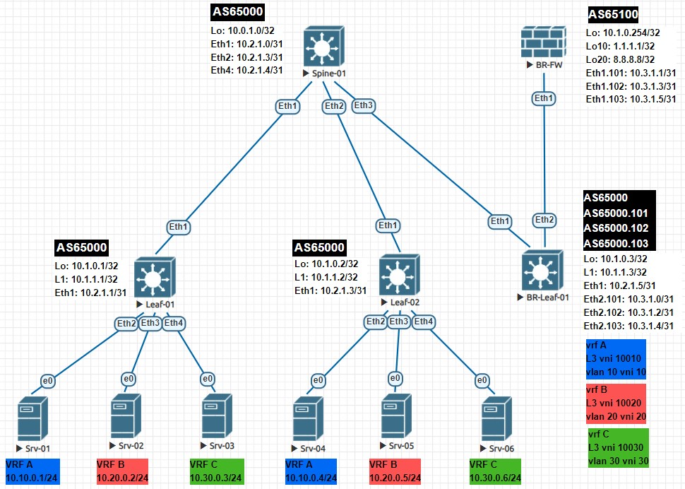

# LAB-08
# EVPN route-type 5
### Цели
- Разобрать EVPN route-type 5 и его применение;
- Настроить route-type для оптимизации маршрутизации.
### Схема сети

### Настройка оборудования
 <details>
<summary>  Настройка Spine-01: </summary>

```
#### Базовая настройка ####
hostname Spine-01
service routing protocols model multi-agent
terminal width 250
username admin privilege 15 role network-admin secret sha512 $6$V/UTnBIIFB18Cw1L$RE5uJmJfjGnLeLRqERxwBH3lJ/YidTa2O/5oviIYzLb1dzkz/rAEzn91Qvyx7eIR5aHTQ/dtAGxyebZy7jnMt/
aaa authorization serial-console
aaa authorization exec default local
ip routing
route-map LOOPBAKS permit 10
   match interface Loopback0

#### Настройка интерфейсов ####
interface Ethernet1
   description ### Link to Leaf-01 int Eth1 ###
   no switchport
   ip address 10.2.1.0/31
   bfd interval 50 min-rx 50 multiplier 3
interface Ethernet2
   description ### Link to Leaf-02 int Eth1 ###
   no switchport
   ip address 10.2.1.2/31
   bfd interval 50 min-rx 50 multiplier 3
interface Ethernet3
   description ### Link to BR-Leaf-01 int Eth1 ###
   no switchport
   ip address 10.2.1.4/31
   bfd interval 50 min-rx 50 multiplier 3
interface Loopback0
   ip address 10.0.1.0/32

#### Настройка BGP ####
router bgp 65000
   bgp asn notation asdot
   router-id 10.0.1.0
   bgp listen range 10.1.0.0/24 peer-group OVERLAY remote-as 65000
   bgp listen range 10.2.1.0/24 peer-group UNDERLAY remote-as 65000
   neighbor OVERLAY peer group
   neighbor OVERLAY update-source Loopback0
   neighbor OVERLAY bfd
   neighbor OVERLAY route-reflector-client
   neighbor OVERLAY timers 5 15
   neighbor OVERLAY password 7 uOE+oO5B97YK28lH6OwjCQ==
   neighbor OVERLAY send-community
   neighbor UNDERLAY peer group
   neighbor UNDERLAY next-hop-self
   neighbor UNDERLAY bfd
   neighbor UNDERLAY route-reflector-client
   neighbor UNDERLAY timers 5 15
   neighbor UNDERLAY password 7 ZcyyQF+TaMkNnh+RPCdLHA==
   redistribute connected route-map LOOPBAKS
   !
   address-family evpn
      neighbor OVERLAY activate
   !
   address-family ipv4
      no neighbor OVERLAY activate
```
</details>
  <details>
<summary>  Настройка Leaf-01: </summary>

```
#### Базовая настройка ####
hostname Leaf-01
service routing protocols model multi-agent
terminal width 250
username admin privilege 15 role network-admin secret sha512 $6$V/UTnBIIFB18Cw1L$RE5uJmJfjGnLeLRqERxwBH3lJ/YidTa2O/5oviIYzLb1dzkz/rAEzn91Qvyx7eIR5aHTQ/dtAGxyebZy7jnMt/
aaa authorization serial-console
aaa authorization exec default local
vlan 10,20,30
ip routing
ip routing vrf A
ip routing vrf B
ip routing vrf C
route-map LOOPBAKS permit 10
   match interface Loopback0
route-map LOOPBAKS permit 20
   match interface Loopback1

#### Настройка интерфейсов ####
interface Ethernet1
   description ### Link to Spine-01 int Eth1 ###
   no switchport
   ip address 10.2.1.1/31
   bfd interval 50 min-rx 50 multiplier 3
interface Ethernet2
   description ### Link to Srv-01 int e0 ###
   switchport access vlan 10
interface Ethernet3
   description ### Link to Srv-02 int e0 ###
   switchport access vlan 20
interface Ethernet4
   description ### Link to Srv-03 int e0 ###
   switchport access vlan 30
interface Loopback0
   ip address 10.1.0.1/32
interface Loopback1
   ip address 10.1.1.1/32
interface Vlan10
   vrf A
   ip address virtual 10.10.0.254/24
interface Vlan20
   vrf B
   ip address virtual 10.20.0.254/24
interface Vlan30
   vrf C
   ip address virtual 10.30.0.254/24
interface Vxlan1
   vxlan source-interface Loopback1
   vxlan udp-port 4789
   vxlan vlan 10 vni 10
   vxlan vlan 20 vni 20
   vxlan vlan 30 vni 30
   vxlan vrf A vni 10010
   vxlan vrf B vni 10020
   vxlan vrf C vni 10030
ip virtual-router mac-address 00:00:11:11:11:11

#### Настройка BGP ####
router bgp 65000
   bgp asn notation asdot
   router-id 10.1.0.1
   maximum-paths 32
   neighbor OVERLAY peer group
   neighbor OVERLAY remote-as 65000
   neighbor OVERLAY update-source Loopback0
   neighbor OVERLAY bfd
   neighbor OVERLAY timers 5 15
   neighbor OVERLAY password 7 uOE+oO5B97YK28lH6OwjCQ==
   neighbor OVERLAY send-community
   neighbor UNDERLAY peer group
   neighbor UNDERLAY remote-as 65000
   neighbor UNDERLAY bfd
   neighbor UNDERLAY timers 5 15
   neighbor UNDERLAY password 7 ZcyyQF+TaMkNnh+RPCdLHA==
   neighbor 10.0.1.0 peer group OVERLAY
   neighbor 10.2.1.0 peer group UNDERLAY
   redistribute connected route-map LOOPBAKS
   !
   vlan 10
      rd 10.1.0.1:10
      route-target both 65000:10
      redistribute learned
   !
   vlan 20
      rd 10.1.0.1:20
      route-target both 65000:20
      redistribute learned
   !
   vlan 30
      rd 10.1.0.1:30
      route-target both 65000:30
      redistribute learned
   !
   address-family evpn
      neighbor OVERLAY activate
   !
   address-family ipv4
      no neighbor OVERLAY activate
   !
   vrf A
      rd 10.1.0.1:10010
      route-target import evpn 65000:10010
      route-target export evpn 65000:10010
   !
   vrf B
      rd 10.1.0.1:10020
      route-target import evpn 65000:10020
      route-target export evpn 65000:10020
   !
   vrf C
      rd 10.1.0.1:10030
      route-target import evpn 65000:10030
      route-target export evpn 65000:10030
```
</details>
 <details>
<summary>  Настройка Leaf-02: </summary>

```
#### Базовая настройка ####
hostname Leaf-02
service routing protocols model multi-agent
terminal width 250
username admin privilege 15 role network-admin secret sha512 $6$V/UTnBIIFB18Cw1L$RE5uJmJfjGnLeLRqERxwBH3lJ/YidTa2O/5oviIYzLb1dzkz/rAEzn91Qvyx7eIR5aHTQ/dtAGxyebZy7jnMt/
aaa authorization serial-console
aaa authorization exec default local
vlan 10,20,30
ip routing
ip routing vrf A
ip routing vrf B
ip routing vrf C
route-map LOOPBAKS permit 10
   match interface Loopback0
route-map LOOPBAKS permit 20
   match interface Loopback1

#### Настройка интерфейсов ####
interface Ethernet1
   description ### Link to Spine-01 int Eth2 ###
   no switchport
   ip address 10.2.1.3/31
   bfd interval 50 min-rx 50 multiplier 3
interface Ethernet2
   description ### Link to Srv-04 int e0 ###
   switchport access vlan 10
interface Ethernet3
   description ### Link to Srv-05 int e0 ###
   switchport access vlan 20
interface Ethernet4
   description ### Link to Srv-06 int e0 ###
   switchport access vlan 30
interface Loopback0
   ip address 10.1.0.2/32
interface Loopback1
   ip address 10.1.1.2/32
interface Vlan10
   vrf A
   ip address virtual 10.10.0.254/24
interface Vlan20
   vrf B
   ip address virtual 10.20.0.254/24
interface Vlan30
   vrf C
   ip address virtual 10.30.0.254/24
interface Vxlan1
   vxlan source-interface Loopback1
   vxlan udp-port 4789
   vxlan vlan 10 vni 10
   vxlan vlan 20 vni 20
   vxlan vlan 30 vni 30
   vxlan vrf A vni 10010
   vxlan vrf B vni 10020
   vxlan vrf C vni 10030
ip virtual-router mac-address 00:00:11:11:11:11

#### Настройка BGP ####
router bgp 65000
   bgp asn notation asdot
   router-id 10.1.0.2
   maximum-paths 32
   neighbor OVERLAY peer group
   neighbor OVERLAY remote-as 65000
   neighbor OVERLAY update-source Loopback0
   neighbor OVERLAY bfd
   neighbor OVERLAY timers 5 15
   neighbor OVERLAY password 7 uOE+oO5B97YK28lH6OwjCQ==
   neighbor OVERLAY send-community
   neighbor UNDERLAY peer group
   neighbor UNDERLAY remote-as 65000
   neighbor UNDERLAY bfd
   neighbor UNDERLAY timers 5 15
   neighbor UNDERLAY password 7 ZcyyQF+TaMkNnh+RPCdLHA==
   neighbor 10.0.1.0 peer group OVERLAY
   neighbor 10.2.1.2 peer group UNDERLAY
   redistribute connected route-map LOOPBAKS
   !
   vlan 10
      rd 10.1.0.2:10
      route-target both 65000:10
      redistribute learned
   !
   vlan 20
      rd 10.1.0.2:20
      route-target both 65000:20
      redistribute learned
   !
   vlan 30
      rd 10.1.0.2:30
      route-target both 65000:30
      redistribute learned
   !
   address-family evpn
      neighbor OVERLAY activate
   !
   address-family ipv4
      no neighbor OVERLAY activate
   !
   vrf A
      rd 10.1.0.2:10010
      route-target import evpn 65000:10010
      route-target export evpn 65000:10010
   !
   vrf B
      rd 10.1.0.2:10020
      route-target import evpn 65000:10020
      route-target export evpn 65000:10020
   !
   vrf C
      rd 10.1.0.2:10030
      route-target import evpn 65000:10030
      route-target export evpn 65000:10030
```
</details>
 <details>
<summary>  Настройка BR-Leaf-01: </summary>

```
#### Базовая настройка ####
hostname BR-Leaf-01
service routing protocols model multi-agent
terminal width 250
username admin privilege 15 role network-admin secret sha512 $6$V/UTnBIIFB18Cw1L$RE5uJmJfjGnLeLRqERxwBH3lJ/YidTa2O/5oviIYzLb1dzkz/rAEzn91Qvyx7eIR5aHTQ/dtAGxyebZy7jnMt/
aaa authorization serial-console
aaa authorization exec default local
ip routing
ip routing vrf A
ip routing vrf B
ip routing vrf C
route-map LOOPBAKS permit 10
   match interface Loopback0
route-map LOOPBAKS permit 20
   match interface Loopback1

#### Настройка интерфейсов ####
interface Ethernet1
   description ### Link to Spine-01 int Eth1 ###
   no switchport
   ip address 10.2.1.5/31
   bfd interval 50 min-rx 50 multiplier 3
interface Ethernet2
   no switchport
interface Ethernet2.101
   encapsulation dot1q vlan 101
   vrf A
   ip address 10.3.1.0/31
interface Ethernet2.102
   encapsulation dot1q vlan 102
   vrf B
   ip address 10.3.1.2/31
interface Ethernet2.103
   encapsulation dot1q vlan 103
   vrf C
   ip address 10.3.1.4/31
interface Loopback0
   ip address 10.1.0.3/32
interface Loopback1
   ip address 10.1.1.3/32
interface Vxlan1
   vxlan source-interface Loopback1
   vxlan udp-port 4789
   vxlan vrf A vni 10010
   vxlan vrf B vni 10020
   vxlan vrf C vni 10030
ip virtual-router mac-address 00:00:11:11:11:11

#### Настройка BGP ####
router bgp 65000
   bgp asn notation asdot
   router-id 10.1.0.3
   maximum-paths 32
   neighbor OVERLAY peer group
   neighbor OVERLAY remote-as 65000
   neighbor OVERLAY update-source Loopback0
   neighbor OVERLAY bfd
   neighbor OVERLAY timers 5 15
   neighbor OVERLAY password 7 uOE+oO5B97YK28lH6OwjCQ==
   neighbor OVERLAY send-community
   neighbor UNDERLAY peer group
   neighbor UNDERLAY remote-as 65000
   neighbor UNDERLAY bfd
   neighbor UNDERLAY timers 5 15
   neighbor UNDERLAY password 7 ZcyyQF+TaMkNnh+RPCdLHA==
   neighbor 10.0.1.0 peer group OVERLAY
   neighbor 10.2.1.4 peer group UNDERLAY
   redistribute connected route-map LOOPBAKS
   !
   address-family evpn
      neighbor OVERLAY activate
   !
   address-family ipv4
      no neighbor OVERLAY activate
   !
   vrf A
      rd 10.1.0.3:10010
      route-target import evpn 65000:10010
      route-target export evpn 65000:10010
      neighbor 10.3.1.1 remote-as 65100
      neighbor 10.3.1.1 local-as 65000.101 no-prepend replace-as
      aggregate-address 10.10.0.0/16 summary-only
      redistribute connected
   !
   vrf B
      rd 10.1.0.3:10020
      route-target import evpn 65000:10020
      route-target export evpn 65000:10020
      neighbor 10.3.1.3 remote-as 65100
      neighbor 10.3.1.3 local-as 65000.102 no-prepend replace-as
      aggregate-address 10.20.0.0/16 summary-only
      redistribute connected
   !
   vrf C
      rd 10.1.0.3:10030
      route-target import evpn 65000:10030
      route-target export evpn 65000:10030
      neighbor 10.3.1.5 remote-as 65100
      neighbor 10.3.1.5 local-as 65000.103 no-prepend replace-as
      aggregate-address 10.30.0.0/16 summary-only
      redistribute connected
```
</details>
 <details>
<summary>  Настройка BR-FW: </summary>

```
#### Базовая настройка ####
hostname BR-FW
service routing protocols model multi-agent
terminal width 250
username admin privilege 15 role network-admin secret sha512 $6$V/UTnBIIFB18Cw1L$RE5uJmJfjGnLeLRqERxwBH3lJ/YidTa2O/5oviIYzLb1dzkz/rAEzn91Qvyx7eIR5aHTQ/dtAGxyebZy7jnMt/
aaa authorization serial-console
aaa authorization exec default local
ip routing
ip prefix-list Lo10
   seq 10 permit 1.0.0.0/8
route-map Lo10 permit 10
   match ip address prefix-list Lo10

#### Настройка интерфейсов ####
interface Ethernet1
   no switchport
interface Ethernet1.101
   encapsulation dot1q vlan 101
   ip address 10.3.1.1/31
interface Ethernet1.102
   encapsulation dot1q vlan 102
   ip address 10.3.1.3/31
interface Ethernet1.103
   encapsulation dot1q vlan 103
   ip address 10.3.1.5/31
interface Loopback0
   ip address 10.1.0.254/32
interface Loopback10
   ip address 1.1.1.1/32
interface Loopback20
   ip address 8.8.8.8/32

#### Настройка BGP ####
router bgp 65100
   bgp asn notation asdot
   router-id 10.1.0.254
   neighbor test peer group
   neighbor 10.3.1.0 remote-as 65000.101
   neighbor 10.3.1.0 default-originate
   neighbor 10.3.1.2 remote-as 65000.102
   neighbor 10.3.1.2 default-originate
   neighbor 10.3.1.4 remote-as 65000.103
   neighbor 10.3.1.4 default-originate
   aggregate-address 1.0.0.0/8 summary-only
   redistribute connected route-map Lo10
```
</details>

### Проверка настроек  

 <details>
<summary> Leaf-01: </summary>

```
Leaf-01#show ip route vrf A

VRF: A
Codes: C - connected, S - static, K - kernel,
       O - OSPF, IA - OSPF inter area, E1 - OSPF external type 1,
       E2 - OSPF external type 2, N1 - OSPF NSSA external type 1,
       N2 - OSPF NSSA external type2, B - BGP, B I - iBGP, B E - eBGP,
       R - RIP, I L1 - IS-IS level 1, I L2 - IS-IS level 2,
       O3 - OSPFv3, A B - BGP Aggregate, A O - OSPF Summary,
       NG - Nexthop Group Static Route, V - VXLAN Control Service,
       DH - DHCP client installed default route, M - Martian,
       DP - Dynamic Policy Route, L - VRF Leaked,
       G  - gRIBI, RC - Route Cache Route

Gateway of last resort:
 B I      0.0.0.0/0 [200/0] via VTEP 10.1.1.3 VNI 10010 router-mac 50:00:00:5b:6f:f5 local-interface Vxlan1

 B I      1.0.0.0/8 [200/0] via VTEP 10.1.1.3 VNI 10010 router-mac 50:00:00:5b:6f:f5 local-interface Vxlan1
 B I      10.3.1.0/31 [200/0] via VTEP 10.1.1.3 VNI 10010 router-mac 50:00:00:5b:6f:f5 local-interface Vxlan1
 B I      10.10.0.4/32 [200/0] via VTEP 10.1.1.2 VNI 10010 router-mac 50:00:00:be:a1:e3 local-interface Vxlan1
 C        10.10.0.0/24 is directly connected, Vlan10
 B I      10.10.0.0/16 [200/0] via VTEP 10.1.1.3 VNI 10010 router-mac 50:00:00:5b:6f:f5 local-interface Vxlan1
 B I      10.20.0.0/16 [200/0] via VTEP 10.1.1.3 VNI 10010 router-mac 50:00:00:5b:6f:f5 local-interface Vxlan1
 B I      10.30.0.0/16 [200/0] via VTEP 10.1.1.3 VNI 10010 router-mac 50:00:00:5b:6f:f5 local-interface Vxlan1

Leaf-01#
Leaf-01#
Leaf-01#show ip route vrf B

VRF: B
Codes: C - connected, S - static, K - kernel,
       O - OSPF, IA - OSPF inter area, E1 - OSPF external type 1,
       E2 - OSPF external type 2, N1 - OSPF NSSA external type 1,
       N2 - OSPF NSSA external type2, B - BGP, B I - iBGP, B E - eBGP,
       R - RIP, I L1 - IS-IS level 1, I L2 - IS-IS level 2,
       O3 - OSPFv3, A B - BGP Aggregate, A O - OSPF Summary,
       NG - Nexthop Group Static Route, V - VXLAN Control Service,
       DH - DHCP client installed default route, M - Martian,
       DP - Dynamic Policy Route, L - VRF Leaked,
       G  - gRIBI, RC - Route Cache Route

Gateway of last resort:
 B I      0.0.0.0/0 [200/0] via VTEP 10.1.1.3 VNI 10020 router-mac 50:00:00:5b:6f:f5 local-interface Vxlan1

 B I      1.0.0.0/8 [200/0] via VTEP 10.1.1.3 VNI 10020 router-mac 50:00:00:5b:6f:f5 local-interface Vxlan1
 B I      10.3.1.2/31 [200/0] via VTEP 10.1.1.3 VNI 10020 router-mac 50:00:00:5b:6f:f5 local-interface Vxlan1
 B I      10.10.0.0/16 [200/0] via VTEP 10.1.1.3 VNI 10020 router-mac 50:00:00:5b:6f:f5 local-interface Vxlan1
 B I      10.20.0.5/32 [200/0] via VTEP 10.1.1.2 VNI 10020 router-mac 50:00:00:be:a1:e3 local-interface Vxlan1
 C        10.20.0.0/24 is directly connected, Vlan20
 B I      10.20.0.0/16 [200/0] via VTEP 10.1.1.3 VNI 10020 router-mac 50:00:00:5b:6f:f5 local-interface Vxlan1
 B I      10.30.0.0/16 [200/0] via VTEP 10.1.1.3 VNI 10020 router-mac 50:00:00:5b:6f:f5 local-interface Vxlan1

Leaf-01#
Leaf-01#
Leaf-01#show ip route vrf C

VRF: C
Codes: C - connected, S - static, K - kernel,
       O - OSPF, IA - OSPF inter area, E1 - OSPF external type 1,
       E2 - OSPF external type 2, N1 - OSPF NSSA external type 1,
       N2 - OSPF NSSA external type2, B - BGP, B I - iBGP, B E - eBGP,
       R - RIP, I L1 - IS-IS level 1, I L2 - IS-IS level 2,
       O3 - OSPFv3, A B - BGP Aggregate, A O - OSPF Summary,
       NG - Nexthop Group Static Route, V - VXLAN Control Service,
       DH - DHCP client installed default route, M - Martian,
       DP - Dynamic Policy Route, L - VRF Leaked,
       G  - gRIBI, RC - Route Cache Route

Gateway of last resort:
 B I      0.0.0.0/0 [200/0] via VTEP 10.1.1.3 VNI 10030 router-mac 50:00:00:5b:6f:f5 local-interface Vxlan1

 B I      1.0.0.0/8 [200/0] via VTEP 10.1.1.3 VNI 10030 router-mac 50:00:00:5b:6f:f5 local-interface Vxlan1
 B I      10.3.1.4/31 [200/0] via VTEP 10.1.1.3 VNI 10030 router-mac 50:00:00:5b:6f:f5 local-interface Vxlan1
 B I      10.10.0.0/16 [200/0] via VTEP 10.1.1.3 VNI 10030 router-mac 50:00:00:5b:6f:f5 local-interface Vxlan1
 B I      10.20.0.0/16 [200/0] via VTEP 10.1.1.3 VNI 10030 router-mac 50:00:00:5b:6f:f5 local-interface Vxlan1
 B I      10.30.0.6/32 [200/0] via VTEP 10.1.1.2 VNI 10030 router-mac 50:00:00:be:a1:e3 local-interface Vxlan1
 C        10.30.0.0/24 is directly connected, Vlan30
 B I      10.30.0.0/16 [200/0] via VTEP 10.1.1.3 VNI 10030 router-mac 50:00:00:5b:6f:f5 local-interface Vxlan1
```
</details>

 <details>
<summary> Leaf-02: </summary>

```
Leaf-02#show ip route vrf B

VRF: B
Codes: C - connected, S - static, K - kernel,
       O - OSPF, IA - OSPF inter area, E1 - OSPF external type 1,
       E2 - OSPF external type 2, N1 - OSPF NSSA external type 1,
       N2 - OSPF NSSA external type2, B - BGP, B I - iBGP, B E - eBGP,
       R - RIP, I L1 - IS-IS level 1, I L2 - IS-IS level 2,
       O3 - OSPFv3, A B - BGP Aggregate, A O - OSPF Summary,
       NG - Nexthop Group Static Route, V - VXLAN Control Service,
       DH - DHCP client installed default route, M - Martian,
       DP - Dynamic Policy Route, L - VRF Leaked,
       G  - gRIBI, RC - Route Cache Route

Gateway of last resort:
 B I      0.0.0.0/0 [200/0] via VTEP 10.1.1.3 VNI 10020 router-mac 50:00:00:5b:6f:f5 local-interface Vxlan1

 B I      1.0.0.0/8 [200/0] via VTEP 10.1.1.3 VNI 10020 router-mac 50:00:00:5b:6f:f5 local-interface Vxlan1
 B I      10.3.1.2/31 [200/0] via VTEP 10.1.1.3 VNI 10020 router-mac 50:00:00:5b:6f:f5 local-interface Vxlan1
 B I      10.10.0.0/16 [200/0] via VTEP 10.1.1.3 VNI 10020 router-mac 50:00:00:5b:6f:f5 local-interface Vxlan1
 B I      10.20.0.2/32 [200/0] via VTEP 10.1.1.1 VNI 10020 router-mac 50:00:00:11:5d:47 local-interface Vxlan1
 C        10.20.0.0/24 is directly connected, Vlan20
 B I      10.20.0.0/16 [200/0] via VTEP 10.1.1.3 VNI 10020 router-mac 50:00:00:5b:6f:f5 local-interface Vxlan1
 B I      10.30.0.0/16 [200/0] via VTEP 10.1.1.3 VNI 10020 router-mac 50:00:00:5b:6f:f5 local-interface Vxlan1

Leaf-02#
Leaf-02#
Leaf-02#show ip route vrf C

VRF: C
Codes: C - connected, S - static, K - kernel,
       O - OSPF, IA - OSPF inter area, E1 - OSPF external type 1,
       E2 - OSPF external type 2, N1 - OSPF NSSA external type 1,
       N2 - OSPF NSSA external type2, B - BGP, B I - iBGP, B E - eBGP,
       R - RIP, I L1 - IS-IS level 1, I L2 - IS-IS level 2,
       O3 - OSPFv3, A B - BGP Aggregate, A O - OSPF Summary,
       NG - Nexthop Group Static Route, V - VXLAN Control Service,
       DH - DHCP client installed default route, M - Martian,
       DP - Dynamic Policy Route, L - VRF Leaked,
       G  - gRIBI, RC - Route Cache Route

Gateway of last resort:
 B I      0.0.0.0/0 [200/0] via VTEP 10.1.1.3 VNI 10030 router-mac 50:00:00:5b:6f:f5 local-interface Vxlan1

 B I      1.0.0.0/8 [200/0] via VTEP 10.1.1.3 VNI 10030 router-mac 50:00:00:5b:6f:f5 local-interface Vxlan1
 B I      10.3.1.4/31 [200/0] via VTEP 10.1.1.3 VNI 10030 router-mac 50:00:00:5b:6f:f5 local-interface Vxlan1
 B I      10.10.0.0/16 [200/0] via VTEP 10.1.1.3 VNI 10030 router-mac 50:00:00:5b:6f:f5 local-interface Vxlan1
 B I      10.20.0.0/16 [200/0] via VTEP 10.1.1.3 VNI 10030 router-mac 50:00:00:5b:6f:f5 local-interface Vxlan1
 B I      10.30.0.3/32 [200/0] via VTEP 10.1.1.1 VNI 10030 router-mac 50:00:00:11:5d:47 local-interface Vxlan1
 C        10.30.0.0/24 is directly connected, Vlan30
 B I      10.30.0.0/16 [200/0] via VTEP 10.1.1.3 VNI 10030 router-mac 50:00:00:5b:6f:f5 local-interface Vxlan1

```
</details>

 <details>
<summary> BR-Leaf-01: </summary>

```
BR-Leaf-01#show ip route vrf A

VRF: A
Codes: C - connected, S - static, K - kernel,
       O - OSPF, IA - OSPF inter area, E1 - OSPF external type 1,
       E2 - OSPF external type 2, N1 - OSPF NSSA external type 1,
       N2 - OSPF NSSA external type2, B - BGP, B I - iBGP, B E - eBGP,
       R - RIP, I L1 - IS-IS level 1, I L2 - IS-IS level 2,
       O3 - OSPFv3, A B - BGP Aggregate, A O - OSPF Summary,
       NG - Nexthop Group Static Route, V - VXLAN Control Service,
       DH - DHCP client installed default route, M - Martian,
       DP - Dynamic Policy Route, L - VRF Leaked,
       G  - gRIBI, RC - Route Cache Route

Gateway of last resort:
 B E      0.0.0.0/0 [200/0]
           via 10.3.1.1, Ethernet2.101

 B E      1.0.0.0/8 [200/0]
           via 10.3.1.1, Ethernet2.101
 C        10.3.1.0/31 [0/0]
           via Ethernet2.101, directly connected
 B I      10.10.0.1/32 [200/0]
           via VTEP 10.1.1.1 VNI 10010 router-mac 50:00:00:11:5d:47 local-interface Vxlan1
 B I      10.10.0.4/32 [200/0]
           via VTEP 10.1.1.2 VNI 10010 router-mac 50:00:00:be:a1:e3 local-interface Vxlan1
 A B      10.10.0.0/16 [200/0]
           Null0
 B E      10.20.0.0/16 [200/0]
           via 10.3.1.1, Ethernet2.101
 B E      10.30.0.0/16 [200/0]
           via 10.3.1.1, Ethernet2.101

BR-Leaf-01#
BR-Leaf-01#
BR-Leaf-01#show ip route vrf B

VRF: B
Codes: C - connected, S - static, K - kernel,
       O - OSPF, IA - OSPF inter area, E1 - OSPF external type 1,
       E2 - OSPF external type 2, N1 - OSPF NSSA external type 1,
       N2 - OSPF NSSA external type2, B - BGP, B I - iBGP, B E - eBGP,
       R - RIP, I L1 - IS-IS level 1, I L2 - IS-IS level 2,
       O3 - OSPFv3, A B - BGP Aggregate, A O - OSPF Summary,
       NG - Nexthop Group Static Route, V - VXLAN Control Service,
       DH - DHCP client installed default route, M - Martian,
       DP - Dynamic Policy Route, L - VRF Leaked,
       G  - gRIBI, RC - Route Cache Route

Gateway of last resort:
 B E      0.0.0.0/0 [200/0]
           via 10.3.1.3, Ethernet2.102

 B E      1.0.0.0/8 [200/0]
           via 10.3.1.3, Ethernet2.102
 C        10.3.1.2/31 [0/0]
           via Ethernet2.102, directly connected
 B E      10.10.0.0/16 [200/0]
           via 10.3.1.3, Ethernet2.102
 B I      10.20.0.2/32 [200/0]
           via VTEP 10.1.1.1 VNI 10020 router-mac 50:00:00:11:5d:47 local-interface Vxlan1
 B I      10.20.0.5/32 [200/0]
           via VTEP 10.1.1.2 VNI 10020 router-mac 50:00:00:be:a1:e3 local-interface Vxlan1
 A B      10.20.0.0/16 [200/0]
           Null0
 B E      10.30.0.0/16 [200/0]
           via 10.3.1.3, Ethernet2.102

BR-Leaf-01#
BR-Leaf-01#
BR-Leaf-01#show ip route vrf C

VRF: C
Codes: C - connected, S - static, K - kernel,
       O - OSPF, IA - OSPF inter area, E1 - OSPF external type 1,
       E2 - OSPF external type 2, N1 - OSPF NSSA external type 1,
       N2 - OSPF NSSA external type2, B - BGP, B I - iBGP, B E - eBGP,
       R - RIP, I L1 - IS-IS level 1, I L2 - IS-IS level 2,
       O3 - OSPFv3, A B - BGP Aggregate, A O - OSPF Summary,
       NG - Nexthop Group Static Route, V - VXLAN Control Service,
       DH - DHCP client installed default route, M - Martian,
       DP - Dynamic Policy Route, L - VRF Leaked,
       G  - gRIBI, RC - Route Cache Route

Gateway of last resort:
 B E      0.0.0.0/0 [200/0]
           via 10.3.1.5, Ethernet2.103

 B E      1.0.0.0/8 [200/0]
           via 10.3.1.5, Ethernet2.103
 C        10.3.1.4/31 [0/0]
           via Ethernet2.103, directly connected
 B E      10.10.0.0/16 [200/0]
           via 10.3.1.5, Ethernet2.103
 B E      10.20.0.0/16 [200/0]
           via 10.3.1.5, Ethernet2.103
 B I      10.30.0.3/32 [200/0]
           via VTEP 10.1.1.1 VNI 10030 router-mac 50:00:00:11:5d:47 local-interface Vxlan1
 B I      10.30.0.6/32 [200/0]
           via VTEP 10.1.1.2 VNI 10030 router-mac 50:00:00:be:a1:e3 local-interface Vxlan1
 A B      10.30.0.0/16 [200/0]
           Null0
```
</details>
 <details>
<summary> BR-FW: </summary>

```
BR-FW#show ip route

VRF: default
Codes: C - connected, S - static, K - kernel,
       O - OSPF, IA - OSPF inter area, E1 - OSPF external type 1,
       E2 - OSPF external type 2, N1 - OSPF NSSA external type 1,
       N2 - OSPF NSSA external type2, B - BGP, B I - iBGP, B E - eBGP,
       R - RIP, I L1 - IS-IS level 1, I L2 - IS-IS level 2,
       O3 - OSPFv3, A B - BGP Aggregate, A O - OSPF Summary,
       NG - Nexthop Group Static Route, V - VXLAN Control Service,
       DH - DHCP client installed default route, M - Martian,
       DP - Dynamic Policy Route, L - VRF Leaked,
       G  - gRIBI, RC - Route Cache Route

Gateway of last resort is not set

 C        1.1.1.1/32 is directly connected, Loopback10
 A B      1.0.0.0/8 is directly connected, Null0
 C        8.8.8.8/32 is directly connected, Loopback20
 C        10.1.0.254/32 is directly connected, Loopback0
 C        10.3.1.0/31 is directly connected, Ethernet1.101
 C        10.3.1.2/31 is directly connected, Ethernet1.102
 C        10.3.1.4/31 is directly connected, Ethernet1.103
```
</details>

 <details>
<summary> Srv-01: </summary>

```
root@Srv-01:~# ping 10.10.0.4 -c3
PING 10.10.0.4 (10.10.0.4) 56(84) bytes of data.
64 bytes from 10.10.0.4: icmp_seq=1 ttl=64 time=12.0 ms
64 bytes from 10.10.0.4: icmp_seq=2 ttl=64 time=15.1 ms
64 bytes from 10.10.0.4: icmp_seq=3 ttl=64 time=64.3 ms

--- 10.10.0.4 ping statistics ---
3 packets transmitted, 3 received, 0% packet loss, time 2002ms
rtt min/avg/max/mdev = 11.972/30.467/64.305/23.961 ms


root@Srv-01:~# ping 10.20.0.2 -c3
PING 10.20.0.2 (10.20.0.2) 56(84) bytes of data.
64 bytes from 10.20.0.2: icmp_seq=1 ttl=59 time=35.1 ms
64 bytes from 10.20.0.2: icmp_seq=2 ttl=59 time=33.1 ms
64 bytes from 10.20.0.2: icmp_seq=3 ttl=59 time=31.1 ms

--- 10.20.0.2 ping statistics ---
3 packets transmitted, 3 received, 0% packet loss, time 2004ms
rtt min/avg/max/mdev = 31.124/33.129/35.133/1.636 ms


root@Srv-01:~# ping 10.20.0.5 -c3
PING 10.20.0.5 (10.20.0.5) 56(84) bytes of data.
64 bytes from 10.20.0.5: icmp_seq=1 ttl=59 time=38.8 ms
64 bytes from 10.20.0.5: icmp_seq=2 ttl=59 time=28.9 ms
64 bytes from 10.20.0.5: icmp_seq=3 ttl=59 time=36.1 ms

--- 10.20.0.5 ping statistics ---
3 packets transmitted, 3 received, 0% packet loss, time 2003ms
rtt min/avg/max/mdev = 28.937/34.617/38.768/4.156 ms


root@Srv-01:~# ping 10.30.0.3 -c3
PING 10.30.0.3 (10.30.0.3) 56(84) bytes of data.
64 bytes from 10.30.0.3: icmp_seq=1 ttl=59 time=28.9 ms
64 bytes from 10.30.0.3: icmp_seq=2 ttl=59 time=33.0 ms
64 bytes from 10.30.0.3: icmp_seq=3 ttl=59 time=29.1 ms

--- 10.30.0.3 ping statistics ---
3 packets transmitted, 3 received, 0% packet loss, time 2004ms
rtt min/avg/max/mdev = 28.865/30.296/32.950/1.878 ms


root@Srv-01:~# ping 10.30.0.6 -c3
PING 10.30.0.6 (10.30.0.6) 56(84) bytes of data.
64 bytes from 10.30.0.6: icmp_seq=1 ttl=59 time=32.4 ms
64 bytes from 10.30.0.6: icmp_seq=2 ttl=59 time=34.2 ms
64 bytes from 10.30.0.6: icmp_seq=3 ttl=59 time=41.3 ms

--- 10.30.0.6 ping statistics ---
3 packets transmitted, 3 received, 0% packet loss, time 2004ms
rtt min/avg/max/mdev = 32.354/35.945/41.292/3.854 ms


root@Srv-01:~# ping 1.1.1.1 -c3
PING 1.1.1.1 (1.1.1.1) 56(84) bytes of data.
64 bytes from 1.1.1.1: icmp_seq=1 ttl=62 time=16.2 ms
64 bytes from 1.1.1.1: icmp_seq=2 ttl=62 time=15.8 ms
64 bytes from 1.1.1.1: icmp_seq=3 ttl=62 time=16.4 ms

--- 1.1.1.1 ping statistics ---
3 packets transmitted, 3 received, 0% packet loss, time 2002ms
rtt min/avg/max/mdev = 15.788/16.150/16.420/0.266 ms


root@Srv-01:~# ping 8.8.8.8 -c3
PING 8.8.8.8 (8.8.8.8) 56(84) bytes of data.
64 bytes from 8.8.8.8: icmp_seq=1 ttl=62 time=17.6 ms
64 bytes from 8.8.8.8: icmp_seq=2 ttl=62 time=30.5 ms
64 bytes from 8.8.8.8: icmp_seq=3 ttl=62 time=16.7 ms

--- 8.8.8.8 ping statistics ---
3 packets transmitted, 3 received, 0% packet loss, time 2003ms
rtt min/avg/max/mdev = 16.744/21.637/30.531/6.299 ms
```
</details>
<details>
<summary> Srv-05: </summary>

```
root@Srv-05:~# ping 10.10.0.1 -c3
PING 10.10.0.1 (10.10.0.1) 56(84) bytes of data.
64 bytes from 10.10.0.1: icmp_seq=1 ttl=59 time=64.0 ms
64 bytes from 10.10.0.1: icmp_seq=2 ttl=59 time=30.0 ms
64 bytes from 10.10.0.1: icmp_seq=3 ttl=59 time=30.9 ms

--- 10.10.0.1 ping statistics ---
3 packets transmitted, 3 received, 0% packet loss, time 2004ms
rtt min/avg/max/mdev = 30.033/41.663/64.036/15.824 ms


root@Srv-05:~# ping 10.10.0.4 -c3
PING 10.10.0.4 (10.10.0.4) 56(84) bytes of data.
64 bytes from 10.10.0.4: icmp_seq=1 ttl=59 time=35.8 ms
64 bytes from 10.10.0.4: icmp_seq=2 ttl=59 time=37.1 ms
64 bytes from 10.10.0.4: icmp_seq=3 ttl=59 time=33.1 ms

--- 10.10.0.4 ping statistics ---
3 packets transmitted, 3 received, 0% packet loss, time 2003ms
rtt min/avg/max/mdev = 33.055/35.318/37.106/1.687 ms


root@Srv-05:~# ping 10.20.0.2 -c3
PING 10.20.0.2 (10.20.0.2) 56(84) bytes of data.
64 bytes from 10.20.0.2: icmp_seq=1 ttl=64 time=14.8 ms
64 bytes from 10.20.0.2: icmp_seq=2 ttl=64 time=20.5 ms
64 bytes from 10.20.0.2: icmp_seq=3 ttl=64 time=18.2 ms

--- 10.20.0.2 ping statistics ---
3 packets transmitted, 3 received, 0% packet loss, time 2003ms
rtt min/avg/max/mdev = 14.834/17.831/20.455/2.309 ms


root@Srv-05:~# ping 10.30.0.3 -c3
PING 10.30.0.3 (10.30.0.3) 56(84) bytes of data.
64 bytes from 10.30.0.3: icmp_seq=1 ttl=59 time=29.7 ms
64 bytes from 10.30.0.3: icmp_seq=2 ttl=59 time=27.5 ms
64 bytes from 10.30.0.3: icmp_seq=3 ttl=59 time=39.8 ms

--- 10.30.0.3 ping statistics ---
3 packets transmitted, 3 received, 0% packet loss, time 2002ms
rtt min/avg/max/mdev = 27.450/32.300/39.751/5.347 ms


root@Srv-05:~# ping 10.30.0.6 -c3
PING 10.30.0.6 (10.30.0.6) 56(84) bytes of data.
64 bytes from 10.30.0.6: icmp_seq=1 ttl=59 time=28.9 ms
64 bytes from 10.30.0.6: icmp_seq=2 ttl=59 time=30.2 ms
64 bytes from 10.30.0.6: icmp_seq=3 ttl=59 time=30.7 ms

--- 10.30.0.6 ping statistics ---
3 packets transmitted, 3 received, 0% packet loss, time 2003ms
rtt min/avg/max/mdev = 28.949/29.957/30.714/0.742 ms


root@Srv-05:~# ping 1.1.1.1 -c3
PING 1.1.1.1 (1.1.1.1) 56(84) bytes of data.
64 bytes from 1.1.1.1: icmp_seq=1 ttl=62 time=16.3 ms
64 bytes from 1.1.1.1: icmp_seq=2 ttl=62 time=14.5 ms
64 bytes from 1.1.1.1: icmp_seq=3 ttl=62 time=19.1 ms

--- 1.1.1.1 ping statistics ---
3 packets transmitted, 3 received, 0% packet loss, time 2004ms
rtt min/avg/max/mdev = 14.524/16.642/19.091/1.879 ms


root@Srv-05:~# ping 8.8.8.8 -c3
PING 8.8.8.8 (8.8.8.8) 56(84) bytes of data.
64 bytes from 8.8.8.8: icmp_seq=1 ttl=62 time=15.8 ms
64 bytes from 8.8.8.8: icmp_seq=2 ttl=62 time=15.0 ms
64 bytes from 8.8.8.8: icmp_seq=3 ttl=62 time=16.7 ms

--- 8.8.8.8 ping statistics ---
3 packets transmitted, 3 received, 0% packet loss, time 2003ms
rtt min/avg/max/mdev = 15.015/15.826/16.677/0.679 ms
```
</details>
