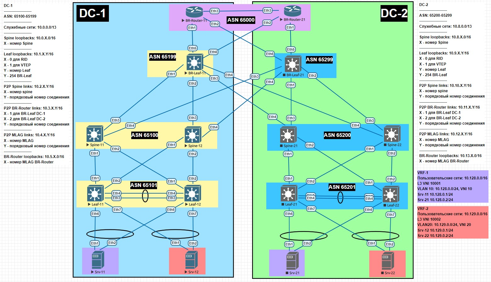

# Проектная пабота
## Проектирование геораспределенной сети ЦОД.
### Цели:
- Cпроектировать и реализовать геораспределенную, катастрофоустройчивую фабрику ЦОД для надежной работы сервисов предприятия.
### Задачи:
- Выработать унифицированное решение для возможности применения в энтерпрайз сетях средного размера;
- Обеспечить гибкость использующихся протоколов и элементов топологии.
### Схема сети

### Настройка оборудования
 <details>
<summary>  Настройка Spine-11: </summary>

```
#### Базовая настройка ####
hostname Spine-11
!
service routing protocols model multi-agent
!
terminal width 250
!
username admin privilege 15 role network-admin secret sha512 $6$V/UTnBIIFB18Cw1L$RE5uJmJfjGnLeLRqERxwBH3lJ/YidTa2O/5oviIYzLb1dzkz/rAEzn91Qvyx7eIR5aHTQ/dtAGxyebZy7jnMt/
!
aaa authorization serial-console
aaa authorization exec default local
!
ip routing
!
route-map LOOPBAKS permit 10
   match interface Loopback0
!
peer-filter AS-FILTER
   10 match as-range 65199 result accept
   20 match as-range 65101 result accept
   30 match as-range 65299 result accept

#### Настройка интерфейсов ####
interface Ethernet1
   description ### Link to Leaf-11 int Eth1 ###
   no switchport
   ip address 10.2.1.0/31
!
interface Ethernet2
   description ### Link to Leaf-12 int Eth1 ###
   no switchport
   ip address 10.2.1.2/31
!
interface Ethernet3
   description ### Link to BR-Leaf-11 int Eth1 ###
   no switchport
   ip address 10.2.1.4/31
!
interface Ethernet4
   description ### Link to BR-Leaf-21 int Eth3 ###
   no switchport
   ip address 10.2.1.6/31
!
interface Loopback0
   description ### For RID ###
   ip address 10.0.1.0/32

#### Настройка BGP ####
router bgp 65100
   router-id 10.0.1.0
   maximum-paths 32
   bgp listen range 10.1.0.0/24 peer-group OVERLAY peer-filter AS-FILTER
   bgp listen range 10.9.0.0/24 peer-group OVERLAY peer-filter AS-FILTER
   bgp listen range 10.2.0.0/16 peer-group UNDERLAY peer-filter AS-FILTER
   neighbor OVERLAY peer group
   neighbor OVERLAY update-source Loopback0
   neighbor OVERLAY ebgp-multihop 5
   neighbor OVERLAY timers 5 15
   neighbor OVERLAY password 7 9xQQO6egEpUfFr9iWyF7Cg==
   neighbor OVERLAY send-community
   neighbor UNDERLAY peer group
   neighbor UNDERLAY timers 5 15
   neighbor UNDERLAY password 7 c2Lge1fq0/XPJRBznUKq1g==
   redistribute connected route-map LOOPBAKS
   !
   address-family evpn
      neighbor OVERLAY activate
   !
   address-family ipv4
      no neighbor OVERLAY activate
```
</details>
 <details>
<summary>  Настройка Spine-12: </summary>

```
#### Базовая настройка ####
hostname Spine-12
!
service routing protocols model multi-agent
!
terminal width 250
!
username admin privilege 15 role network-admin secret sha512 $6$V/UTnBIIFB18Cw1L$RE5uJmJfjGnLeLRqERxwBH3lJ/YidTa2O/5oviIYzLb1dzkz/rAEzn91Qvyx7eIR5aHTQ/dtAGxyebZy7jnMt/
!
aaa authorization serial-console
aaa authorization exec default local
!
ip routing
!
route-map LOOPBAKS permit 10
   match interface Loopback0
!
peer-filter AS-FILTER
   10 match as-range 65199 result accept
   20 match as-range 65101 result accept
   30 match as-range 65299 result accept

#### Настройка интерфейсов ####
interface Ethernet1
   description ### Link to Leaf-11 int Eth2 ###
   no switchport
   ip address 10.2.2.0/31
!
interface Ethernet2
   description ### Link to Leaf-12 int Eth2 ###
   no switchport
   ip address 10.2.2.2/31
!
interface Ethernet3
   description ### Link to BR-Leaf-11 int Eth2 ###
   no switchport
   ip address 10.2.2.4/31
!
interface Ethernet4
   description ### Link to BR-Leaf-21 int Eth4 ###
   no switchport
   ip address 10.2.2.6/31
!
interface Loopback0
   description ### For RID ###
   ip address 10.0.2.0/32

#### Настройка BGP ####
router bgp 65100
   router-id 10.0.2.0
   maximum-paths 32
   bgp listen range 10.1.0.0/24 peer-group OVERLAY peer-filter AS-FILTER
   bgp listen range 10.9.0.0/24 peer-group OVERLAY peer-filter AS-FILTER
   bgp listen range 10.2.0.0/16 peer-group UNDERLAY peer-filter AS-FILTER
   neighbor OVERLAY peer group
   neighbor OVERLAY update-source Loopback0
   neighbor OVERLAY ebgp-multihop 5
   neighbor OVERLAY timers 5 15
   neighbor OVERLAY password 7 9xQQO6egEpUfFr9iWyF7Cg==
   neighbor OVERLAY send-community
   neighbor UNDERLAY peer group
   neighbor UNDERLAY timers 5 15
   neighbor UNDERLAY password 7 c2Lge1fq0/XPJRBznUKq1g==
   redistribute connected route-map LOOPBAKS
   !
   address-family evpn
      neighbor OVERLAY activate
   !
   address-family ipv4
      no neighbor OVERLAY activate
```
</details>
 <details>
<summary>  Настройка Spine-21: </summary>

```
#### Базовая настройка ####
hostname Spine-21
!
service routing protocols model multi-agent
!
terminal width 250
!
username admin privilege 15 role network-admin secret sha512 $6$V/UTnBIIFB18Cw1L$RE5uJmJfjGnLeLRqERxwBH3lJ/YidTa2O/5oviIYzLb1dzkz/rAEzn91Qvyx7eIR5aHTQ/dtAGxyebZy7jnMt/
!
aaa authorization serial-console
aaa authorization exec default local
!
ip routing
!
route-map LOOPBAKS permit 10
   match interface Loopback0
!
peer-filter AS-FILTER
   10 match as-range 65199 result accept
   20 match as-range 65101 result accept
   30 match as-range 65299 result accept

#### Настройка интерфейсов ####
interface Ethernet1
   description ### Link to Leaf-21 int Eth1 ###
   no switchport
   ip address 10.10.1.0/31
!
interface Ethernet2
   description ### Link to Leaf-22 int Eth1 ###
   no switchport
   ip address 10.10.1.2/31
!
interface Ethernet3
   description ### Link to BR-Leaf-21 int Eth1 ###
   no switchport
   ip address 10.10.1.4/31
!
interface Ethernet4
   description ### Link to BR-Leaf-11 int Eth3 ###
   no switchport
   ip address 10.10.1.6/31
!
interface Loopback0
   description ### For RID ###
   ip address 10.8.1.0/32

#### Настройка BGP ####
router bgp 65200
   router-id 10.8.1.0
   maximum-paths 32
   bgp listen range 10.1.0.0/24 peer-group OVERLAY peer-filter AS-FILTER
   bgp listen range 10.9.0.0/24 peer-group OVERLAY-1 peer-filter AS-FILTER
   bgp listen range 10.10.0.0/16 peer-group UNDERLAY peer-filter AS-FILTER
   neighbor OVERLAY peer group
   neighbor OVERLAY update-source Loopback0
   neighbor OVERLAY ebgp-multihop 5
   neighbor OVERLAY timers 5 15
   neighbor OVERLAY password 7 9xQQO6egEpUfFr9iWyF7Cg==
   neighbor OVERLAY send-community
   neighbor UNDERLAY peer group
   neighbor UNDERLAY timers 5 15
   neighbor UNDERLAY password 7 c2Lge1fq0/XPJRBznUKq1g==
   redistribute connected route-map LOOPBAKS
   !
   address-family evpn
      neighbor OVERLAY activate
   !
   address-family ipv4
      no neighbor OVERLAY activate
```
</details>
 <details>
<summary>  Настройка Spine-22: </summary>

```
#### Базовая настройка ####
hostname Spine-22
!
service routing protocols model multi-agent
!
terminal width 250
!
username admin privilege 15 role network-admin secret sha512 $6$V/UTnBIIFB18Cw1L$RE5uJmJfjGnLeLRqERxwBH3lJ/YidTa2O/5oviIYzLb1dzkz/rAEzn91Qvyx7eIR5aHTQ/dtAGxyebZy7jnMt/
!
aaa authorization serial-console
aaa authorization exec default local
!
ip routing
!
route-map LOOPBAKS permit 10
   match interface Loopback0
!
peer-filter AS-FILTER
   10 match as-range 65199 result accept
   20 match as-range 65101 result accept
   30 match as-range 65299 result accept

#### Настройка интерфейсов ####
interface Ethernet1
   description ### Link to Leaf-21 int Eth2 ###
   no switchport
   ip address 10.10.2.0/31
!
interface Ethernet2
   description ### Link to Leaf-22 int Eth2 ###
   no switchport
   ip address 10.10.2.2/31
!
interface Ethernet3
   description ### Link to BR-Leaf-21 int Eth2 ###
   no switchport
   ip address 10.10.2.4/31
!
interface Ethernet4
   description ### Link to BR-Leaf-11 int Eth4 ###
   no switchport
   ip address 10.10.2.6/31
!
interface Loopback0
   description ### For RID ###
   ip address 10.8.2.0/32

#### Настройка BGP ####
router bgp 65200
   router-id 10.8.2.0
   maximum-paths 32
   bgp listen range 10.1.0.0/24 peer-group OVERLAY peer-filter AS-FILTER
   bgp listen range 10.9.0.0/24 peer-group OVERLAY peer-filter AS-FILTER
   bgp listen range 10.10.0.0/16 peer-group UNDERLAY peer-filter AS-FILTER
   neighbor OVERLAY peer group
   neighbor OVERLAY update-source Loopback0
   neighbor OVERLAY ebgp-multihop 5
   neighbor OVERLAY timers 5 15
   neighbor OVERLAY password 7 9xQQO6egEpUfFr9iWyF7Cg==
   neighbor OVERLAY send-community
   neighbor UNDERLAY peer group
   neighbor UNDERLAY timers 5 15
   neighbor UNDERLAY password 7 c2Lge1fq0/XPJRBznUKq1g==
   redistribute connected route-map LOOPBAKS
   !
   address-family evpn
      neighbor OVERLAY activate
   !
   address-family ipv4
      no neighbor OVERLAY activate
```
</details>
  <details>
<summary>  Настройка Leaf-11: </summary>

```
#### Базовая настройка ####
hostname Leaf-11
!
service routing protocols model multi-agent
!
terminal width 250
!
username admin privilege 15 role network-admin secret sha512 $6$V/UTnBIIFB18Cw1L$RE5uJmJfjGnLeLRqERxwBH3lJ/YidTa2O/5oviIYzLb1dzkz/rAEzn91Qvyx7eIR5aHTQ/dtAGxyebZy7jnMt/
!
aaa authorization serial-console
aaa authorization exec default local
!
vlan 10,20
!
vrf instance VRF-1
!
vrf instance VRF-2
!
ip virtual-router mac-address 00:00:11:11:11:11
!
ip routing
ip routing vrf VRF-1
ip routing vrf VRF-2
!
route-map LOOPBAKS permit 10
   match interface Loopback0
!
route-map LOOPBAKS permit 20
   match interface Loopback1

#### Настройка интерфейсов ####
interface Loopback0
   description ### For RID ###
   ip address 10.1.0.1/32
!
interface Loopback1
   description ### For VTEP ###
   ip address 10.1.1.1/32
!
interface Ethernet1
   description ### Link to Spine-11 int Eth1 ###
   no switchport
   ip address 10.2.1.1/31
!
interface Ethernet2
   description ### Link to Spine-12 int Eth2 ###
   no switchport
   ip address 10.2.2.1/31
!
interface Vlan10
   vrf VRF-1
   ip address virtual 10.128.0.254/24
!
interface Vlan20
   vrf VRF-2
   ip address virtual 10.129.0.254/24
!
interface Vxlan1
   vxlan source-interface Loopback1
   vxlan udp-port 4789
   vxlan vlan 10 vni 10
   vxlan vlan 20 vni 20
   vxlan vrf VRF-1 vni 10001
   vxlan vrf VRF-2 vni 10002

#### Настройка MLAG ####
no spanning-tree vlan-id 4093-4094
!
vlan 4093-4094
   trunk group mlagpeer
!
interface Ethernet3
   description ### Po1 to Leaf-12 int Eth3 ###
   channel-group 1 mode active
!
interface Ethernet4
   description ### Po1 to Leaf-12 int Eth4 ###
   channel-group 1 mode active
!
interface Ethernet6
   description ### Po10 to Srv-11 int Eth1 ###
   channel-group 10 mode active
!
interface Ethernet7
   description ### Po20 to Srv-12 int Eth1 ###
   channel-group 20 mode active
!
interface Port-Channel1
   description ### PeerLink to Leaf-12 int Po1 ###
   switchport mode trunk
   switchport trunk group mlagpeer
!
interface Port-Channel10
   description ### Link to Srv-11 int Po10 ###
   switchport access vlan 10
   mlag 10
!
interface Port-Channel20
   description ### Link to Srv-12 int Po20 ###
   switchport access vlan 20
   mlag 20
!
interface Vlan4093
   description ### For iBGP ###
   ip address 10.4.1.0/31
!
interface Vlan4094
   description ### MLAG Peer-address ###
   ip address 10.4.1.2/31
!
mlag configuration
   domain-id mlag-01
   local-interface Vlan4094
   peer-address 10.4.1.3
   peer-link Port-Channel1

#### Настройка BGP ####
router bgp 65101
   router-id 10.1.0.1
   maximum-paths 32
   neighbor OVERLAY peer group
   neighbor OVERLAY remote-as 65100
   neighbor OVERLAY update-source Loopback0
   neighbor OVERLAY ebgp-multihop 5
   neighbor OVERLAY timers 5 15
   neighbor OVERLAY password 7 9xQQO6egEpUfFr9iWyF7Cg==
   neighbor OVERLAY send-community
   neighbor UNDERLAY peer group
   neighbor UNDERLAY remote-as 65100
   neighbor UNDERLAY timers 5 15
   neighbor UNDERLAY password 7 c2Lge1fq0/XPJRBznUKq1g==
   neighbor iBGP peer group
   neighbor iBGP remote-as 65101
   neighbor iBGP next-hop-self
   neighbor iBGP timers 5 15
   neighbor iBGP password 7 d3DyfwhRApq/cx8UQ+Aw7A==
   neighbor 10.0.1.0 peer group OVERLAY
   neighbor 10.0.2.0 peer group OVERLAY
   neighbor 10.2.1.0 peer group UNDERLAY
   neighbor 10.2.2.0 peer group UNDERLAY
   neighbor 10.4.1.1 peer group iBGP
   redistribute connected route-map LOOPBAKS
   !
   vlan 10
      rd 10.1.0.1:10
      route-target both 1:10
      redistribute learned
   !
   vlan 20
      rd 10.1.0.1:20
      route-target both 1:20
      redistribute learned
   !
   address-family evpn
      neighbor OVERLAY activate
   !
   address-family ipv4
      no neighbor OVERLAY activate
   !
   vrf VRF-1
      rd 10.1.0.1:10001
      route-target import evpn 1:10001
      route-target export evpn 1:10001
   !
   vrf VRF-2
      rd 10.1.0.1:10002
      route-target import evpn 2:10002
      route-target export evpn 2:10002
```
</details>
   <details>
<summary>  Настройка Leaf-12: </summary>

```
#### Базовая настройка ####
hostname Leaf-12
!
service routing protocols model multi-agent
!
terminal width 250
!
username admin privilege 15 role network-admin secret sha512 $6$V/UTnBIIFB18Cw1L$RE5uJmJfjGnLeLRqERxwBH3lJ/YidTa2O/5oviIYzLb1dzkz/rAEzn91Qvyx7eIR5aHTQ/dtAGxyebZy7jnMt/
!
aaa authorization serial-console
aaa authorization exec default local
!
vlan 10,20
!
vrf instance VRF-1
!
vrf instance VRF-2
!
ip virtual-router mac-address 00:00:11:11:11:11
!
ip routing
ip routing vrf VRF-1
ip routing vrf VRF-2
!
route-map LOOPBAKS permit 10
   match interface Loopback0
!
route-map LOOPBAKS permit 20
   match interface Loopback1

#### Настройка интерфейсов ####
interface Loopback0
   description ### For RID ###
   ip address 10.1.0.2/32
!
interface Loopback1
   description ### For VTEP ###
   ip address 10.1.1.2/32
!
interface Ethernet1
   description ### Link to Spine-11 int Eth2 ###
   no switchport
   ip address 10.2.1.3/31
!
interface Ethernet2
   description ### Link to Spine-12 int Eth2 ###
   no switchport
   ip address 10.2.2.3/31
!
interface Vlan10
   vrf VRF-1
   ip address virtual 10.128.0.254/24
!
interface Vlan20
   vrf VRF-2
   ip address virtual 10.129.0.254/24
!
interface Vxlan1
   vxlan source-interface Loopback1
   vxlan udp-port 4789
   vxlan vlan 10 vni 10
   vxlan vlan 20 vni 20
   vxlan vrf VRF-1 vni 10001
   vxlan vrf VRF-2 vni 10002

#### Настройка MLAG ####
no spanning-tree vlan-id 4093-4094
!
vlan 4093-4094
   trunk group mlagpeer
!
interface Ethernet3
   description ### Po1 to Leaf-11 int Eth3 ###
   channel-group 1 mode active
!
interface Ethernet4
   description ### Po1 to Leaf-11 int Eth4 ###
   channel-group 1 mode active
!
interface Ethernet6
   description ### Po10 to Srv-11 int Eth2 ###
   channel-group 10 mode active
!
interface Ethernet7
   description ### Po20 to Srv-12 int Eth2 ###
   channel-group 20 mode active
!
interface Port-Channel1
   description ### PeerLink to Leaf-11 int Po1 ###
   switchport mode trunk
   switchport trunk group mlagpeer
!
interface Port-Channel10
   description ### Link to Srv-11 int Po10 ###
   switchport access vlan 10
   mlag 10
!
interface Port-Channel20
   description ### Link to Srv-12 int Po20 ###
   switchport access vlan 20
   mlag 20
!
interface Vlan4093
   description ### For iBGP ###
   ip address 10.4.1.1/31
!
interface Vlan4094
   description ### MLAG Peer-address ###
   ip address 10.4.1.3/31
!
mlag configuration
   domain-id mlag-01
   local-interface Vlan4094
   peer-address 10.4.1.2
   peer-link Port-Channel1

#### Настройка BGP ####
router bgp 65101
   router-id 10.1.0.2
   maximum-paths 32
   neighbor OVERLAY peer group
   neighbor OVERLAY remote-as 65100
   neighbor OVERLAY update-source Loopback0
   neighbor OVERLAY ebgp-multihop 5
   neighbor OVERLAY timers 5 15
   neighbor OVERLAY password 7 9xQQO6egEpUfFr9iWyF7Cg==
   neighbor OVERLAY send-community
   neighbor UNDERLAY peer group
   neighbor UNDERLAY remote-as 65100
   neighbor UNDERLAY timers 5 15
   neighbor UNDERLAY password 7 c2Lge1fq0/XPJRBznUKq1g==
   neighbor iBGP peer group
   neighbor iBGP remote-as 65101
   neighbor iBGP next-hop-self
   neighbor iBGP timers 5 15
   neighbor iBGP password 7 d3DyfwhRApq/cx8UQ+Aw7A==
   neighbor 10.0.1.0 peer group OVERLAY
   neighbor 10.0.2.0 peer group OVERLAY
   neighbor 10.2.1.2 peer group UNDERLAY
   neighbor 10.2.2.2 peer group UNDERLAY
   neighbor 10.4.1.0 peer group iBGP
   redistribute connected route-map LOOPBAKS
   !
   vlan 10
      rd 10.1.0.2:10
      route-target both 1:10
      redistribute learned
   !
   vlan 20
      rd 10.1.0.2:20
      route-target both 1:20
      redistribute learned
   !
   address-family evpn
      neighbor OVERLAY activate
   !
   address-family ipv4
      no neighbor OVERLAY activate
   !
   vrf VRF-1
      rd 10.1.0.1:10001
      route-target import evpn 1:10001
      route-target export evpn 1:10001
   !
   vrf VRF-2
      rd 10.1.0.1:10002
      route-target import evpn 2:10002
      route-target export evpn 2:10002
```
</details>  
   <details>
<summary>  Настройка Leaf-21: </summary>

```
#### Базовая настройка ####
hostname Leaf-21
!
service routing protocols model multi-agent
!
terminal width 250
!
username admin privilege 15 role network-admin secret sha512 $6$V/UTnBIIFB18Cw1L$RE5uJmJfjGnLeLRqERxwBH3lJ/YidTa2O/5oviIYzLb1dzkz/rAEzn91Qvyx7eIR5aHTQ/dtAGxyebZy7jnMt/
!
aaa authorization serial-console
aaa authorization exec default local
!
vlan 10,20
!
vrf instance VRF-1
!
vrf instance VRF-2
!
ip virtual-router mac-address 00:00:11:11:11:11
!
ip routing
ip routing vrf VRF-1
ip routing vrf VRF-2
!
route-map LOOPBAKS permit 10
   match interface Loopback0
!
route-map LOOPBAKS permit 20
   match interface Loopback1

#### Настройка интерфейсов ####
interface Loopback0
   description ### For RID ###
   ip address 10.9.0.1/32
!
interface Loopback1
   description ### For VTEP ###
   ip address 10.9.1.1/32
!
interface Ethernet1
   description ### Link to Spine-21 int Eth1 ###
   no switchport
   ip address 10.10.1.1/31
!
interface Ethernet2
   description ### Link to Spine-22 int Eth2 ###
   no switchport
   ip address 10.10.2.1/31
!
interface Vlan10
   vrf VRF-1
   ip address virtual 10.128.0.254/24
!
interface Vlan20
   vrf VRF-2
   ip address virtual 10.129.0.254/24
!
interface Vxlan1
   vxlan source-interface Loopback1
   vxlan udp-port 4789
   vxlan vlan 10 vni 10
   vxlan vlan 20 vni 20
   vxlan vrf VRF-1 vni 10001
   vxlan vrf VRF-2 vni 10002

#### Настройка MLAG ####
no spanning-tree vlan-id 4093-4094
!
vlan 4093-4094
   trunk group mlagpeer
!
interface Ethernet3
   description ### Po1 to Leaf-22 int Eth3 ###
   channel-group 1 mode active
!
interface Ethernet4
   description ### Po1 to Leaf-22 int Eth4 ###
   channel-group 1 mode active
!
interface Ethernet6
   description ### Po10 to Srv-21 int Eth1 ###
   channel-group 10 mode active
!
interface Ethernet7
   description ### Po20 to Srv-22 int Eth1 ###
   channel-group 20 mode active
!
interface Port-Channel1
   description ### PeerLink to Leaf-22 int Po1 ###
   switchport mode trunk
   switchport trunk group mlagpeer
!
interface Port-Channel10
   description ### Link to Srv-21 int Po10 ###
   switchport access vlan 10
   mlag 10
!
interface Port-Channel20
   description ### Link to Srv-22 int Po20 ###
   switchport access vlan 20
   mlag 20
!
interface Vlan4093
   description ### For iBGP ###
   ip address 10.12.1.0/31
!
interface Vlan4094
   description ### MLAG Peer-address ###
   ip address 10.12.1.2/31
!
mlag configuration
   domain-id mlag-01
   local-interface Vlan4094
   peer-address 10.12.1.3
   peer-link Port-Channel1

#### Настройка BGP ####
router bgp 65201
   router-id 10.9.0.1
   maximum-paths 32
   neighbor OVERLAY peer group
   neighbor OVERLAY remote-as 65200
   neighbor OVERLAY update-source Loopback0
   neighbor OVERLAY ebgp-multihop 5
   neighbor OVERLAY timers 5 15
   neighbor OVERLAY password 7 9xQQO6egEpUfFr9iWyF7Cg==
   neighbor OVERLAY send-community
   neighbor UNDERLAY peer group
   neighbor UNDERLAY remote-as 65200
   neighbor UNDERLAY timers 5 15
   neighbor UNDERLAY password 7 c2Lge1fq0/XPJRBznUKq1g==
   neighbor iBGP peer group
   neighbor iBGP remote-as 65201
   neighbor iBGP next-hop-self
   neighbor iBGP timers 5 15
   neighbor iBGP password 7 d3DyfwhRApq/cx8UQ+Aw7A==
   neighbor 10.8.1.0 peer group OVERLAY
   neighbor 10.8.2.0 peer group OVERLAY
   neighbor 10.10.1.0 peer group UNDERLAY
   neighbor 10.10.2.0 peer group UNDERLAY
   neighbor 10.12.1.1 peer group iBGP
   redistribute connected route-map LOOPBAKS
   !
   vlan 10
      rd 10.9.0.1:10
      route-target both 1:10
      redistribute learned
   !
   vlan 20
      rd 10.9.0.1:20
      route-target both 1:20
      redistribute learned
   !
   address-family evpn
      neighbor OVERLAY activate
   !
   address-family ipv4
      no neighbor OVERLAY activate
   !
   vrf VRF-1
      rd 10.9.0.1:10001
      route-target import evpn 1:10001
      route-target export evpn 1:10001
   !
   vrf VRF-2
      rd 10.9.0.1:10002
      route-target import evpn 2:10002
      route-target export evpn 2:10002
```
</details>  
   <details>
<summary>  Настройка Leaf-22: </summary>

```
#### Базовая настройка ####
hostname Leaf-22
!
service routing protocols model multi-agent
!
terminal width 250
!
username admin privilege 15 role network-admin secret sha512 $6$V/UTnBIIFB18Cw1L$RE5uJmJfjGnLeLRqERxwBH3lJ/YidTa2O/5oviIYzLb1dzkz/rAEzn91Qvyx7eIR5aHTQ/dtAGxyebZy7jnMt/
!
aaa authorization serial-console
aaa authorization exec default local
!
vlan 10,20
!
vrf instance VRF-1
!
vrf instance VRF-2
!
ip virtual-router mac-address 00:00:11:11:11:11
!
ip routing
ip routing vrf VRF-1
ip routing vrf VRF-2
!
route-map LOOPBAKS permit 10
   match interface Loopback0
!
route-map LOOPBAKS permit 20
   match interface Loopback1

#### Настройка интерфейсов ####
interface Loopback0
   description ### For RID ###
   ip address 10.9.0.2/32
!
interface Loopback1
   description ### For VTEP ###
   ip address 10.9.1.2/32
!
interface Ethernet1
   description ### Link to Spine-21 int Eth1 ###
   no switchport
   ip address 10.10.1.3/31
!
interface Ethernet2
   description ### Link to Spine-22 int Eth2 ###
   no switchport
   ip address 10.10.2.3/31
!
interface Vlan10
   vrf VRF-1
   ip address virtual 10.128.0.254/24
!
interface Vlan20
   vrf VRF-2
   ip address virtual 10.129.0.254/24
!
interface Vxlan1
   vxlan source-interface Loopback1
   vxlan udp-port 4789
   vxlan vlan 10 vni 10
   vxlan vlan 20 vni 20
   vxlan vrf VRF-1 vni 10001
   vxlan vrf VRF-2 vni 10002

#### Настройка MLAG ####
no spanning-tree vlan-id 4093-4094
!
vlan 4093-4094
   trunk group mlagpeer
!
interface Ethernet3
   description ### Po1 to Leaf-21 int Eth3 ###
   channel-group 1 mode active
!
interface Ethernet4
   description ### Po1 to Leaf-21 int Eth4 ###
   channel-group 1 mode active
!
interface Ethernet6
   description ### Po10 to Srv-21 int Eth1 ###
   channel-group 10 mode active
!
interface Ethernet7
   description ### Po20 to Srv-22 int Eth1 ###
   channel-group 20 mode active
!
interface Port-Channel1
   description ### PeerLink to Leaf-21 int Po1 ###
   switchport mode trunk
   switchport trunk group mlagpeer
!
interface Port-Channel10
   description ### Link to Srv-21 int Po10 ###
   switchport access vlan 10
   mlag 10
!
interface Port-Channel20
   description ### Link to Srv-22 int Po20 ###
   switchport access vlan 20
   mlag 20
!
interface Vlan4093
   description ### For iBGP ###
   ip address 10.12.1.1/31
!
interface Vlan4094
   description ### MLAG Peer-address ###
   ip address 10.12.1.3/31
!
mlag configuration
   domain-id mlag-01
   local-interface Vlan4094
   peer-address 10.12.1.2
   peer-link Port-Channel1

#### Настройка BGP ####
router bgp 65201
   router-id 10.9.0.1
   maximum-paths 32
   neighbor OVERLAY peer group
   neighbor OVERLAY remote-as 65200
   neighbor OVERLAY update-source Loopback0
   neighbor OVERLAY ebgp-multihop 5
   neighbor OVERLAY timers 5 15
   neighbor OVERLAY password 7 9xQQO6egEpUfFr9iWyF7Cg==
   neighbor OVERLAY send-community
   neighbor UNDERLAY peer group
   neighbor UNDERLAY remote-as 65200
   neighbor UNDERLAY timers 5 15
   neighbor UNDERLAY password 7 c2Lge1fq0/XPJRBznUKq1g==
   neighbor iBGP peer group
   neighbor iBGP remote-as 65201
   neighbor iBGP next-hop-self
   neighbor iBGP timers 5 15
   neighbor iBGP password 7 d3DyfwhRApq/cx8UQ+Aw7A==
   neighbor 10.8.1.0 peer group OVERLAY
   neighbor 10.8.2.0 peer group OVERLAY
   neighbor 10.10.1.0 peer group UNDERLAY
   neighbor 10.10.2.0 peer group UNDERLAY
   neighbor 10.12.1.1 peer group iBGP
   redistribute connected route-map LOOPBAKS
   !
   vlan 10
      rd 10.9.0.1:10
      route-target both 1:10
      redistribute learned
   !
   vlan 20
      rd 10.9.0.1:20
      route-target both 1:20
      redistribute learned
   !
   address-family evpn
      neighbor OVERLAY activate
   !
   address-family ipv4
      no neighbor OVERLAY activate
   !
   vrf VRF-1
      rd 10.9.0.1:10001
      route-target import evpn 1:10001
      route-target export evpn 1:10001
   !
   vrf VRF-2
      rd 10.9.0.1:10002
      route-target import evpn 2:10002
      route-target export evpn 2:10002
```
</details>  
   <details>
<summary>  Настройка BR-Leaf-11: </summary>

```
#### Базовая настройка ####
hostname BR-Leaf-11
!
service routing protocols model multi-agent
!
terminal width 250
!
username admin privilege 15 role network-admin secret sha512 $6$V/UTnBIIFB18Cw1L$RE5uJmJfjGnLeLRqERxwBH3lJ/YidTa2O/5oviIYzLb1dzkz/rAEzn91Qvyx7eIR5aHTQ/dtAGxyebZy7jnMt/
!
aaa authorization serial-console
aaa authorization exec default local
!
vrf instance VRF-1
!
vrf instance VRF-2
!
ip virtual-router mac-address 00:00:11:11:11:11
!
ip routing
ip routing vrf VRF-1
ip routing vrf VRF-2
!
route-map LOOPBAKS permit 10
   match interface Loopback0
!
route-map LOOPBAKS permit 20
   match interface Loopback1
!
route-map BR-Router-11 permit 10
   set local-preference 200
!
route-map Spine-DC2 permit 10
   set as-path prepend auto

#### Настройка интерфейсов ####
interface Ethernet1
   description ### Link to Spine-11 int Eth 3 ###
   no switchport
   ip address 10.2.1.5/31
!
interface Ethernet2
   description ### Link to Spine-12 int Eth 3 ###
   no switchport
   ip address 10.2.2.5/31
!
interface Ethernet3
   description ### Link to Spine-21 int Eth 4 ###
   no switchport
   ip address 10.10.1.7/31
!
interface Ethernet4
   description ### Link to Spine-22 int Eth 4 ###
   no switchport
   ip address 10.10.2.7/31
!
interface Ethernet5
   description ### Link to BR-Router-11 int Eth 1 ###
   no switchport
!
interface Ethernet5.1
   description ### VRF-1 link to BR-Router-11 int Eth1.1 ###
   encapsulation dot1q vlan 1
   vrf VRF-1
   ip address 10.3.1.1/31
!
interface Ethernet5.2
   description ### VRF-2 link to BR-Router-11 int Eth1.2 ###
   encapsulation dot1q vlan 2
   vrf VRF-2
   ip address 10.3.1.3/31
!
interface Ethernet6
   description ### Link to BR-Router-21 int Eth 2 ###
   no switchport
!
interface Ethernet6.1
   description ### VRF-1 link to BR-Router-21 int Eth2.1 ###
   encapsulation dot1q vlan 1
   vrf VRF-1
   ip address 10.11.1.1/31
!
interface Ethernet6.2
   description ### VRF-2 link to BR-Router-21 int Eth2.2 ###
   encapsulation dot1q vlan 2
   vrf VRF-2
   ip address 10.11.1.3/31
!
interface Loopback0
   description ### For RID ###
   ip address 10.1.0.254/32
!
interface Loopback1
   description ### For VTEP ###
   ip address 10.1.1.254/32
!
interface Vxlan1
   vxlan source-interface Loopback1
   vxlan udp-port 4789
   vxlan vrf VRF-1 vni 10001
   vxlan vrf VRF-2 vni 10002

#### Настройка BGP ####
router bgp 65199
   bgp asn notation asdot
   router-id 10.1.0.254
   maximum-paths 32
   neighbor BR-Router peer group
   neighbor BR-Router remote-as 65000
   neighbor BR-Router timers 5 15
   neighbor BR-Router password 7 wl01PHF75uToDH52zw6rVA==
   neighbor OVERLAY peer group
   neighbor OVERLAY-1 peer group
   neighbor OVERLAY-1 remote-as 65100
   neighbor OVERLAY-1 update-source Loopback0
   neighbor OVERLAY-1 ebgp-multihop 5
   neighbor OVERLAY-1 timers 5 15
   neighbor OVERLAY-1 password 7 5mxPWBF4R5bMFZzIIaOMhg==
   neighbor OVERLAY-1 send-community
   neighbor OVERLAY-2 peer group
   neighbor OVERLAY-2 remote-as 65200
   neighbor OVERLAY-2 update-source Loopback0
   neighbor OVERLAY-2 ebgp-multihop 5
   neighbor OVERLAY-2 timers 5 15
   neighbor OVERLAY-2 password 7 5HR+E8CJjttw/PNrUXWb5w==
   neighbor OVERLAY-2 send-community
   neighbor OVERLAY-2 route-map Spine-DC2 out
   neighbor UNDERLAY-1 peer group
   neighbor UNDERLAY-1 remote-as 65100
   neighbor UNDERLAY-1 timers 5 15
   neighbor UNDERLAY-1 password 7 3MAy3jnc7sYrfpdhTvReJg==
   neighbor UNDERLAY-2 peer group
   neighbor UNDERLAY-2 remote-as 65200
   neighbor UNDERLAY-2 timers 5 15
   neighbor UNDERLAY-2 password 7 Uli+GZSJX4ylTHVh6p7r6w==
   neighbor 10.0.1.0 peer group OVERLAY-1
   neighbor 10.0.2.0 peer group OVERLAY-1
   neighbor 10.2.1.4 peer group UNDERLAY-1
   neighbor 10.2.2.4 peer group UNDERLAY-1
   neighbor 10.8.1.0 peer group OVERLAY-2
   neighbor 10.8.2.0 peer group OVERLAY-2
   neighbor 10.10.1.6 peer group UNDERLAY-2
   neighbor 10.10.2.6 peer group UNDERLAY-2
   redistribute connected route-map LOOPBAKS
   !
   address-family evpn
      neighbor OVERLAY-1 activate
      neighbor OVERLAY-2 activate
   !
   address-family ipv4
      no neighbor OVERLAY-1 activate
      no neighbor OVERLAY-2 activate
   !
   vrf VRF-1
      rd 10.1.0.253:10001
      route-target import evpn 1:10001
      route-target export evpn 1:10001
      neighbor 10.3.1.0 peer group BR-Router
      neighbor 10.3.1.0 route-map BR-Router-11 in
      neighbor 10.11.1.0 peer group BR-Router
      aggregate-address 10.128.0.0/16 summary-only advertise-only
   !
   vrf VRF-2
      rd 10.1.0.253:10002
      route-target import evpn 2:10002
      route-target export evpn 2:10002
      neighbor 10.3.1.2 peer group BR-Router
      neighbor 10.3.1.2 route-map BR-Router-11 in
      neighbor 10.11.1.2 peer group BR-Router
      aggregate-address 10.129.0.0/16 summary-only advertise-only
```
</details>  
   <details>
<summary>  Настройка BR-Leaf-21: </summary>

```
#### Базовая настройка ####
hostname BR-Leaf-21
!
service routing protocols model multi-agent
!
terminal width 250
!
username admin privilege 15 role network-admin secret sha512 $6$V/UTnBIIFB18Cw1L$RE5uJmJfjGnLeLRqERxwBH3lJ/YidTa2O/5oviIYzLb1dzkz/rAEzn91Qvyx7eIR5aHTQ/dtAGxyebZy7jnMt/
!
aaa authorization serial-console
aaa authorization exec default local
!
vrf instance VRF-1
!
vrf instance VRF-2
!
ip virtual-router mac-address 00:00:11:11:11:11
!
ip routing
ip routing vrf VRF-1
ip routing vrf VRF-2
!
route-map LOOPBAKS permit 10
   match interface Loopback0
!
route-map LOOPBAKS permit 20
   match interface Loopback1
!
route-map BR-Router-21 permit 10
   set local-preference 200
!
route-map Spine-DC1 permit 10
   set as-path prepend auto

#### Настройка интерфейсов ####
interface Ethernet1
   description ### Link to Spine-21 int Eth 3 ###
   no switchport
   ip address 10.10.1.5/31
!
interface Ethernet2
   description ### Link to Spine-22 int Eth 3 ###
   no switchport
   ip address 10.10.2.5/31
!
interface Ethernet3
   description ### Link to Spine-11 int Eth 4 ###
   no switchport
   ip address 10.2.1.7/31
!
interface Ethernet4
   description ### Link to Spine-22 int Eth 4 ###
   no switchport
   ip address 10.2.2.7/31
!
interface Ethernet5
   description ### Link to BR-Router-21 int Eth 1 ###
   no switchport
!
interface Ethernet5.1
   description ### VRF-1 link to BR-Router-21 int Eth1.1 ###
   encapsulation dot1q vlan 1
   vrf VRF-1
   ip address 10.11.2.1/31
!
interface Ethernet5.2
   description ### VRF-2 link to BR-Router-21 int Eth1.2 ###
   encapsulation dot1q vlan 2
   vrf VRF-2
   ip address 10.11.2.3/31
!
interface Ethernet6
   description ### Link to BR-Router-11 int Eth 2 ###
   no switchport
!
interface Ethernet6.1
   description ### VRF-1 link to BR-Router-11 int Eth2.1 ###
   encapsulation dot1q vlan 1
   vrf VRF-1
   ip address 10.3.2.1/31
!
interface Ethernet6.2
   description ### VRF-2 link to BR-Router-11 int Eth2.2 ###
   encapsulation dot1q vlan 2
   vrf VRF-2
   ip address 10.3.2.3/31
!
interface Loopback0
   description ### For RID ###
   ip address 10.9.0.254/32
!
interface Loopback1
   description ### For VTEP ###
   ip address 10.9.1.254/32
!
interface Vxlan1
   vxlan source-interface Loopback1
   vxlan udp-port 4789
   vxlan vrf VRF-1 vni 10001
   vxlan vrf VRF-2 vni 10002
 
#### Настройка BGP ####
router bgp 65299
   bgp asn notation asdot
   router-id 10.9.0.254
   maximum-paths 32
   neighbor BR-Router peer group
   neighbor BR-Router remote-as 65000
   neighbor BR-Router timers 5 15
   neighbor BR-Router password 7 wl01PHF75uToDH52zw6rVA==
   neighbor OVERLAY peer group
   neighbor OVERLAY-1 peer group
   neighbor OVERLAY-1 remote-as 65200
   neighbor OVERLAY-1 update-source Loopback0
   neighbor OVERLAY-1 ebgp-multihop 5
   neighbor OVERLAY-1 timers 5 15
   neighbor OVERLAY-1 password 7 5mxPWBF4R5bMFZzIIaOMhg==
   neighbor OVERLAY-1 send-community
   neighbor OVERLAY-2 peer group
   neighbor OVERLAY-2 remote-as 65100
   neighbor OVERLAY-2 update-source Loopback0
   neighbor OVERLAY-2 ebgp-multihop 5
   neighbor OVERLAY-2 timers 5 15
   neighbor OVERLAY-2 route-map Spine-DC1 out
   neighbor OVERLAY-2 password 7 5HR+E8CJjttw/PNrUXWb5w==
   neighbor OVERLAY-2 send-community
   neighbor UNDERLAY-1 peer group
   neighbor UNDERLAY-1 remote-as 65200
   neighbor UNDERLAY-1 timers 5 15
   neighbor UNDERLAY-1 password 7 3MAy3jnc7sYrfpdhTvReJg==
   neighbor UNDERLAY-2 peer group
   neighbor UNDERLAY-2 remote-as 65100
   neighbor UNDERLAY-2 timers 5 15
   neighbor UNDERLAY-2 password 7 Uli+GZSJX4ylTHVh6p7r6w==
   neighbor 10.0.1.0 peer group OVERLAY-2
   neighbor 10.0.2.0 peer group OVERLAY-2
   neighbor 10.2.1.6 peer group UNDERLAY-2
   neighbor 10.2.2.6 peer group UNDERLAY-2
   neighbor 10.3.1.2 route-map BR-Router-21 in
   neighbor 10.8.1.0 peer group OVERLAY-1
   neighbor 10.8.2.0 peer group OVERLAY-1
   neighbor 10.10.1.4 peer group UNDERLAY-1
   neighbor 10.10.2.4 peer group UNDERLAY-1
   redistribute connected route-map LOOPBAKS
   !
   address-family evpn
      neighbor OVERLAY-1 activate
      neighbor OVERLAY-2 activate
   !
   address-family ipv4
      no neighbor OVERLAY-1 activate
      no neighbor OVERLAY-2 activate
   !
   vrf VRF-1
      rd 10.9.0.254:10001
      route-target import evpn 1:10001
      route-target export evpn 1:10001
      neighbor 10.3.2.0 peer group BR-Router
      neighbor 10.11.2.0 peer group BR-Router
      neighbor 10.11.2.0 route-map BR-Router-21 in
      aggregate-address 10.128.0.0/16 summary-only advertise-only
   !
   vrf VRF-2
      rd 10.9.0.254:10002
      route-target import evpn 2:10002
      route-target export evpn 2:10002
      neighbor 10.3.2.2 peer group BR-Router
      neighbor 10.11.2.2 peer group BR-Router
      neighbor 10.11.2.2 route-map BR-Router-21 in
      aggregate-address 10.129.0.0/16 summary-only advertise-only
```
</details>
   <details>
<summary>  Настройка BR-Router-11: </summary>

```
#### Базовая настройка ####
hostname BR-Router-11
!
terminal width 250
!
username admin privilege 15 role network-admin secret sha512 $6$V/UTnBIIFB18Cw1L$RE5uJmJfjGnLeLRqERxwBH3lJ/YidTa2O/5oviIYzLb1dzkz/rAEzn91Qvyx7eIR5aHTQ/dtAGxyebZy7jnMt/
!
aaa authorization serial-console
aaa authorization exec default local
!
ip routing
!
ip prefix-list BR-Leaf seq 10 permit 0.0.0.0/0
!
route-map BR-Leaf permit 10
   match ip address prefix-list BR-Leaf


#### Настройка интерфейсов ####
interface Ethernet1
   description ### Link to BR-Leaf-11 int Eth5 ###
   no switchport
!
interface Ethernet1.1
   description ### Link to VRF-1 BR-Leaf-11 int Eth5.1 ###
   encapsulation dot1q vlan 1
   ip address 10.3.1.0/31
!
interface Ethernet1.2
   description ### Link to VRF-2 BR-Leaf-11 int Eth5.2 ###
   encapsulation dot1q vlan 2
   ip address 10.3.1.2/31
!
interface Ethernet2
   description ### Link to BR-Leaf-21 int Eth6 ###
   no switchport
!
interface Ethernet2.1
   description ### Link to VRF-1 BR-Leaf-21 int Eth6.1 ###
   encapsulation dot1q vlan 1
   ip address 10.3.2.0/31
!
interface Ethernet2.2
   description ### Link to VRF-2 BR-Leaf-21 int Eth6.2 ###
   encapsulation dot1q vlan 2
   ip address 10.3.2.2/31
!
interface Ethernet3
   description ### Link to BR-Router-21 int Eth3 ###
   no switchport
   ip address 10.5.0.0/31
!
interface Loopback0
   description ### For RID ###
   ip address 10.5.1.0/32
!
interface Loopback10
   description ### host-1 ###
   ip address 200.0.0.1/32
!
interface Loopback11
   description ### host-2 ###
   ip address 100.0.0.1/32
!
interface Loopback12
   description ### host-3 ###
   ip address 8.8.8.8/32


#### Настройка BGP ####
router bgp 65000
   bgp asn notation asdot
   router-id 10.5.1.0
   maximum-paths 32
   neighbor BR-Leaf-1 peer group
   neighbor BR-Leaf-1 remote-as 65199
   neighbor BR-Leaf-1 timers 5 15
   neighbor BR-Leaf-1 route-map BR-Leaf out
   neighbor BR-Leaf-1 password 7 h89y9wbnsh7/69fLhlTqtQ==
   neighbor BR-Leaf-1 default-originate
   neighbor BR-Leaf-2 peer group
   neighbor BR-Leaf-2 remote-as 65299
   neighbor BR-Leaf-2 timers 5 15
   neighbor BR-Leaf-2 route-map BR-Leaf out
   neighbor BR-Leaf-2 password 7 NkjfnoWdmeiYpNCV/HY69A==
   neighbor BR-Leaf-2 default-originate
   neighbor 10.3.1.1 peer group BR-Leaf-1
   neighbor 10.3.1.3 peer group BR-Leaf-1
   neighbor 10.3.2.1 peer group BR-Leaf-2
   neighbor 10.3.2.3 peer group BR-Leaf-2
   neighbor 10.5.0.1 remote-as 65000
   neighbor 10.5.0.1 next-hop-self
   neighbor 10.5.0.1 timers 5 15
   neighbor 10.5.0.1 password 7 Eq2YBDFujM335oxnEa5yAg==

```
</details>
 <details>
<summary>  Настройка BR-Router-21: </summary>

```
#### Базовая настройка ####
hostname BR-Router-21
!
!
terminal width 250
!
username admin privilege 15 role network-admin secret sha512 $6$V/UTnBIIFB18Cw1L$RE5uJmJfjGnLeLRqERxwBH3lJ/YidTa2O/5oviIYzLb1dzkz/rAEzn91Qvyx7eIR5aHTQ/dtAGxyebZy7jnMt/
!
aaa authorization serial-console
aaa authorization exec default local
!
ip routing
!
ip prefix-list BR-Leaf seq 10 permit 0.0.0.0/0
!
route-map BR-Leaf permit 10
   match ip address prefix-list BR-Leaf


#### Настройка интерфейсов ####
interface Ethernet1
   description ### Link to BR-Leaf-21 int Eth5 ###
   no switchport
!
interface Ethernet1.1
   description ### Link to VRF-1 BR-Leaf-21 int Eth5.1 ###
   encapsulation dot1q vlan 1
   ip address 10.11.2.0/31
!
interface Ethernet1.2
   description ### Link to VRF-2 BR-Leaf-21 int Eth5.2 ###
   encapsulation dot1q vlan 2
   ip address 10.11.2.2/31
!
interface Ethernet2
   description ### Link to BR-Leaf-11 int Eth6 ###
   no switchport
!
interface Ethernet2.1
   description ### Link to VRF-1 BR-Leaf-11 int Eth6.1 ###
   encapsulation dot1q vlan 1
   ip address 10.11.1.0/31
!
interface Ethernet2.2
   description ### Link to VRF-2 BR-Leaf-21 int Eth6.2 ###
   encapsulation dot1q vlan 2
   ip address 10.11.1.2/31
!
interface Ethernet3
   description ### Link to BR-Router-11 int Eth3 ###
   no switchport
   ip address 10.5.0.1/31
!
interface Loopback0
   description ### For RID ###
   ip address 10.5.2.0/32
!
interface Loopback10
   description ### host-1 ###
   ip address 200.0.0.1/32
!
interface Loopback11
   description ### host-2 ###
   ip address 100.0.0.1/32
!
interface Loopback12
   description ### host-3 ###
   ip address 8.8.8.8/32


#### Настройка BGP ####
router bgp 65000
   router-id 10.5.2.0
   maximum-paths 32
   neighbor BR-Leaf-1 peer group
   neighbor BR-Leaf-1 remote-as 65199
   neighbor BR-Leaf-1 timers 5 15
   neighbor BR-Leaf-1 route-map BR-Leaf out
   neighbor BR-Leaf-1 password 7 h89y9wbnsh7/69fLhlTqtQ==
   neighbor BR-Leaf-1 default-originate
   neighbor BR-Leaf-2 peer group
   neighbor BR-Leaf-2 remote-as 65299
   neighbor BR-Leaf-2 timers 5 15
   neighbor BR-Leaf-2 route-map BR-Leaf out
   neighbor BR-Leaf-2 password 7 NkjfnoWdmeiYpNCV/HY69A==
   neighbor BR-Leaf-2 default-originate
   neighbor 10.5.0.0 remote-as 65000
   neighbor 10.5.0.0 next-hop-self
   neighbor 10.5.0.0 timers 5 15
   neighbor 10.5.0.0 password 7 Eq2YBDFujM335oxnEa5yAg==
   neighbor 10.11.1.1 peer group BR-Leaf-1
   neighbor 10.11.1.3 peer group BR-Leaf-1
   neighbor 10.11.2.1 peer group BR-Leaf-2
   neighbor 10.11.2.3 peer group BR-Leaf-2
```
</details>

### Проверка настроек  

 <details>
<summary> Leaf-11: </summary>

```
Leaf-11#sh ip route vrf VRF-1

VRF: VRF-1
Codes: C - connected, S - static, K - kernel,
       O - OSPF, IA - OSPF inter area, E1 - OSPF external type 1,
       E2 - OSPF external type 2, N1 - OSPF NSSA external type 1,
       N2 - OSPF NSSA external type2, B - BGP, B I - iBGP, B E - eBGP,
       R - RIP, I L1 - IS-IS level 1, I L2 - IS-IS level 2,
       O3 - OSPFv3, A B - BGP Aggregate, A O - OSPF Summary,
       NG - Nexthop Group Static Route, V - VXLAN Control Service,
       DH - DHCP client installed default route, M - Martian,
       DP - Dynamic Policy Route, L - VRF Leaked,
       G  - gRIBI, RC - Route Cache Route

Gateway of last resort:
 B E      0.0.0.0/0 [200/0] via VTEP 10.1.1.254 VNI 10001 router-mac 50:00:00:00:51:83 local-interface Vxlan1

 B E      10.128.0.2/32 [200/0] via VTEP 10.9.1.2 VNI 10001 router-mac 50:00:00:5b:6f:f5 local-interface Vxlan1
                                via VTEP 10.9.1.1 VNI 10001 router-mac 50:00:00:6b:0f:11 local-interface Vxlan1
 C        10.128.0.0/24 is directly connected, Vlan10
 B E      10.128.0.0/16 [200/0] via VTEP 10.1.1.254 VNI 10001 router-mac 50:00:00:00:51:83 local-interface Vxlan1

Leaf-11#
Leaf-11#
Leaf-11#
Leaf-11#sh ip route vrf VRF-2

VRF: VRF-2
Codes: C - connected, S - static, K - kernel,
       O - OSPF, IA - OSPF inter area, E1 - OSPF external type 1,
       E2 - OSPF external type 2, N1 - OSPF NSSA external type 1,
       N2 - OSPF NSSA external type2, B - BGP, B I - iBGP, B E - eBGP,
       R - RIP, I L1 - IS-IS level 1, I L2 - IS-IS level 2,
       O3 - OSPFv3, A B - BGP Aggregate, A O - OSPF Summary,
       NG - Nexthop Group Static Route, V - VXLAN Control Service,
       DH - DHCP client installed default route, M - Martian,
       DP - Dynamic Policy Route, L - VRF Leaked,
       G  - gRIBI, RC - Route Cache Route

Gateway of last resort:
 B E      0.0.0.0/0 [200/0] via VTEP 10.1.1.254 VNI 10002 router-mac 50:00:00:00:51:83 local-interface Vxlan1

 B E      10.129.0.2/32 [200/0] via VTEP 10.9.1.1 VNI 10002 router-mac 50:00:00:6b:0f:11 local-interface Vxlan1
                                via VTEP 10.9.1.2 VNI 10002 router-mac 50:00:00:5b:6f:f5 local-interface Vxlan1
 C        10.129.0.0/24 is directly connected, Vlan20
 B E      10.129.0.0/16 [200/0] via VTEP 10.1.1.254 VNI 10002 router-mac 50:00:00:00:51:83 local-interface Vxlan1
Leaf-11#
Leaf-11#
Leaf-11#sh mlag
MLAG Configuration:
domain-id                          :             mlag-01
local-interface                    :            Vlan4094
peer-address                       :            10.4.1.3
peer-link                          :       Port-Channel1
peer-config                        :          consistent

MLAG Status:
state                              :              Active
negotiation status                 :           Connected
peer-link status                   :                  Up
local-int status                   :                  Up
system-id                          :   52:00:00:11:5d:47
dual-primary detection             :            Disabled
dual-primary interface errdisabled :               False

MLAG Ports:
Disabled                           :                   0
Configured                         :                   0
Inactive                           :                   0
Active-partial                     :                   0
Active-full                        :                   2

Leaf-11#
Leaf-11#
Leaf-11#sh mlag interfaces 10
                                                                                           local/remote
   mlag       desc                                       state       local       remote          status
---------- ------------------------------------ ----------------- ----------- ------------ ------------
     10       ### Link to Srv-11 int Po10 ##       active-full        Po10         Po10           up/up
Leaf-11#
Leaf-11#
Leaf-11#sh mlag interfaces 20
                                                                                           local/remote
   mlag       desc                                       state       local       remote          status
---------- ------------------------------------ ----------------- ----------- ------------ ------------
     20       ### Link to Srv-12 int Po20 ##       active-full        Po20         Po20           up/up
Leaf-11#

```
</details>

 <details>
<summary> Leaf-12: </summary>

```
Leaf-21#sh ip route vrf VRF-1

VRF: VRF-1
Codes: C - connected, S - static, K - kernel,
       O - OSPF, IA - OSPF inter area, E1 - OSPF external type 1,
       E2 - OSPF external type 2, N1 - OSPF NSSA external type 1,
       N2 - OSPF NSSA external type2, B - BGP, B I - iBGP, B E - eBGP,
       R - RIP, I L1 - IS-IS level 1, I L2 - IS-IS level 2,
       O3 - OSPFv3, A B - BGP Aggregate, A O - OSPF Summary,
       NG - Nexthop Group Static Route, V - VXLAN Control Service,
       DH - DHCP client installed default route, M - Martian,
       DP - Dynamic Policy Route, L - VRF Leaked,
       G  - gRIBI, RC - Route Cache Route

Gateway of last resort:
 B E      0.0.0.0/0 [200/0] via VTEP 10.9.1.254 VNI 10001 router-mac 50:00:00:6f:20:c3 local-interface Vxlan1

 B E      10.128.0.1/32 [200/0] via VTEP 10.1.1.1 VNI 10001 router-mac 50:00:00:d0:a5:18 local-interface Vxlan1
                                via VTEP 10.1.1.2 VNI 10001 router-mac 50:00:00:11:5d:47 local-interface Vxlan1
 C        10.128.0.0/24 is directly connected, Vlan10
 B E      10.128.0.0/16 [200/0] via VTEP 10.9.1.254 VNI 10001 router-mac 50:00:00:6f:20:c3 local-interface Vxlan1

Leaf-21#
Leaf-21#
Leaf-21#
Leaf-21#sh ip route vrf VRF-2

VRF: VRF-2
Codes: C - connected, S - static, K - kernel,
       O - OSPF, IA - OSPF inter area, E1 - OSPF external type 1,
       E2 - OSPF external type 2, N1 - OSPF NSSA external type 1,
       N2 - OSPF NSSA external type2, B - BGP, B I - iBGP, B E - eBGP,
       R - RIP, I L1 - IS-IS level 1, I L2 - IS-IS level 2,
       O3 - OSPFv3, A B - BGP Aggregate, A O - OSPF Summary,
       NG - Nexthop Group Static Route, V - VXLAN Control Service,
       DH - DHCP client installed default route, M - Martian,
       DP - Dynamic Policy Route, L - VRF Leaked,
       G  - gRIBI, RC - Route Cache Route

Gateway of last resort:
 B E      0.0.0.0/0 [200/0] via VTEP 10.9.1.254 VNI 10002 router-mac 50:00:00:6f:20:c3 local-interface Vxlan1

 B E      10.129.0.1/32 [200/0] via VTEP 10.1.1.1 VNI 10002 router-mac 50:00:00:d0:a5:18 local-interface Vxlan1
                                via VTEP 10.1.1.2 VNI 10002 router-mac 50:00:00:11:5d:47 local-interface Vxlan1
 C        10.129.0.0/24 is directly connected, Vlan20
 B E      10.129.0.0/16 [200/0] via VTEP 10.9.1.254 VNI 10002 router-mac 50:00:00:6f:20:c3 local-interface Vxlan1

Leaf-21#
Leaf-21#
Leaf-21#sh mlag
MLAG Configuration:
domain-id                          :             mlag-01
local-interface                    :            Vlan4094
peer-address                       :           10.12.1.3
peer-link                          :       Port-Channel1
peer-config                        :          consistent

MLAG Status:
state                              :              Active
negotiation status                 :           Connected
peer-link status                   :                  Up
local-int status                   :                  Up
system-id                          :   52:00:00:5b:6f:f5
dual-primary detection             :            Disabled
dual-primary interface errdisabled :               False

MLAG Ports:
Disabled                           :                   0
Configured                         :                   0
Inactive                           :                   0
Active-partial                     :                   0
Active-full                        :                   2

Leaf-21#
Leaf-21#
Leaf-21#sh mlag interfaces 10
                                                                                           local/remote
   mlag       desc                                       state       local       remote          status
---------- ------------------------------------ ----------------- ----------- ------------ ------------
     10       ### Link to Srv-21 int Po10 ##       active-full        Po10         Po10           up/up
Leaf-21#
Leaf-21#
Leaf-21#sh mlag interfaces 20
                                                                                           local/remote
   mlag       desc                                       state       local       remote          status
---------- ------------------------------------ ----------------- ----------- ------------ ------------
     20       ### Link to Srv-22 int Po20 ##       active-full        Po20         Po20           up/up
```
</details>
 <details>
<summary> Srv-11: </summary>

```
Leaf-11#sh port-channel 10 detailed
Port Channel Port-Channel10 (Fallback State: Unconfigured):
Minimum links: unconfigured
Minimum speed: unconfigured
Current weight/Max weight: 1/16
  Active Ports:
       Port                Time Became Active       Protocol       Mode      Weight
    ------------------- ------------------------ -------------- ------------ ------
       Ethernet6           Tue 13:49:50             LACP           Active      1
       PeerEthernet6       Tue 12:35:53             LACP           Active      0

Leaf-11#
Leaf-11#
Srv-11#ping 10.128.0.2 repeat 3
PING 10.128.0.2 (10.128.0.2) 72(100) bytes of data.
80 bytes from 10.128.0.2: icmp_seq=1 ttl=64 time=32.5 ms
80 bytes from 10.128.0.2: icmp_seq=2 ttl=64 time=26.4 ms
80 bytes from 10.128.0.2: icmp_seq=3 ttl=64 time=26.9 ms

--- 10.128.0.2 ping statistics ---
3 packets transmitted, 3 received, 0% packet loss, time 24ms
rtt min/avg/max/mdev = 26.450/28.646/32.523/2.756 ms, pipe 3, ipg/ewma 12.017/31.164 ms
Srv-11#
Srv-11#
Srv-11#ping 10.129.0.1 repeat 3
PING 10.129.0.1 (10.129.0.1) 72(100) bytes of data.
80 bytes from 10.129.0.1: icmp_seq=1 ttl=59 time=110 ms
80 bytes from 10.129.0.1: icmp_seq=2 ttl=59 time=106 ms
80 bytes from 10.129.0.1: icmp_seq=3 ttl=59 time=100 ms

--- 10.129.0.1 ping statistics ---
3 packets transmitted, 3 received, 0% packet loss, time 21ms
rtt min/avg/max/mdev = 100.199/105.971/110.719/4.355 ms, pipe 3, ipg/ewma 10.796/108.996 ms
Srv-11#
Srv-11#
Srv-11#ping 10.129.0.2 repeat 3
PING 10.129.0.2 (10.129.0.2) 72(100) bytes of data.
From 10.3.1.3 icmp_seq=1 Time to live exceeded
From 10.3.1.3 icmp_seq=2 Time to live exceeded
From 10.3.1.3 icmp_seq=3 Time to live exceeded

--- 10.129.0.2 ping statistics ---
3 packets transmitted, 0 received, +3 errors, 100% packet loss, time 22ms
pipe 3
Srv-11#ping 8.8.8.8 repeat 3
PING 8.8.8.8 (8.8.8.8) 72(100) bytes of data.
80 bytes from 8.8.8.8: icmp_seq=1 ttl=62 time=19.6 ms
80 bytes from 8.8.8.8: icmp_seq=2 ttl=62 time=16.4 ms
80 bytes from 8.8.8.8: icmp_seq=3 ttl=62 time=18.9 ms

--- 8.8.8.8 ping statistics ---
3 packets transmitted, 3 received, 0% packet loss, time 30ms
rtt min/avg/max/mdev = 16.474/18.354/19.670/1.373 ms, pipe 2, ipg/ewma 15.358/19.226 ms
```
</details>
<details>
<summary> Srv-22: </summary>

```
Srv-22#sh port-channel 20 detailed
Port Channel Port-Channel20 (Fallback State: Unconfigured):
Minimum links: unconfigured
Minimum speed: unconfigured
Current weight/Max weight: 2/16
  Active Ports:
       Port            Time Became Active       Protocol       Mode      Weight
    --------------- ------------------------ -------------- ------------ ------
       Ethernet1       Wed 13:47:50             LACP           Active      1
       Ethernet2       Wed 13:47:50             LACP           Active      1

Srv-22#
Srv-22#
Srv-22#ping 10.128.0.1 repeat 3
PING 10.128.0.1 (10.128.0.1) 72(100) bytes of data.
80 bytes from 10.128.0.1: icmp_seq=1 ttl=49 time=799 ms
80 bytes from 10.128.0.1: icmp_seq=2 ttl=51 time=794 ms
80 bytes from 10.128.0.1: icmp_seq=3 ttl=51 time=800 ms

--- 10.128.0.1 ping statistics ---
3 packets transmitted, 3 received, 0% packet loss, time 22ms
rtt min/avg/max/mdev = 794.727/798.264/800.084/2.605 ms, pipe 3, ipg/ewma 11.380/799.420 ms
Srv-22#
Srv-22#
Srv-22#ping 10.128.0.2 repeat 3
PING 10.128.0.2 (10.128.0.2) 72(100) bytes of data.
80 bytes from 10.128.0.2: icmp_seq=1 ttl=59 time=49.7 ms
80 bytes from 10.128.0.2: icmp_seq=2 ttl=59 time=42.3 ms
80 bytes from 10.128.0.2: icmp_seq=3 ttl=59 time=42.6 ms

--- 10.128.0.2 ping statistics ---
3 packets transmitted, 3 received, 0% packet loss, time 22ms
rtt min/avg/max/mdev = 42.363/44.921/49.766/3.427 ms, pipe 3, ipg/ewma 11.438/48.064 ms
Srv-22#
Srv-22#
Srv-22#ping 10.129.0.1 repeat 3
PING 10.129.0.1 (10.129.0.1) 72(100) bytes of data.
80 bytes from 10.129.0.1: icmp_seq=1 ttl=64 time=32.0 ms
80 bytes from 10.129.0.1: icmp_seq=2 ttl=64 time=23.7 ms
80 bytes from 10.129.0.1: icmp_seq=3 ttl=64 time=27.1 ms

--- 10.129.0.1 ping statistics ---
3 packets transmitted, 3 received, 0% packet loss, time 22ms
rtt min/avg/max/mdev = 23.708/27.631/32.022/3.415 ms, pipe 3, ipg/ewma 11.314/30.505 ms
Srv-22#
Srv-22#
Srv-22#ping 8.8.8.8 repeat 3
PING 8.8.8.8 (8.8.8.8) 72(100) bytes of data.
80 bytes from 8.8.8.8: icmp_seq=1 ttl=62 time=18.9 ms
80 bytes from 8.8.8.8: icmp_seq=2 ttl=62 time=18.1 ms
80 bytes from 8.8.8.8: icmp_seq=3 ttl=62 time=20.1 ms

--- 8.8.8.8 ping statistics ---
3 packets transmitted, 3 received, 0% packet loss, time 32ms
rtt min/avg/max/mdev = 18.148/19.067/20.153/0.827 ms, pipe 2, ipg/ewma 16.372/18.974 ms
```
</details>

